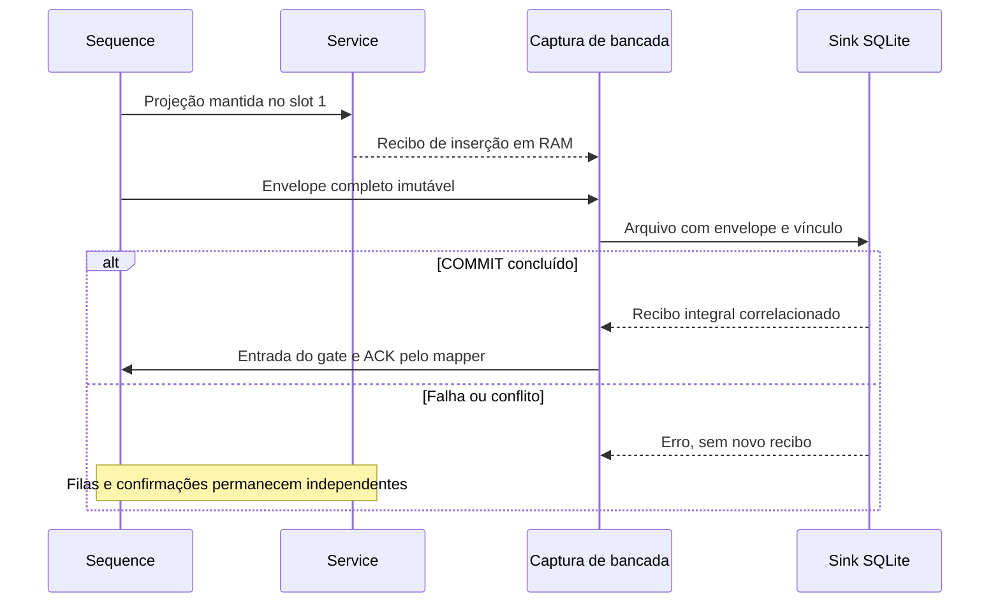

# Bancada Sequence + Service: preparar agora, validar no simulador depois

Estado: **candidato de software, sem validação nativa**. O caminho por arquivos e
SQLite foi executado. Os helpers de Scripting e a composição ST estão preparados
e testados com uma API simulada; nenhuma sessão do Machine Expert foi acessada.

## Começar no computador — três comandos

Na pasta `FB_Sequence`, com Python **3.10 ou superior**, sem instalar bibliotecas:

```powershell
python tools/verify_offline.py
python integration/service_v02/bench_transport.py demo --output build/demo
python tools/build_bench_package.py
```

O primeiro verifica fontes, executa as suítes e grava `build/offline/verification.json`.
O segundo grava uma captura **sintética**, banco SQLite, recibo e `report.json` em
`build/demo`. Esperado: `status=PASS`, `check_count=14`, somente um registro após
o reenvio. Use outro diretório para repetir a demonstração; arquivos anteriores
não são apagados. O terceiro gera um ZIP textual determinístico e seu SHA-256.

No Linux, os mesmos comandos funcionam com `python3` se esse for o nome instalado.
A matriz CI prepara Linux/Windows e Python 3.10/3.12. Execução local nesta entrega
é evidência do ambiente registrado no relatório, não de todos os ambientes da CI.

Para também conferir os dez DUTs da versão Service selecionada:

```powershell
python tools/verify_offline.py --service ../FB_Service
```

O pacote contém as fontes desta bancada e metadados da dependência. O Service
continua em seu repositório, fixado por `integration/service_v02/service_dependency.json`.
O pacote não é um projeto nativo, compilador nem biblioteca importável automaticamente.

## O que cada confirmação significa

| Sinal ou arquivo | O que demonstra | Quem pode retirar o item |
|---|---|---|
| `aEventReceipts[1]` | Projeção inserida na fila Service em RAM | Não remove a cabeça Sequence |
| `receipt.json / sink_receipt` | Envelope completo e vínculo gravados pelo sink após COMMIT | É entrada do gate; não escreve ACK |
| `fbReceiptGate.stReceipt` | Recibo do sink corresponde à inserção e ao evento elegível | Mapper pode gerar o ACK de origem |
| `fbMapper.xAck` + sessão/EventID | Propriedade integral correlacionada | Sequence pode retirar sua cabeça |
| `stAuditAck` | Canal independente do outbox Service | Apenas Service trata sua fila de auditoria |
| ACK de transferência | Canal do adaptador Service, ausente nesta bancada | Não equivale à posse do envelope Sequence |



A origem do comando `uiSourceID` continua distinta do produtor
`uiProducerSourceID`. `Accepted` continua sendo admissão. Tempo sintético fica
marcado, UTC fica desconhecido e nenhum operador autenticado é inventado.

## Arquivo completo e uso do sink

A captura contém exatamente `schema`, `origin`, `envelope` e `ingress`.
O exemplo completo está em
[`synthetic_capture.json`](../integration/service_v02/examples/synthetic_capture.json).
O envelope contém todos os campos de `ST_SEQ_EVENT` e a projeção Service integral.
Campos ausentes, enum inválido, chaves JSON repetidas, captura truncada ou
proveniência divergente impedem a gravação e a emissão do recibo.

```powershell
python integration/service_v02/bench_transport.py persist --capture build/demo/capture.json --database build/demo/envelopes.sqlite3 --receipt build/demo/receipt.json
python integration/service_v02/bench_transport.py inspect --database build/demo/envelopes.sqlite3
python integration/service_v02/bench_transport.py verify-receipt --capture build/demo/capture.json --receipt build/demo/receipt.json
```

`inspect` reabre o banco em modo somente leitura, verifica integridade e confronta
as chaves com o payload. `verify-receipt` verifica o vínculo exato dos arquivos;
ele não autentica o escritor e não demonstra sozinho que o banco ainda existe.

O recibo possui SHA-256 da captura e as identidades de origem, mapeamento e
BootID/RecordID. Ele é publicado completo, sem substituir um recibo de outra
captura, inclusive com coletores concorrentes. Use diretório local com suporte
a hard links para o coletor Python; a publicação falha explicitamente se esse
recurso não existir. Não há cliente MQTT, TCP ou conexão industrial nesta CLI.

## Preparação para a validação no Machine Expert 2.6

Este roteiro é **somente para um projeto separado em SIMULATION**.

1. Importe os objetos Sequence de `src/`, `tests/FB_SEQ_ControlMock.st` e os
   arquivos `.st` da raiz `integration/service_v02/`. Importe separadamente os
   tipos, funções e FBs canônicos Service da dependência fixada. Não duplique
   tipos iguais em duas pastas. O pacote conjunto do Control fornece a ordem
   de dependências para revisão; o compilador do IDE ainda precisa aceitá-la.
2. Vincule apenas `PRG_SEQ_ServiceBench` a uma task de simulação. Ele contém
   instâncias próprias; não conecte simultaneamente os antigos programas demo
   ou `PRG_Task_Sequence` a essas instâncias. Todos os comandos e permissões
   começam inativos. O incremento de 20 ms é sintético, não medição do ciclo.
3. Confira os campos descritos abaixo antes de habilitar a bancada. Somente o
   ControlMock concede publicação, pedidos e execução. Gere os comandos da
   Sequence pelo contrato existente: sessão/processo corretos, origem própria,
   RequestID crescente e nível mantido até o resultado correspondente.
4. Quando `xCaptureReady=TRUE`, capture pelo helper abaixo. Isso deve representar
   uma cabeça estável já inserida em RAM no Service; não force recibos manualmente.
5. Execute o sink Python fora do IDE. Somente após sucesso retorne o arquivo de
   recibo ao helper de simulação e observe o gate, o mapper e a fila Sequence.

| Grupo de Watch | Campos principais | Resultado a registrar |
|---|---|---|
| Autoridade | `xEnableBench`, `xAllowRequests`, `xAllowExecution`, `xAllowPublication`, `fbControlMock.stAuthority` | Permissões independentes; revogação suprime publicação |
| Origem | `fbSequence.stEvent`, `fbSequence.uiEventCount`, `fbMapper.stEnvelope` | Evento completo e identidade constantes enquanto pendente |
| Inserção | `fbService.aEventReceipts[1]`, `fbService.stHealth`, `xCaptureReady` | Inserção em RAM correlacionada; não basta para ACK |
| Confirmação | `stSinkReturned`, `fbReceiptGate.xReadyForReceipt`, `fbReceiptGate.stReceipt`, `fbMapper.xAck` | Baixo bruto observado, recibo completo, depois ACK da origem |

A saúde Service pode indicar ausência de runtime/operations: esses provedores
estão deliberadamente sem dados nesta bancada de eventos. OEE permanece inativo;
não se deduzem dados de equipamento, produção ou safety a partir da Sequence.

## Capturar e retornar o recibo no IDE — preparado, não executado aqui

O módulo `machine_expert_bench.py` usa o padrão já existente no historiador
Service: `create_online_application`, `read_value`, `get_online_device`,
`get_simulation_mode`, prepared values e `system.delay`. Sintaxe compatível com
IronPython 2.7 e Python 3; a API efetiva do Machine Expert ainda precisa ser validada.

No Scripting Immediate da **simulação já conectada e em RUN**, ajuste somente o
caminho local do checkout:

```python
import sys
sys.path.insert(0, r"C:\FBs\FB_Sequence\integration\service_v02")
import machine_expert_bench
capture_path = machine_expert_bench.capture(online, r"C:\FBs\bench-data")
```

O helper confirma SIMULATION, permissões e ausência de valores forçados/preparados,
lê duas vezes o envelope completo e seu recibo de inserção e exige igualdade.
Se o valor monitorado não tiver formato reconhecido, falha explicitamente.
Nunca faz login, muda RUN/STOP nem troca o modo de simulação.

Copie o caminho retornado para o coletor Python 3, fora do IDE:

```powershell
python integration/service_v02/bench_transport.py persist --capture CAMINHO_DA_CAPTURA --database C:/FBs/bench-data/envelopes.sqlite3 --receipt C:/FBs/bench-data/receipt.json
```

Depois de `status=COMMITTED`, no Scripting Immediate:

```python
machine_expert_bench.apply_receipt(online, capture_path,
    r"C:\FBs\bench-data\receipt.json", system_api=system)
```

O helper verifica o SHA da captura, todas as identidades e o envelope atual.
Escreve somente `PRG_SEQ_ServiceBench.stSinkReturned`, em três fases: validade
baixa, corpo com readback e validade alta. Antes de publicar alta, exige que
`fbReceiptGate.xReadyForReceipt=TRUE`: o gate precisa ter observado o baixo bruto
para aquele vínculo. O retorno `SUBMITTED` não significa que o PLC aceitou: confira
o ACK do mapper e o avanço da fila. Nenhum ACK de origem, auditoria ou transporte
é escrito por esse script. Em falha durante a última escrita, a entrega pode já
ter ocorrido; observe a fila antes de repetir. A API com mocks não comprova isso
no IDE real.

## Falhas previstas e recuperação

| Situação | Comportamento | Próximo passo |
|---|---|---|
| Queda antes do COMMIT | Nenhum recibo novo | Repetir a mesma captura |
| COMMIT concluído, arquivo de recibo não publicado | Registro já persistido | Repetir a mesma captura; uma linha, mesmo recibo |
| Recibo já existente para outra captura | Arquivo não é substituído | Escolher novo nome de saída; verificar ambos os vínculos |
| Identidade de origem repetida com conteúdo/vínculo alterado | Conflito, sem sobrescrita | Investigar a origem; não apagar o histórico para contornar |
| Outro BootID para evento já guardado | Conflito de reconciliação | Revisar o reinício; não remapear automaticamente |
| IDE sem API, fora de SIMULATION, parado ou sem publicação | Captura/retorno recusados | Corrigir o projeto de simulação e repetir |
| Escrita parcial do corpo do recibo | Validade permanece baixa | Corrigir o erro e repetir o recibo original |
| Falha após última escrita | Estado de entrega incerto | Verificar gate/mapper/fila antes de repetir |

Recibos são produzidos por um consumidor local designado; SHA-256 correlaciona
conteúdo, não autentica usuários. A imagem Service de 160 words continua
inalterada e não substitui esta captura integral. Backup, retenção e recuperação
de perda de energia do computador/PLC precisam de validação própria; filas ST
continuam voláteis. Não existe alegação de auditoria inviolável ou certificação.

## Aceite ainda aberto

- Compilar o programa conjunto e os testes nativos no Machine Expert 2.6.
- Executar os 23 checks do mapper e 9 do gate, além dos testes de autoridade e
  lifecycle. Os alvos esperados não são resultados observados.
- Comprovar captura completa pelo helper, COMMIT e recibo retornado em SIMULATION.
- Observar revogação de publicação, fila cheia, reenvio e recibo atrasado/incompatível.
- Registrar versão exata, ambiente, resultado, evidências e tempos/memória medidos.

O escopo desta entrega não inclui IO, comissionamento, hardware ou uso produtivo.
