# Manual de testes - FB_Sequence

Edição ampliada | 14 de setembro de 2026 | 80 testes

Este manual permite investigar o FB_Sequence por comportamento: comando recebido, decisão de admissão, intenção enviada ao consumidor e condição que permite avançar. Cada ficha contém um teste identificável e um diagrama próprio. Os critérios usam estados, identidades e contadores para que desenvolvimento, revisão e diagnóstico possam discutir o mesmo resultado, mesmo sem acompanhar cada scan.

Escopo: FB_Sequence, blocos de suporte, PRG_SEQ_Demo e FB_SEQ_ControlMock em simulação fechada. A receita orienta etapas; o mock representa a resposta do consumidor das intenções. Os programas chamados IntegrationTests no repositório verificam a Sequence com o mock. Este volume não comprova integração com outros FBs, persistência externa ou execução em equipamentos.

## Referência

Fonte técnica de referência: luisauguszvc95-dot/FB_Sequence, branch codex/sequence-traceability-v0.2, commit 00f2953808e267bfdbc637347fea88737466e5bd, contrato 0.2. Expectativas extraídas dos fontes, testes nativos e demo com ControlMock; nenhuma aprovação de execução nova é atribuída por este manual.

## Consulta

[PDF deste FB](manual.pdf) | [Catálogo de testes](#catálogo) | [Tipos de teste](#tipos-de-teste) | [Preparação](#preparação) | [Evidências](#evidências)

## Glossário

| Termo | Significado |
| --- | --- |
| FB | Bloco funcional com memória entre chamadas. Uma instância conserva o estado da sua sequência. |
| GVL | Lista de variáveis globais de um projeto. Nesta demo, as principais watches partem de PRG_SEQ_Demo. |
| DUT | Tipo declarado no projeto, como uma estrutura ST ou enumeração E de estados ou comandos. |
| Watch | Janela de observação de variáveis. Estados de poucos scans podem desaparecer entre suas atualizações. |
| Scan / chamada | Passagem de execução do programa. O relógio da demo avança 20 ms virtuais por chamada. |
| Borda | Transição de FALSE para TRUE; não equivale à identidade nova de uma solicitação. |
| Baseline | Condição de referência: entradas, receita, identidades e contadores usados para comparar a alteração. |
| Validade | Indicação de que uma informação pode ser considerada na sua interface; não significa etapa concluída. |
| Receita candidata / aplicada | Conteúdo editável antes de LoadRecipe e cópia validada utilizada pela execução. São referências diferentes. |
| Request | Pedido do solicitante, identificado por udiRequestID; seu resultado informa admissão ou rejeição. |
| Intent | Intenção da Sequence dirigida ao consumidor, identificada por IntentID, como Acquire, Execute ou Release. |
| Token de recurso | Identificador da posse concedida pelo consumidor. Deve corresponder às mensagens do lote corrente. |
| Grant / autoridade | Concessão para solicitar, executar ou publicar, associada à identidade e à validade da autoridade. |
| Feedback | Informação de retorno sobre o recurso ou processo, como qualificação e conclusão da etapa. |
| ACK de evento | Confirmação com SessionID e EventID da cabeça; permite retirar aquele evento da fila. |
| Sessão | Identidade que separa contextos de execução e evita confundir comandos ou eventos de sessões distintas. |
| Rastreabilidade | Vínculo entre origem, comando, receita, lote, etapa e evento; inclui indicar tempo sintético e perdas conhecidas. |
| Mock | Componente de teste que simula autoridade e respostas do consumidor, sem saídas de processo. |
| Fixture | Conjunto de entradas preparado para reproduzir um cenário. Nos testes de suporte, fornece snapshots pelas entradas públicas do bloco; não é escrita forçada no estado interno da Sequence. |

## Preparação

A Sequence valida comandos e receita, coordena lote e etapas, publica intenções e registra eventos. O consumidor das intenções executa a ação e fornece resultado e feedback.

Comando aceito, intenção aceita, critério de etapa atendido e recurso liberado são resultados separados. Nenhum deles substitui automaticamente os demais.

O ControlMock fornece autoridade e respostas simuladas; seus perfis e tokens não comprovam a compatibilidade de um Control de aplicação.

Publicação, continuidade do histórico e persistência têm alcances distintos. A fila desta implementação é em memória; um ACK de evento confirma consumo local da cabeça.

### Como escolher e interpretar uma ficha

Leia a condição de partida antes de comparar resultados. A ficha relaciona causa alterada, componentes atingidos e evidência esperada. O diagrama resume essa relação; a descrição da ficha define os campos, condições e exceções. Mude uma causa por vez, anote valores antes e depois e permita que a task observe a alteração. Contadores e identidades ajudam a reconhecer pulsos que uma watch não mostra. Use os índices por tipo e componente para localizar uma dúvida e o ID da ficha para registrar ou discutir a evidência.

### Tipos de teste

Funcional: percurso normal e transformação das entradas em resultados. Contrato e validação: identidade, formato, campos obrigatórios e combinações aceitas ou rejeitadas. Limites e temporização: capacidades, valores de fronteira, ordenação e vencimento de prazos. Falhas e recuperação: reação à indisponibilidade ou entrada inválida e condições para voltar a operar. Rastreabilidade e persistência: origem, sequência e conservação de evidências, consumo confirmado e perdas conhecidas. Neste volume, persistência limita-se a observar o comportamento da fila em memória; não há banco nesta rota. Cada ficha tem um tipo principal; um mesmo comportamento pode participar de mais de uma dessas relações.

### Seleção de execução

Essencial: seleção inicial para conhecer as funções e conferir uma base utilizável. Completa: amplia a seleção com variações, rejeições e recuperação das interfaces. Aprofundamento: casos de fronteira ou que exigem uma bancada específica. Esses rótulos orientam a seleção de execução; não representam severidade de máquina. Escolher pelo componente alterado ajuda na regressão: repetir os testes da sua entrada, dos resultados dependentes e das confirmações que encerram o percurso.

### Demo pronta e bancada dedicada

Demo pronta usa as entradas de teste já disponíveis no programa indicado. Bancada dedicada a preparar exige um programa de teste separado, com entradas controladas e chamadas reproduzíveis ao bloco ou interface; a ficha identifica a preparação necessária. Quando a demo sobrescreve um campo, editar sua cópia na watch não substitui essa bancada. Não escrever em estados, contadores, tokens ou flags privados para fabricar o resultado. Uma bancada ainda não preparada mantém o ensaio como Não executado, com a dependência registrada. Toda execução deste volume é em simulação fechada, sem vínculo com saídas físicas.

### Base funcional e ordem de chamada

Em instância nova, os BOOL começam FALSE; AuthorityID, sessão, processo, máquina e produtor usam 1. A base funcional coloca PRG_SEQ_Demo.xControlMockEnabled, PRG_SEQ_Demo.xSequenceEnabled, PRG_SEQ_Demo.xAllowRequests, PRG_SEQ_Demo.xAllowExecution, PRG_SEQ_Demo.xAllowPublication e PRG_SEQ_Demo.xFinishActions em TRUE. Manter PRG_SEQ_Demo.xQualified, PRG_SEQ_Demo.xStepComplete, PRG_SEQ_Demo.xFaulted e PRG_SEQ_Demo.xRejectRequest em FALSE até o estímulo da ficha. O mock é chamado antes da Sequence; a intenção publicada recebe resposta nos ciclos seguintes. Cada chamada representa 20 ms virtuais.

### Receita original e variante de observação

Receita original 1/revisão 1: etapa 10/perfil 100, WaitQualified de 250 ms; etapa 20/perfil 200, WaitComplete; etapa 30/perfil 300, WaitOperator. Cada etapa tem timeout de 10000 ms. A variante de observação é proposta pelo manual: após a inicialização e antes de LoadRecipe, definir PRG_SEQ_Demo.stRecipe.udiRevision=2, PRG_SEQ_Demo.stRecipe.astSteps[1].udiQualifiedMs=5000 e PRG_SEQ_Demo.stRecipe.astSteps[1].udiTimeoutMs, PRG_SEQ_Demo.stRecipe.astSteps[2].udiTimeoutMs e PRG_SEQ_Demo.stRecipe.astSteps[3].udiTimeoutMs=600000. Carregar e iniciar explicitamente receita 1/revisão 2. O timeout transitório permanece 5000 ms. Testes de prazo usam a variante indicada pela própria ficha.

### Preparação comum dos comandos

Escrever em PRG_SEQ_Demo.stCommand: udiSessionID=1, uiProcessID=1, uiSourceID=1 e udiRequestID novo, positivo e estritamente crescente. Preparar todo o payload com xValid=FALSE; ativar TRUE somente quando pronto. Preservar identidade e payload até PRG_SEQ_Demo.fbSequence.stCommandResult.xValid e udiRequestID correspondente. LoadRecipe usa udiRecipeID=1 e udiRecipeRevision igual à candidata. Start usa receita/revisão aplicada e udiBatchID positivo maior que o último iniciado. Hold, Resume, Stop, Abort e Reset usam o BatchID corrente. ConfirmStep exige BatchID, StepID e PromptID correntes. Corrigir um pedido rejeitado exige RequestID novo.

### Watch de entrada, admissão e estado

Observar ou editar as entradas superiores em PRG_SEQ_Demo e PRG_SEQ_Demo.stCommand. A resposta do pedido está em PRG_SEQ_Demo.fbSequence.stCommandResult: xValid, udiRequestID, eCommand, eResult, eReason e eStateAfter. O estado está em PRG_SEQ_Demo.fbSequence.stRuntime: eState, eReason, udiBatchID, uiStepID, uiProfileID, udiQualifiedElapsedMs, udiStepElapsedMs, xWaitingOperator, udiPromptID e udiResourceToken. eStateAfter conserva a decisão da admissão; pode mostrar Starting mesmo quando o runtime já estiver em Running.

### Watch do consumidor e propriedade dos dados

A intenção é PRG_SEQ_Demo.fbSequence.stControlRequest. Autoridade, resultado e feedback são PRG_SEQ_Demo.fbControlMock.stAuthority, PRG_SEQ_Demo.fbControlMock.stResult e PRG_SEQ_Demo.fbControlMock.stRuntime. A demo reescreve entradas copiadas e o mock reescreve essas saídas. Não editar feedback ou token de saída para simular retorno incorreto. PRG_SEQ_Demo.stConfig é capturado na primeira chamada, mesmo desabilitado; mudança posterior provoca ConfigInvalid. Configuração especial requer instância nova já preparada. PRG_SEQ_Demo.stTraceTime.xValid e PRG_SEQ_Demo.stTraceTime.xSynthetic são recalculados por scan.

### Três confirmações, três critérios

PRG_SEQ_Demo.fbSequence.stCommandResult confirma admissão do comando. PRG_SEQ_Demo.fbControlMock.stResult confirma a intenção correlacionada: Execute aceito não precisa ter xDone=TRUE. O progresso depende do critério da etapa e do feedback esperado. Encerramento ainda exige Complete, Stop ou Abort e posterior Release. Grants de request, execution e publication são distintos: habilitar a Sequence não concede autoridade; negar publicação não equivale a parar o núcleo.

### Eventos, ACK e continuidade

Observar PRG_SEQ_Demo.fbSequence.xEventAvailable, PRG_SEQ_Demo.fbSequence.stEvent, PRG_SEQ_Demo.fbSequence.uiEventCount e PRG_SEQ_Demo.fbSequence.udiEventsDropped. A fila tem 32 posições. Preparar o ACK com PRG_SEQ_Demo.udiAckEventID=0, escrever PRG_SEQ_Demo.udiAckSessionID igual à sessão da cabeça e escrever por último PRG_SEQ_Demo.udiAckEventID igual ao EventID da cabeça. Identidade incorreta não autoriza remoção. Sob publicação negada, contagem pública zero não comprova fila vazia. Na demo sintética, xTraceReady=FALSE pode ser esperado; xTraceHistoryComplete descreve perdas locais conhecidas, sem provar persistência.

### Reposição e leitura do resultado

Restaurar entradas, permitir requests/publicação e PRG_SEQ_Demo.xFinishActions, aguardar encerramento e liberação. Enviar Reset com BatchID ainda corrente e RequestID novo. Reset preserva receita, fila e contadores de identidade; retira o lote do runtime. Novo Start exige BatchID maior. Para base absolutamente limpa, reinicializar a aplicação simulada e suas instâncias não retentivas; não escrever xInitialized ou estados internos. Não executado: existe uma expectativa, mas o cenário ainda não foi observado nesta execução. Aprovado: todas as condições e critérios da ficha foram observados. Falhou: houve divergência reproduzível com pré-condições satisfeitas. Inconclusivo: versão, entrada, temporização ou evidência não permitem concluir. Uma expectativa descrita no manual não é resultado executado; a elaboração deste documento não executa nem aprova os FBs no Machine Expert.

## Catálogo

DEM: demo; ADP: demo com Adapter; HIS: historiador; BAN: bancada dedicada de software a preparar. A ficha indica a interface pública e as condições necessárias.

| ID | Componente | Dúvida | Tipo | Local | Página PDF |
| --- | --- | --- | --- | --- | --- |
| [SEQ-001](#seq-001) | Inicialização e configuração | O que significa a Demo iniciar com todos os sinais desligados? | FUN | DEM | 14 |
| [SEQ-002](#seq-002) | Inicialização e configuração | Uma configuração alterada online passa a valer imediatamente? | CON | BAN | 15 |
| [SEQ-003](#seq-003) | Inicialização e configuração | Como reconhecer uma instância criada com limites inválidos? | CON | BAN | 16 |
| [SEQ-004](#seq-004) | Inicialização e configuração | Como um delta de ciclo inválido afeta Idle e um lote ativo? | LIM | BAN | 17 |
| [SEQ-005](#seq-005) | Receita aplicada | Qual é a prova de que a receita foi carregada? | FUN | DEM | 18 |
| [SEQ-006](#seq-006) | Receita aplicada | O que ocorre quando o pedido referencia outra receita ou revisão? | CON | DEM | 19 |
| [SEQ-007](#seq-007) | Receita aplicada | Editar a candidata durante o lote altera a etapa em execução? | CON | DEM | 20 |
| [SEQ-008](#seq-008) | Admissão de comandos | Por que um Start pode ser rejeitado mesmo com Control disponível? | CON | DEM | 21 |
| [SEQ-009](#seq-009) | Admissão de comandos | Quando um Start aceito realmente se torna Running? | FUN | DEM | 22 |
| [SEQ-010](#seq-010) | Admissão de comandos | Um lote pode iniciar usando outra revisão da receita? | CON | DEM | 23 |
| [SEQ-011](#seq-011) | Admissão de comandos | Reset permite reutilizar um BatchID antigo? | CON | DEM | 24 |
| [SEQ-012](#seq-012) | Admissão de comandos | Ready sozinho basta para admitir Start? | CON | BAN | 25 |
| [SEQ-013](#seq-013) | Admissão de comandos | Um comando de outro lote pode alterar o lote corrente? | CON | DEM | 26 |
| [SEQ-014](#seq-014) | Admissão de comandos | O bloco aceita qualquer comando se os IDs estiverem corretos? | CON | DEM | 27 |
| [SEQ-015](#seq-015) | Critérios de etapa | Quando começa a acumular o tempo qualificado? | LIM | DEM | 28 |
| [SEQ-016](#seq-016) | Critérios de etapa | Perder qualificação zera o trabalho já acumulado? | LIM | DEM | 29 |
| [SEQ-017](#seq-017) | Critérios de etapa | O sinal StepComplete sozinho encerra uma etapa? | FUN | DEM | 30 |
| [SEQ-018](#seq-018) | Critérios de etapa | Qual confirmação é aceita na etapa de operador? | FUN | DEM | 31 |
| [SEQ-019](#seq-019) | Critérios de etapa | Uma confirmação antiga ou antecipada pode avançar a etapa? | CON | DEM | 32 |
| [SEQ-020](#seq-020) | Pausa e encerramento | Hold aceito já significa que a sequência está Held? | FUN | DEM | 33 |
| [SEQ-021](#seq-021) | Pausa e encerramento | O tempo retoma imediatamente com o feedback antigo de Hold? | CON | BAN | 34 |
| [SEQ-022](#seq-022) | Pausa e encerramento | O fim da última etapa basta para declarar Complete? | FUN | DEM | 35 |
| [SEQ-023](#seq-023) | Pausa e encerramento | Qual é a diferença observável entre Stop e fim normal? | FUN | DEM | 36 |
| [SEQ-024](#seq-024) | Pausa e encerramento | Como reconhecer Abort solicitado sem confundir com falha detectada? | FUN | DEM | 37 |
| [SEQ-025](#seq-025) | Pausa e encerramento | Por que Reset continua NotReady após retirar a causa de falha? | REC | DEM | 38 |
| [SEQ-026](#seq-026) | Pausa e encerramento | Quais informações continuam existindo depois de Reset? | RAS | DEM | 39 |
| [SEQ-027](#seq-027) | Pausa e encerramento | Basta receber xReleased para fechar o lote? | CON | BAN | 40 |
| [SEQ-028](#seq-028) | Falhas e recuperação | Como a sequência reage se a posse muda durante Execute? | REC | BAN | 41 |
| [SEQ-029](#seq-029) | Limites e prazos | Uma etapa não qualificada pode esperar indefinidamente? | LIM | DEM | 42 |
| [SEQ-030](#seq-030) | Limites e prazos | Uma ação aceita, mas nunca concluída, escapa do timeout? | LIM | DEM | 43 |
| [SEQ-031](#seq-031) | Limites e prazos | O tempo longo de Running pode causar timeout instantâneo de Completing? | LIM | BAN | 44 |
| [SEQ-032](#seq-032) | Autoridade e correlação | Retirar requests também libera o recurso do lote? | REC | DEM | 45 |
| [SEQ-033](#seq-033) | Autoridade e correlação | É possível bloquear execução mantendo o caminho de cleanup? | REC | DEM | 46 |
| [SEQ-034](#seq-034) | Autoridade e correlação | Resultados de duas gerações de autoridade podem ser combinados? | CON | BAN | 47 |
| [SEQ-035](#seq-035) | Autoridade e correlação | Desabilitar a Sequence pausa ou encerra silenciosamente o lote? | REC | DEM | 48 |
| [SEQ-036](#seq-036) | Falhas e recuperação | Como a falha informada pelo Control aparece na Sequence? | REC | DEM | 49 |
| [SEQ-037](#seq-037) | Falhas e recuperação | Rejeitar uma intenção é a mesma coisa que informar falha de processo? | REC | DEM | 50 |
| [SEQ-038](#seq-038) | Autoridade e correlação | Um resultado antigo, mas aceito, pode qualificar a intenção atual? | CON | BAN | 51 |
| [SEQ-039](#seq-039) | Autoridade e correlação | Quanto tempo a etapa tolera ficar sem feedback utilizável? | REC | BAN | 52 |
| [SEQ-040](#seq-040) | Autoridade e correlação | A idade exatamente no limite ainda é aceita? | LIM | BAN | 53 |
| [SEQ-041](#seq-041) | Publicação e rastreabilidade | Uma watch zerada significa que o lote parou? | RAS | DEM | 54 |
| [SEQ-042](#seq-042) | Publicação e rastreabilidade | Qual ACK realmente retira um evento da Sequence? | RAS | DEM | 55 |
| [SEQ-043](#seq-043) | Publicação e rastreabilidade | Por que a Demo pode ter dados válidos e TraceReady falso? | RAS | BAN | 56 |
| [SEQ-044](#seq-044) | Publicação e rastreabilidade | O timestamp do evento muda enquanto ele aguarda ACK? | RAS | BAN | 57 |
| [SEQ-045](#seq-045) | Publicação e rastreabilidade | Drenar uma fila que transbordou apaga a evidência de perda? | RAS | DEM | 58 |
| [SEQ-046](#seq-046) | Validação estrutural de receitas | Uma receita corrigida deixa de carregar o diagnóstico anterior? | CON | BAN | 59 |
| [SEQ-047](#seq-047) | Validação estrutural de receitas | Uma receita sem identificação consegue passar pela validação? | CON | BAN | 60 |
| [SEQ-048](#seq-048) | Validação estrutural de receitas | O tamanho declarado protege o acesso ao array? | LIM | BAN | 61 |
| [SEQ-049](#seq-049) | Validação estrutural de receitas | O diagnóstico aponta o item do array que está incompleto? | CON | BAN | 62 |
| [SEQ-050](#seq-050) | Validação estrutural de receitas | IDs repetidos em posições distantes são detectados? | CON | BAN | 63 |
| [SEQ-051](#seq-051) | Validação estrutural de receitas | A etapa pode exigir mais tempo qualificado do que seu limite permite? | LIM | BAN | 64 |
| [SEQ-052](#seq-052) | Validação estrutural de receitas | O validador distingue política suportada de significado físico do perfil? | CON | BAN | 65 |
| [SEQ-053](#seq-053) | Temporizadores e aritmética | Por que o tempo não aumenta em toda chamada? | FUN | BAN | 66 |
| [SEQ-054](#seq-054) | Temporizadores e aritmética | Um reset concorrente com a contagem realmente zera o timer? | REC | BAN | 67 |
| [SEQ-055](#seq-055) | Temporizadores e aritmética | Um delta muito grande provoca estouro ou ultrapassa a meta? | LIM | BAN | 68 |
| [SEQ-056](#seq-056) | Temporizadores e aritmética | Zerar a meta equivale a cumprir a duração? | CON | BAN | 69 |
| [SEQ-057](#seq-057) | Temporizadores e aritmética | Reduzir e depois aumentar o target recupera tempo descartado? | LIM | BAN | 70 |
| [SEQ-058](#seq-058) | Temporizadores e aritmética | Os contadores mantêm o máximo ao exceder a capacidade? | LIM | BAN | 71 |
| [SEQ-059](#seq-059) | Admissão de comandos no suporte | Retirar xValid ou trocar o comando permite reutilizar o mesmo ID? | CON | BAN | 72 |
| [SEQ-060](#seq-060) | Admissão de comandos no suporte | Um ID menor pode fazer o gate esquecer a marca anterior? | CON | BAN | 73 |
| [SEQ-061](#seq-061) | Admissão de comandos no suporte | Um pacote de outra sessão bloqueia comandos válidos futuros? | CON | BAN | 74 |
| [SEQ-062](#seq-062) | Admissão de comandos no suporte | Corrigir o processo permite reapresentar o mesmo RequestID? | CON | BAN | 75 |
| [SEQ-063](#seq-063) | Admissão de comandos no suporte | O gate exige IDs consecutivos ou apenas crescentes? | LIM | BAN | 76 |
| [SEQ-064](#seq-064) | Fila de eventos no suporte | Manter xPush verdadeiro gera um evento ou vários? | FUN | BAN | 77 |
| [SEQ-065](#seq-065) | Fila de eventos no suporte | Um ACK consegue remover um evento diferente da cabeça? | CON | BAN | 78 |
| [SEQ-066](#seq-066) | Fila de eventos no suporte | O que é perdido quando chegam mais de 32 eventos? | REC | BAN | 79 |
| [SEQ-067](#seq-067) | Fila de eventos no suporte | Uma posição liberada pode ser reutilizada na mesma chamada? | LIM | BAN | 80 |
| [SEQ-068](#seq-068) | Fila de eventos no suporte | Ao voltar ao início do buffer, a fila conserva a sequência? | LIM | BAN | 81 |
| [SEQ-069](#seq-069) | Fila de eventos no suporte | Um ACK antecipado apaga um evento criado na mesma chamada? | CON | BAN | 82 |
| [SEQ-070](#seq-070) | Fila de eventos no suporte | A fila modifica o fato ou verifica a sessão do consumidor? | CON | BAN | 83 |
| [SEQ-071](#seq-071) | Construção de fatos de rastreabilidade | Um evento antigo reaparece quando nada mudou? | FUN | BAN | 84 |
| [SEQ-072](#seq-072) | Construção de fatos de rastreabilidade | A evidência distingue a receita aplicada do comando que a solicitou? | RAS | BAN | 85 |
| [SEQ-073](#seq-073) | Construção de fatos de rastreabilidade | Um comando rejeitado recebe crédito por uma mudança independente? | RAS | BAN | 86 |
| [SEQ-074](#seq-074) | Construção de fatos de rastreabilidade | O evento de conclusão descreve a etapa encerrada ou a seguinte? | RAS | BAN | 87 |
| [SEQ-075](#seq-075) | Construção de fatos de rastreabilidade | Retomar a espera do operador gera outra emissão do mesmo prompt? | CON | BAN | 88 |
| [SEQ-076](#seq-076) | Construção de fatos de rastreabilidade | Após avançar a etapa, ainda é possível saber o que foi confirmado? | RAS | BAN | 89 |
| [SEQ-077](#seq-077) | Construção de fatos de rastreabilidade | Entrar em Faulted significa que o lote foi finalizado? | REC | BAN | 90 |
| [SEQ-078](#seq-078) | Construção de fatos de rastreabilidade | A evidência conserva a autoridade antiga quando o recurso muda? | RAS | BAN | 91 |
| [SEQ-079](#seq-079) | Construção de fatos de rastreabilidade | BatchStarted prova execução e BatchFinished sempre significa sucesso? | CON | BAN | 92 |
| [SEQ-080](#seq-080) | Construção de fatos de rastreabilidade | O builder inventa horário, identidade do ator ou número definitivo do evento? | RAS | BAN | 93 |

## Tipos de teste

### Funcional

Confirma o efeito normal de uma entrada ou comando válido.

[SEQ-001](#seq-001) · [SEQ-005](#seq-005) · [SEQ-009](#seq-009) · [SEQ-017](#seq-017) · [SEQ-018](#seq-018) · [SEQ-020](#seq-020) · [SEQ-022](#seq-022) · [SEQ-023](#seq-023) · [SEQ-024](#seq-024) · [SEQ-053](#seq-053) · [SEQ-064](#seq-064) · [SEQ-071](#seq-071)

### Contrato e validação

Confere identidade, formato, configuração e admissibilidade dos dados.

[SEQ-002](#seq-002) · [SEQ-003](#seq-003) · [SEQ-006](#seq-006) · [SEQ-007](#seq-007) · [SEQ-008](#seq-008) · [SEQ-010](#seq-010) · [SEQ-011](#seq-011) · [SEQ-012](#seq-012) · [SEQ-013](#seq-013) · [SEQ-014](#seq-014) · [SEQ-019](#seq-019) · [SEQ-021](#seq-021) · [SEQ-027](#seq-027) · [SEQ-034](#seq-034) · [SEQ-038](#seq-038) · [SEQ-046](#seq-046) · [SEQ-047](#seq-047) · [SEQ-049](#seq-049) · [SEQ-050](#seq-050) · [SEQ-052](#seq-052) · [SEQ-056](#seq-056) · [SEQ-059](#seq-059) · [SEQ-060](#seq-060) · [SEQ-061](#seq-061) · [SEQ-062](#seq-062) · [SEQ-065](#seq-065) · [SEQ-069](#seq-069) · [SEQ-070](#seq-070) · [SEQ-075](#seq-075) · [SEQ-079](#seq-079)

### Limites e temporização

Investiga fronteiras numéricas, prazos, contagem e saturação.

[SEQ-004](#seq-004) · [SEQ-015](#seq-015) · [SEQ-016](#seq-016) · [SEQ-029](#seq-029) · [SEQ-030](#seq-030) · [SEQ-031](#seq-031) · [SEQ-040](#seq-040) · [SEQ-048](#seq-048) · [SEQ-051](#seq-051) · [SEQ-055](#seq-055) · [SEQ-057](#seq-057) · [SEQ-058](#seq-058) · [SEQ-063](#seq-063) · [SEQ-067](#seq-067) · [SEQ-068](#seq-068)

### Falhas e recuperação

Confere rejeição, perda de condição e retorno após remover a causa.

[SEQ-025](#seq-025) · [SEQ-028](#seq-028) · [SEQ-032](#seq-032) · [SEQ-033](#seq-033) · [SEQ-035](#seq-035) · [SEQ-036](#seq-036) · [SEQ-037](#seq-037) · [SEQ-039](#seq-039) · [SEQ-054](#seq-054) · [SEQ-066](#seq-066) · [SEQ-077](#seq-077)

### Rastreabilidade e persistência

Confere origem, identidade, fila, confirmação e conservação dos fatos.

[SEQ-026](#seq-026) · [SEQ-041](#seq-041) · [SEQ-042](#seq-042) · [SEQ-043](#seq-043) · [SEQ-044](#seq-044) · [SEQ-045](#seq-045) · [SEQ-072](#seq-072) · [SEQ-073](#seq-073) · [SEQ-074](#seq-074) · [SEQ-076](#seq-076) · [SEQ-078](#seq-078) · [SEQ-080](#seq-080)

## Cobertura

80 fichas propostas:45 do núcleo e 35 de componentes de suporte. Variantes equivalentes ficam na mesma ficha; a cardinalidade representa critérios distintos, não cada valor de entrada.
Os 14 testes anteriores estão mapeados em legacy_id; o catálogo amplia suas coberturas e separa diagnósticos que antes compartilhavam uma ficha.
As prioridades Essencial, Completa e Aprofundamento orientam seleção e regressão; não são níveis de segurança da máquina nem resultados de execução.
Demo permite estímulos de alto nível publicados por PRG_SEQ_Demo; corrupção de identidade, idade, delta e snapshots precisa de bancada de software dedicada. Nenhuma ficha orienta escrever estados internos do núcleo.
O catálogo cobre núcleo, contratos, receita, máquina de estados, temporização, grants, correlação, fila volátil e construção de fatos. O adaptador FB_Sequence↔FB_Service permanece fora deste ensaio independente e deve ter catálogo de integração próprio.
CounterExhausted de IntentID/PromptID/EventID e saturação da revisão são ramos conhecidos do código, mas o catálogo não inventa injeção em estado interno para alcançá-los. Exigem execução longa instrumentada ou infraestrutura de teste aprovada que preserve entradas públicas. A fronteira UDINT do gate e da soma saturada é testável diretamente e está coberta.
xTraceReady avalia critérios locais e não certifica UTC, persistência durável, conformidade normativa ou entrega ao consumidor. SourceID identifica rota e não autentica uma pessoa.
A fila tem 32 posições e é volátil. Reset não limpa eventos, perdas nem identidades; recomeço da instância perde esse estado e deve ser registrado com gestão de sessão no chamador.
Leitura de fontes e validação documental concluídas; PRGs nativos e cenários deste catálogo ainda exigem execução registrada no Machine Expert. Números de verificações nativas são critérios esperados, não resultados observados.

As fichas descrevem expectativas; a autoria do manual não executou os ensaios no Machine Expert. Prioridades Essencial, Completa e Aprofundamento orientam a seleção da cobertura e não indicam severidade de máquina.

## Testes

### SEQ-001 - Partida sem permissões e publicação inválida

Inicialização e configuração | Funcional | Essencial | Demo

Reconhecer o estado inicial da bancada e distinguir dados indisponíveis de uma sequência efetivamente pronta. Esta ficha orienta a leitura das demais.

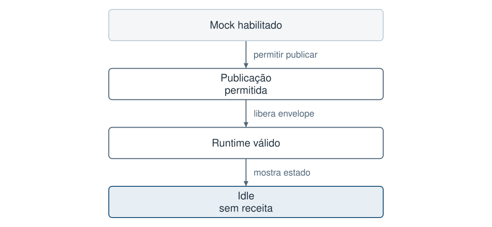

Habilitar observação torna o estado legível; a execução ainda depende de comando e condições próprias.

**Condição inicial.** Instância nova de PRG_SEQ_Demo; manter os valores declarados pelo projeto, sem comandos válidos nem ACKs pendentes.

**Alteração.** Habilitar primeiro o mock e apenas a publicação; depois liberar requests e execução, mantendo xSequenceEnabled=FALSE.

**Componentes afetados.** O mock passa a publicar autoridade. A permissão de publicação libera envelopes de observação, enquanto o habilitador da Sequence continua impedindo Start. Nenhuma dessas mudanças carrega receita.

**Onde observar.** W1: xControlMockEnabled, xSequenceEnabled e três grants. W2: stRuntime.xDataValid/eState/xRecipeLoaded; W3: stAuthority; stControlRequest.xValid.

**Resultado esperado.** No início, envelopes públicos são inválidos e zerados. Com autoridade e publicação válidas, runtime mostra Idle e receita não carregada; intenção permanece inválida. Liberar grants sozinho não inicia lote. A versão publicada é contrato 0.2.

**Divergência a investigar.** É desvio encontrar Acquire sem Start admitido. Interpretar eState=0 enquanto xDataValid=FALSE como confirmação de Idle é erro de leitura, não evidência funcional.

**Retorno à referência.** Adotar os grants da condição base, registrar versão e instância. Preparar o primeiro LoadRecipe com identidade nova; não editar saídas internas para fabricar prontidão.

**Fonte.** [src/fb/FB_Sequence.st:79-109](https://github.com/luisauguszvc95-dot/FB_Sequence/blob/00f2953808e267bfdbc637347fea88737466e5bd/src/fb/FB_Sequence.st#L79); [tests/PRG_SEQ_Demo.st:1-25](https://github.com/luisauguszvc95-dot/FB_Sequence/blob/00f2953808e267bfdbc637347fea88737466e5bd/tests/PRG_SEQ_Demo.st#L1)

### SEQ-002 - Configuração capturada e alteração online

Inicialização e configuração | Contrato e validação | Completa | bancada dedicada

Verificar a identidade e os limites fixados na primeira chamada. Essa proteção evita que um lote mude de contrato durante a execução.

A cópia inicial é a referência durante toda a vida da instância.

**Condição inicial.** Instância nova e configuração válida desde a primeira chamada; publicação liberada. Manter Idle e registrar uiMachineID e limites originais.

**Alteração.** Alterar um campo de stConfig, por exemplo uiMachineID, e depois devolver exatamente o valor inicial, sem reinicializar.

**Componentes afetados.** FB compara toda configuração recebida com sua cópia capturada. Enquanto divergente, perde autorização pública; restaurar os campos não remove o estado de falha já registrado.

**Onde observar.** stRuntime.xDataValid antes e depois; stControlRequest.xValid; após restauração, stRuntime.eState/eReason e identificação original.

**Resultado esperado.** Durante divergência, envelopes públicos ficam inválidos e não há intenção válida. Depois de restaurar, aparece Faulted/ConfigInvalid. A configuração capturada continua a original; alteração online não é mecanismo de reconfiguração. Em instância sem lote, Reset exige runtime fresco, Ready e recurso livre.

**Divergência a investigar.** Não concluir que a mudança foi aceita porque a watch pública zerou. Não usar uma sequência de trocas de configuração para medir limites distintos na mesma instância.

**Retorno à referência.** Restaurar configuração e aplicar Reset se as condições permitirem. Para ensaiar outro limite ou identidade, iniciar uma nova instância de software já configurada com esse valor.

**Fonte.** [src/fb/FB_Sequence.st:79-99](https://github.com/luisauguszvc95-dot/FB_Sequence/blob/00f2953808e267bfdbc637347fea88737466e5bd/src/fb/FB_Sequence.st#L79); [tests/PRG_SEQ_TraceEngineTests.st:123-136](https://github.com/luisauguszvc95-dot/FB_Sequence/blob/00f2953808e267bfdbc637347fea88737466e5bd/tests/PRG_SEQ_TraceEngineTests.st#L123)

### SEQ-003 - Configuração inicial inválida

Inicialização e configuração | Contrato e validação | Completa | bancada dedicada

Verificar que a bancada recusa operar quando identidade ou limites essenciais não foram configurados, sem depender de um comando Start para detectar o problema.

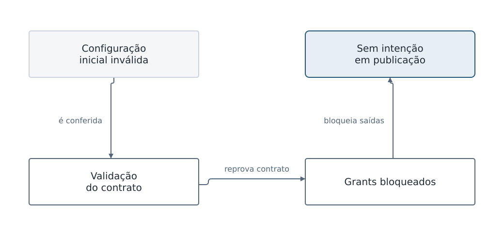

A indisponibilidade pública acompanha a configuração inválida; a recuperação exige outra instância.

**Condição inicial.** Bancada dedicada chamando uma instância nova com publicação solicitada pelo mock. Preparar uma variante por instância: ProcessID ou SessionID zero, ou um dos três limites temporais zero.

**Alteração.** Executar chamadas com a configuração inválida desde o primeiro ciclo; observar somente saídas públicas e os sinais fornecidos pelo chamador.

**Componentes afetados.** xConfigOK fica falso. O bloco entra internamente em falha, mas a mesma condição impede autoridade e publicação válidas; o diagnóstico público fica indisponível.

**Onde observar.** Entradas stConfig; stRuntime.xDataValid; stCommandResult.xValid; stControlRequest.xValid; xEventAvailable e uiEventCount.

**Resultado esperado.** Nenhuma intenção válida é exposta e nenhum envelope público deve ser interpretado como pronto. Corrigir apenas stConfig no ciclo seguinte não recupera essa instância: a cópia original inválida permanece capturada. É necessário recriar a instância com configuração válida.

**Divergência a investigar.** Expor runtime válido, aceitar operação ou gerar Acquire nessa configuração reprova o caso. Exigir ConfigInvalid visível enquanto a publicação está bloqueada seria um critério incorreto.

**Retorno à referência.** Encerrar a instância de ensaio e criar outra com valores válidos. Registrar a variante e a ausência de publicação; não forçar o estado interno para tentar recuperar uma inicialização inválida.

**Fonte.** [src/fb/FB_Sequence.st:79-107](https://github.com/luisauguszvc95-dot/FB_Sequence/blob/00f2953808e267bfdbc637347fea88737466e5bd/src/fb/FB_Sequence.st#L79)

### SEQ-004 - Delta zero ou acima do máximo

Inicialização e configuração | Limites e temporização | Completa | bancada dedicada

Separar rejeição de partida de falha durante execução. O delta é tempo decorrido informado pelo chamador; não é o timestamp de rastreabilidade.

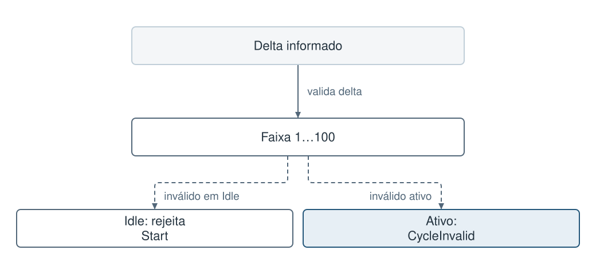

A mesma validação gera rejeição em Idle e falha latente quando existe execução ativa.

**Condição inicial.** Bancada dedicada com stCfg.udiMaxCycleMs=100, demais limites válidos e feedback correlacionado. Comparar Idle e Running em instâncias controladas.

**Alteração.** Fornecer udiDeltaMs=0 ou 101. Em Idle enviar Start novo e válido; em Running apenas manter o ciclo inválido. Incluir 100 como ponto aceito.

**Componentes afetados.** Delta inválido é convertido em zero para contagem. Start verifica xCycleOK; a supervisão de um estado ativo registra a falha antes de avaliar o processo.

**Onde observar.** Entrada udiDeltaMs; stCommandResult.eResult/eReason; stRuntime.eState/eReason/udiStepElapsedMs; stControlRequest.eAction.

**Resultado esperado.** Em Idle, Start é Rejected/CycleInvalid e não adquire recurso. Em Running, ocorre Faulted/CycleInvalid e cleanup depende de grants e feedback. O valor exatamente igual a 100 é permitido; o ensaio não mede jitter físico.

**Divergência a investigar.** Avançar tempo de processo usando delta rejeitado ou aceitar Start com delta zero são desvios. A Demo fixa 20 ms por chamada, portanto editar o input direto na watch não constitui injeção estável.

**Retorno à referência.** Voltar ao delta válido no chamador; concluir Abort/Release quando houver lote e então Reset. Para nova condição inicial, usar instância independente sem alterar o limite capturado.

**Fonte.** [src/fb/FB_Sequence.st:100-104](https://github.com/luisauguszvc95-dot/FB_Sequence/blob/00f2953808e267bfdbc637347fea88737466e5bd/src/fb/FB_Sequence.st#L100); [src/fb/FB_Sequence.st:155-162](https://github.com/luisauguszvc95-dot/FB_Sequence/blob/00f2953808e267bfdbc637347fea88737466e5bd/src/fb/FB_Sequence.st#L155); [src/fb/FB_Sequence.st:220-249](https://github.com/luisauguszvc95-dot/FB_Sequence/blob/00f2953808e267bfdbc637347fea88737466e5bd/src/fb/FB_Sequence.st#L220)

### SEQ-005 - Aplicação de receita válida em Idle

Receita aplicada | Funcional | Essencial | Demo

Relacionar o pedido de carga à cópia de receita que a Sequence realmente utiliza. A admissão do pedido deve ter evidência coerente no runtime e nos eventos.

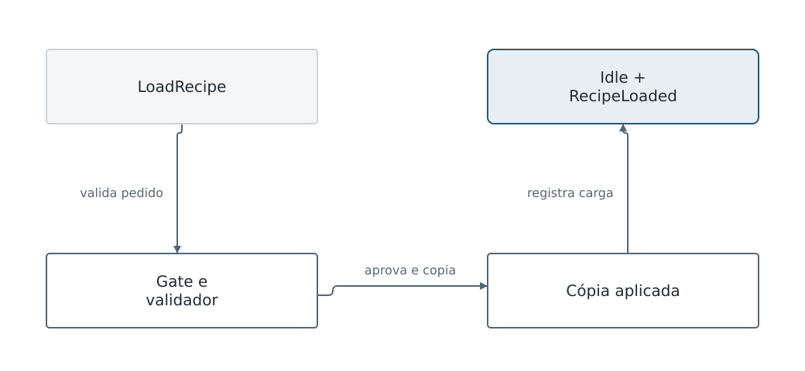

Carregar define a receita aplicada; a partida é outra decisão do contrato.

**Condição inicial.** Demo em Idle, mock e publicação ativos, requests permitidos. Candidata original com RecipeID=1, revisão=1 e três etapas válidas. ACK zero durante a observação inicial.

**Alteração.** Enviar LoadRecipe com novo RequestID e referência igual à candidata; acompanhar a mesma identidade no resultado.

**Componentes afetados.** O gate admite o pedido; o validador confere etapas; o núcleo copia a candidata e atualiza RecipeID, revisão e quantidade aplicada. O builder registra carga e resultado do comando.

**Onde observar.** W1 stCommand e stRecipe; W2 stCommandResult e stRuntime.xRecipeLoaded/udiRecipeID/udiRecipeRevision/uiStepCount; W4 eventos disponíveis.

**Resultado esperado.** Resultado Accepted/None, runtime permanece Idle, receita carregada com três etapas e nenhuma aquisição de recurso. Com fila inicialmente vazia, entram RecipeLoaded e CommandResult nessa ordem. A carga pode ocorrer com execução ainda não permitida, desde que requests e publicação estejam válidos.

**Divergência a investigar.** Aceitar com referência aplicada divergente, entrar em Running ao carregar ou gerar intenção de Control nessa operação reprova o comportamento.

**Retorno à referência.** Retirar xValid do comando e registrar a identidade aplicada. Se drenar eventos, confirmar apenas a cabeça observada. Preparar Start com novo RequestID e BatchID positivo.

**Fonte.** [src/fb/FB_Sequence.st:200-218](https://github.com/luisauguszvc95-dot/FB_Sequence/blob/00f2953808e267bfdbc637347fea88737466e5bd/src/fb/FB_Sequence.st#L200)

### SEQ-006 - Referência de carga divergente

Receita aplicada | Contrato e validação | Essencial | Demo

Impedir que a interface declare uma receita e o núcleo aplique silenciosamente outra. A identidade solicitada e a identidade aplicada devem permanecer distinguíveis.

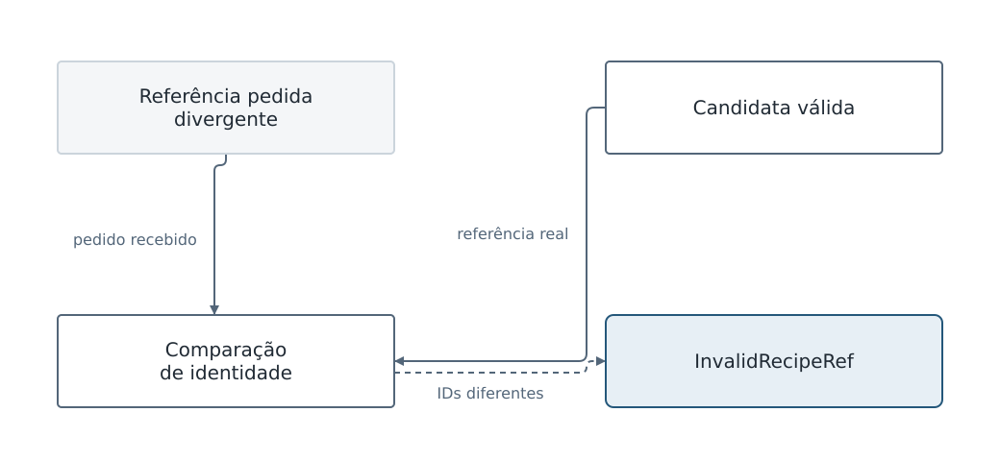

A referência rejeitada não substitui a receita já aplicada.

**Condição inicial.** Idle com candidata válida e uma receita anteriormente aplicada. Manter grants válidos e anotar a revisão aplicada; não alterar estrutura de etapas neste caso.

**Alteração.** Enviar LoadRecipe novo com RecipeID diferente da candidata; repetir a família com revisão diferente, usando outro RequestID.

**Componentes afetados.** A candidata passa na validação estrutural, mas a comparação de referências rejeita a solicitação antes de copiar dados para a receita aplicada.

**Onde observar.** stCommand.udiRecipeID/udiRecipeRevision; stRecipe; stCommandResult.eReason; stRuntime.udiRecipeID/udiRecipeRevision; evento CommandResult quando chegar à cabeça.

**Resultado esperado.** Rejected/InvalidRecipeRef. A receita antes aplicada continua carregada e seu conteúdo não muda. O evento de comando preserva a referência pedida e o contexto aplicado; não deve surgir RecipeLoaded para esse pedido rejeitado.

**Divergência a investigar.** Confundir RecipeInvalid, que trata estrutura inválida, com InvalidRecipeRef mascara a causa. Usar o mesmo RequestID para a segunda variante impede concluir que ela foi reavaliada.

**Retorno à referência.** Corrigir referência e enviar novo pedido. Manter anotadas as duas identidades no registro do teste para permitir que programação e operação expliquem a divergência sem depender de telas específicas.

**Fonte.** [src/fb/FB_Sequence.st:200-218](https://github.com/luisauguszvc95-dot/FB_Sequence/blob/00f2953808e267bfdbc637347fea88737466e5bd/src/fb/FB_Sequence.st#L200)

### SEQ-007 - Isolamento da receita aplicada

Receita aplicada | Contrato e validação | Essencial | Demo

Confirmar que os dados usados pelo lote são uma cópia consistente. A candidata pode ser preparada para uso futuro sem mudar silenciosamente o processo corrente.

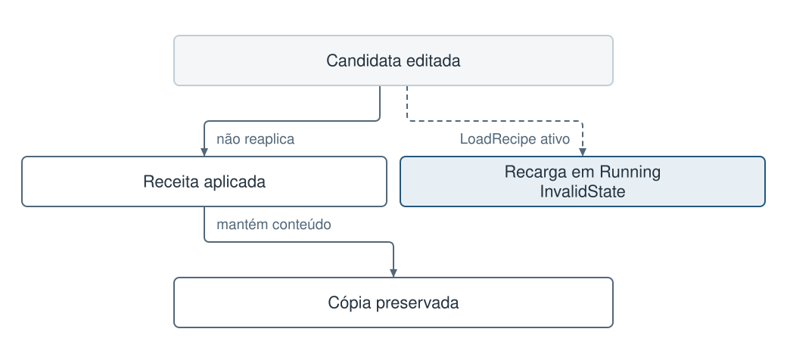

A candidata editada só pode substituir a cópia aplicada em uma nova carga admitida em Idle.

**Condição inicial.** Demo com receita de observação aplicada e lote Running na etapa temporizada, xQualified=FALSE. Anotar revisão, perfil e timeout aplicados.

**Alteração.** Alterar na candidata a revisão, o tempo qualificado e parâmetros da etapa. Depois enviar LoadRecipe novo enquanto o lote continua ativo.

**Componentes afetados.** O núcleo usa stRecipe interno copiado na carga anterior. O pedido de recarga fora de Idle falha na validação de estado; mudanças da candidata não são reaplicadas automaticamente.

**Onde observar.** W1 stRecipe e stCommand; W2 runtime.udiRecipeRevision/uiStepID; W3 stControlRequest.uiProfileID/rParameter1/rParameter2; tempo necessário quando qualificar.

**Resultado esperado.** A execução preserva a revisão e os parâmetros aplicados. LoadRecipe em Running resulta Rejected/InvalidState. A etapa não passa a usar o alvo encurtado da candidata. Não há RecipeLoaded para a tentativa rejeitada.

**Divergência a investigar.** Acelerar a etapa por ter editado apenas a candidata ou trocar parâmetros da intenção sem carga válida reprova o isolamento. Não confundir edição de entrada candidata com escrita no estado interno.

**Retorno à referência.** Encerrar e liberar o lote; Reset para Idle. Atualizar referência do próximo LoadRecipe, aplicar deliberadamente a nova revisão e verificar sua identidade antes de iniciar outro lote.

**Fonte.** [src/fb/FB_Sequence.st:200-218](https://github.com/luisauguszvc95-dot/FB_Sequence/blob/00f2953808e267bfdbc637347fea88737466e5bd/src/fb/FB_Sequence.st#L200); [tests/PRG_SEQ_LifecycleTests.st:63-67](https://github.com/luisauguszvc95-dot/FB_Sequence/blob/00f2953808e267bfdbc637347fea88737466e5bd/tests/PRG_SEQ_LifecycleTests.st#L63); [src/fb/FB_Sequence.st:476-492](https://github.com/luisauguszvc95-dot/FB_Sequence/blob/00f2953808e267bfdbc637347fea88737466e5bd/src/fb/FB_Sequence.st#L476)

### SEQ-008 - Start sem receita aplicada

Admissão de comandos | Contrato e validação | Essencial | Demo

Verificar a pré-condição de carga e diferenciar a disponibilidade do recurso da existência de uma definição de processo válida.

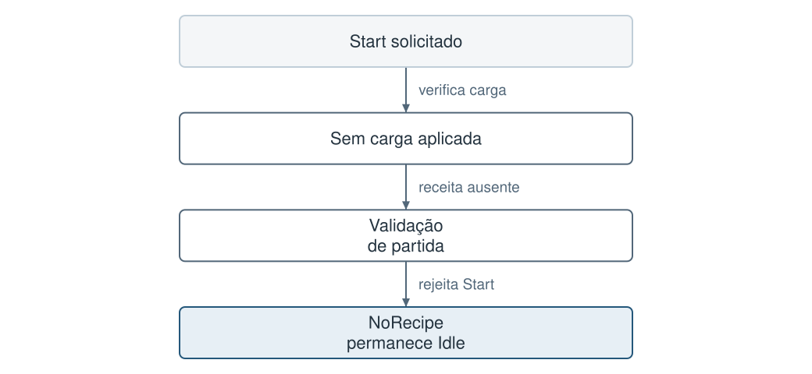

Existência da candidata e aplicação da receita são condições distintas.

**Condição inicial.** Instância nova em Idle, todos os grants e habilitadores válidos, runtime do mock fresco e Ready, recurso livre. Não executar LoadRecipe.

**Alteração.** Enviar Start novo com RecipeID e revisão da candidata original, BatchID positivo e identidade de comando correta.

**Componentes afetados.** A candidata existir em memória não equivale a receita aplicada. A validação de Start consulta xRecipeLoaded antes de emitir Acquire.

**Onde observar.** W1 stCommand; W2 stRuntime.xRecipeLoaded/eState/udiBatchID e stCommandResult; W3 stControlRequest.xValid e posse do mock.

**Resultado esperado.** Start fica Rejected/NoRecipe; estado permanece Idle e lote não é iniciado. A Sequence não copia a candidata implicitamente, não reserva recurso e não consome esse BatchID como lote iniciado. O RequestID do comando, por outro lado, já foi observado e deve avançar na correção.

**Divergência a investigar.** Gerar Acquire ou considerar a candidata carregada apenas por estar preenchida reprova o contrato. Um resultado Accepted de pedido anterior não serve como evidência deste Start.

**Retorno à referência.** Aplicar LoadRecipe válido usando novo RequestID. Confirmar receita no runtime e reenviar Start com outro RequestID; usar BatchID que satisfaça a condição de lote da instância.

**Fonte.** [src/fb/FB_Sequence.st:220-249](https://github.com/luisauguszvc95-dot/FB_Sequence/blob/00f2953808e267bfdbc637347fea88737466e5bd/src/fb/FB_Sequence.st#L220)

### SEQ-009 - Start, Acquire e token de recurso

Admissão de comandos | Funcional | Essencial | Demo

Separar admissão do comando, pedido de posse e execução efetiva. O setor deve conseguir localizar em qual camada a partida está aguardando.

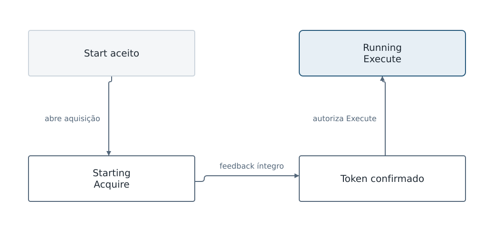

O mock consome a intenção do ciclo anterior; a correlação determina a passagem para Running.

**Condição inicial.** Demo em Idle com receita aplicada; mock, Sequence e três grants ativos. xQualified=FALSE evita avanço imediato; recurso deve estar livre.

**Alteração.** Enviar Start novo, BatchID maior que qualquer lote iniciado nessa sessão, referência igual à receita aplicada.

**Componentes afetados.** O comando admitido cria estado Starting e intenção Acquire. No ciclo seguinte, o mock responde à intenção anterior; a Sequence só avança com resultado e runtime correlacionados e token positivo coerente.

**Onde observar.** W2 stCommandResult.eResult/eStateAfter e stRuntime.eState/udiResourceToken; W3 stControlRequest.eAction/udiIntentID e result/runtime do mock.

**Resultado esperado.** Start Accepted leva primeiro a Starting/Acquire; confirmação de aquisição permite Running e intenção Execute com outro IntentID. Resultado Accepted do comando não certifica etapa completa. O token publicado pela Sequence deve coincidir com a posse do mock.

**Divergência a investigar.** Pular para execução sem feedback de aquisição ou usar token zero em Running são desvios. Contar um atraso de um scan do mock como falha sem consultar o contrato é interpretação incorreta.

**Retorno à referência.** Manter qualificação bloqueada para observar a etapa. Encerrar por Stop ou concluir processo, aguardar Release e Reset antes de outra partida independente.

**Fonte.** [src/fb/FB_Sequence.st:220-249](https://github.com/luisauguszvc95-dot/FB_Sequence/blob/00f2953808e267bfdbc637347fea88737466e5bd/src/fb/FB_Sequence.st#L220); [src/fb/FB_Sequence.st:354-363](https://github.com/luisauguszvc95-dot/FB_Sequence/blob/00f2953808e267bfdbc637347fea88737466e5bd/src/fb/FB_Sequence.st#L354)

### SEQ-010 - Referência de Start diferente da aplicada

Admissão de comandos | Contrato e validação | Completa | Demo

Verificar que a partida identifica exatamente a definição de processo aplicada. Isso evita atribuir execução a uma revisão que nunca foi carregada.

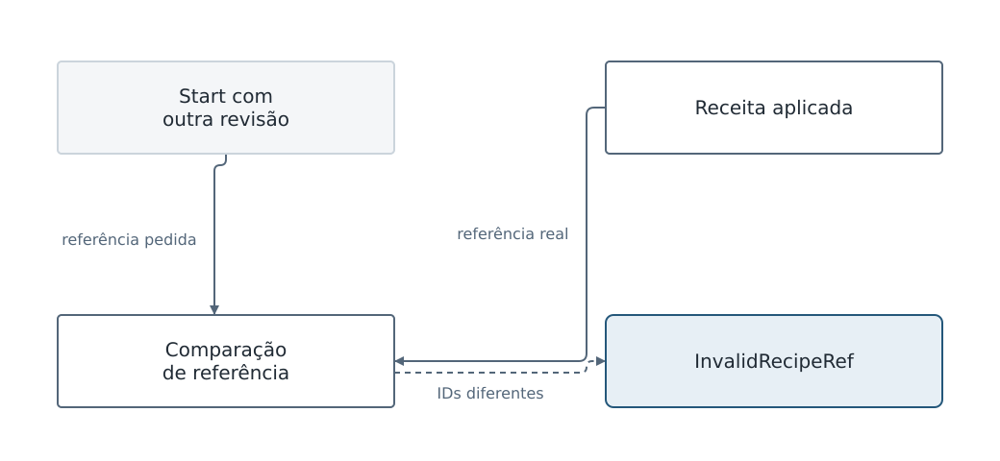

A revisão do lote é a revisão aplicada, não a referência de uma tentativa rejeitada.

**Condição inicial.** Idle com receita válida aplicada; runtime do Control fresco, Ready e livre; permissões e habilitadores válidos. Não alterar a candidata durante esta ficha.

**Alteração.** Enviar Start novo com RecipeID ou revisão divergente da receita aplicada. Depois corrigir a referência com outro RequestID.

**Componentes afetados.** Start compara a referência do pedido com a cópia aplicada; a validação ocorre antes de capturar BatchID e antes de gerar Acquire.

**Onde observar.** stCommand.udiRecipeID/udiRecipeRevision; stRuntime.udiRecipeID/udiRecipeRevision/udiBatchID; stCommandResult.eReason; stControlRequest.

**Resultado esperado.** Pedido divergente é Rejected/InvalidRecipeRef, permanece Idle e não toma posse. Após correção completa, o novo pedido pode iniciar normalmente. O lote da tentativa rejeitada não é considerado iniciado apenas por ter aparecido no envelope de comando.

**Divergência a investigar.** Aplicar automaticamente a revisão pedida ou reservar recurso durante a rejeição reprova o caso. Conferir somente o nome da receita na interface não substitui comparar ID e revisão.

**Retorno à referência.** Retirar xValid; corrigir ambos os campos da referência conforme o runtime aplicado. Repetir com novo RequestID e controlar o BatchID utilizado pela partida admitida.

**Fonte.** [src/fb/FB_Sequence.st:227-239](https://github.com/luisauguszvc95-dot/FB_Sequence/blob/00f2953808e267bfdbc637347fea88737466e5bd/src/fb/FB_Sequence.st#L227)

### SEQ-011 - BatchID positivo e crescente na sessão

Admissão de comandos | Contrato e validação | Essencial | Demo

Manter identidade única de lotes admitidos mesmo quando o estado volta a Idle. Essa regra protege a leitura posterior dos eventos e dos comandos associados.

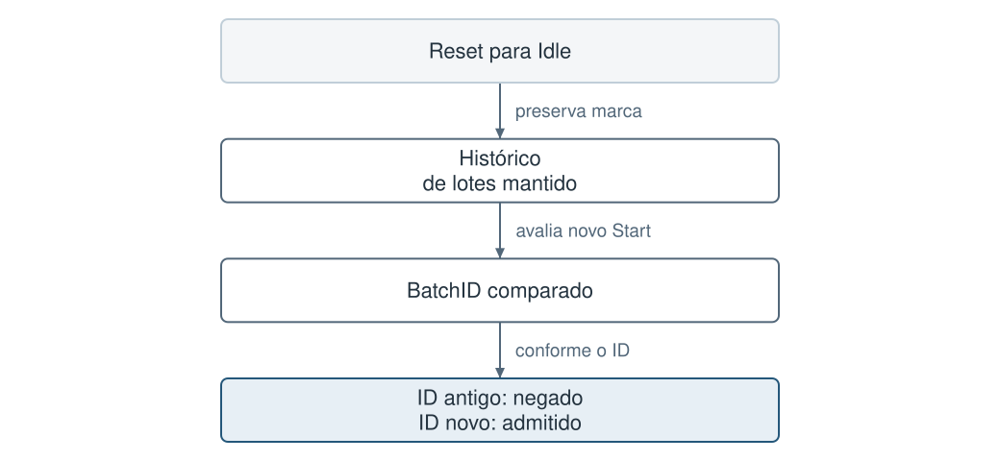

Reset encerra o contexto corrente sem reciclar a identidade dos lotes da sessão.

**Condição inicial.** Uma execução já iniciada com BatchID B e encerrada, liberada e resetada. Mesma instância e sessão; receita continua aplicada.

**Alteração.** Enviar Start novo com BatchID zero, com B e com valor menor que B, em tentativas separadas. Depois usar um valor maior que B.

**Componentes afetados.** O núcleo preserva o maior lote iniciado em udiLastBatchID. Reset limpa o lote corrente publicado, mas não apaga o histórico de admissão da sessão.

**Onde observar.** stCommand.udiBatchID/udiRequestID; stCommandResult.eReason; stRuntime.eState/udiBatchID; stControlRequest.xValid.

**Resultado esperado.** Zero e IDs já ultrapassados recebem Rejected/InvalidRequest. Um BatchID maior pode ser aceito se as demais pré-condições forem válidas. Tentativas rejeitadas consomem RequestID, não atualizam o maior lote admitido.

**Divergência a investigar.** Aceitar novamente B após Reset reprova a identidade de sessão. Reinicializar somente para contornar a regra descaracteriza o teste e pode ocultar a colisão que ele pretende detectar.

**Retorno à referência.** Usar sempre novo RequestID e próximo BatchID maior. Se houver recomeço da instância por projeto, estabelecer uma nova sessão no chamador antes da primeira chamada e registrar a mudança.

**Fonte.** [src/fb/FB_Sequence.st:233-245](https://github.com/luisauguszvc95-dot/FB_Sequence/blob/00f2953808e267bfdbc637347fea88737466e5bd/src/fb/FB_Sequence.st#L233); [src/fb/FB_Sequence.st:286-304](https://github.com/luisauguszvc95-dot/FB_Sequence/blob/00f2953808e267bfdbc637347fea88737466e5bd/src/fb/FB_Sequence.st#L286)

### SEQ-012 - Runtime não pronto ou recurso já ocupado

Admissão de comandos | Contrato e validação | Completa | bancada dedicada

Verificar a condição de disponibilidade exigida antes de uma nova aquisição. A validade do envelope, seu frescor e a ausência de posse fazem parte da prontidão.

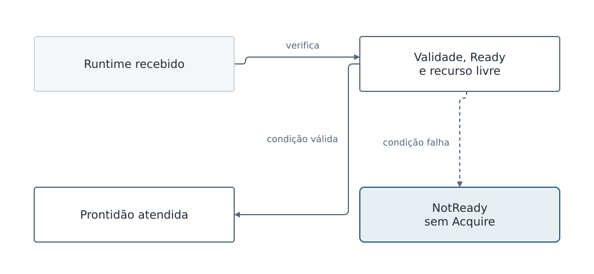

A disponibilidade para iniciar exige o conjunto das condições, não apenas um bit Ready.

**Condição inicial.** Bancada dedicada com Idle e receita aplicada. Usar cópias explícitas de feedback como entradas do FB; manter autoridade e comando corretos.

**Alteração.** Comparar runtime inválido, idade vencida, xReady=FALSE, xFaulted=TRUE ou xResourceGranted=TRUE. Fazer uma variante por chamada de Start novo, mantendo as demais condições válidas.

**Componentes afetados.** A admissão consulta runtime fresco e pronto sem falha nem recurso concedido. O bloco não tenta resolver uma posse prévia por meio de Start.

**Onde observar.** stControlRuntime.xValid/udiAgeMs/xReady/xFaulted/xResourceGranted; stCommandResult.eReason; stRuntime.eState; stControlRequest.xValid.

**Resultado esperado.** Cada condição impeditiva gera Rejected/NotReady em Idle e nenhuma intenção Acquire. Um runtime limpo e correlacionado permite a tentativa seguinte. A regra de falha do Control em lote ativo não deve ser confundida com esta rejeição de partida.

**Divergência a investigar.** Aceitar Start com recurso já concedido ou usar Ready de envelope inválido reprova o caso. A Demo republica idade e identidade a cada ciclo, por isso exige bancada dedicada para essas variantes.

**Retorno à referência.** Restaurar o feedback público de entrada e usar RequestID novo. Não limpar posse escrevendo saídas do mock; representar a liberação por uma resposta coerente na bancada.

**Fonte.** [src/fb/FB_Sequence.st:233-238](https://github.com/luisauguszvc95-dot/FB_Sequence/blob/00f2953808e267bfdbc637347fea88737466e5bd/src/fb/FB_Sequence.st#L233)

### SEQ-013 - Comando operacional com BatchID divergente

Admissão de comandos | Contrato e validação | Essencial | Demo

Verificar a separação entre comandos da sessão e comandos destinados ao lote ativo. A interface deve correlacionar a ação com o contexto que está exibindo.

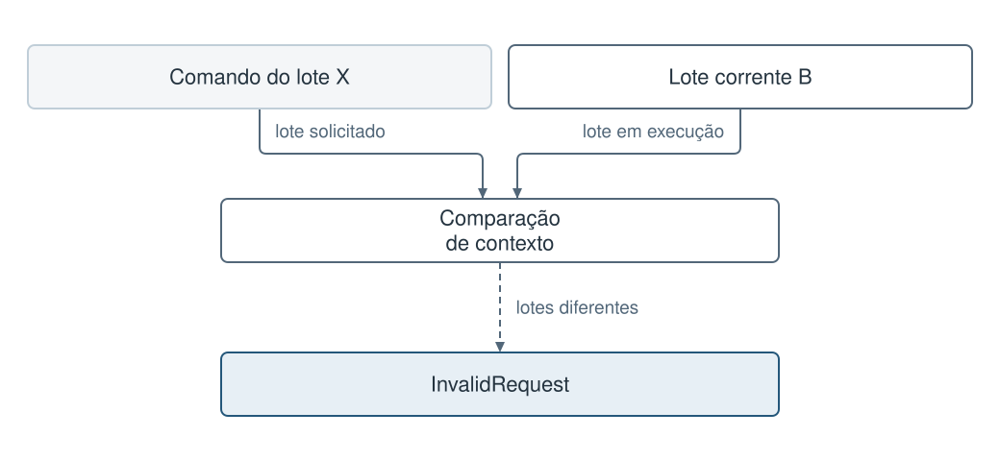

A identidade de lote é validada antes da transição operacional.

**Condição inicial.** Demo em Running, ou Held para Resume, com lote B identificado. Publicação e requests permitidos; manter processo estável enquanto observa.

**Alteração.** Enviar Hold, Stop ou Abort com BatchID diferente de B e novo RequestID. Usar Resume e Reset apenas nos seus estados apropriados em variações separadas.

**Componentes afetados.** Antes do CASE de estados, o núcleo compara BatchID para Hold, Resume, Stop, Abort e Reset. Divergência impede a ação mesmo que o nome do comando fosse válido naquele estado.

**Onde observar.** stCommand.udiBatchID/eCommand; stRuntime.udiBatchID/eState; stCommandResult.eReason; stControlRequest.eAction/udiIntentID.

**Resultado esperado.** Rejected/InvalidRequest. O estado e a intenção do lote corrente permanecem associados a B; o pedido não abre um novo lote nem substitui a ação corrente. ConfirmStep possui sua validação específica de lote, etapa e prompt.

**Divergência a investigar.** Alterar estado do lote B por uma ação endereçada a outro lote reprova isolamento. Reenviar a correção mantendo o mesmo RequestID não prova que o núcleo recebeu novo pedido.

**Retorno à referência.** Copiar o BatchID publicado válido e enviar novo RequestID. Registrar tanto a identidade solicitada quanto a corrente para permitir diagnóstico de tela desatualizada ou comando fora de contexto.

**Fonte.** [src/fb/FB_Sequence.st:190-199](https://github.com/luisauguszvc95-dot/FB_Sequence/blob/00f2953808e267bfdbc637347fea88737466e5bd/src/fb/FB_Sequence.st#L190)

### SEQ-014 - Comando incompatível com o estado

Admissão de comandos | Contrato e validação | Completa | Demo

Verificar a tabela de admissibilidade dos comandos e tornar explícita a diferença entre identidade válida e ação permitida no momento.

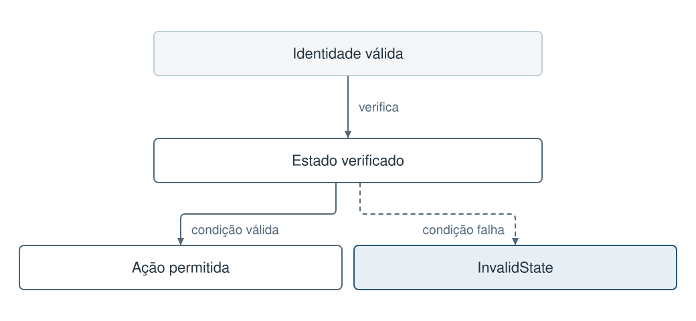

Um envelope correto ainda depende da admissibilidade da ação no estado atual.

**Condição inicial.** Demo com autoridade válida, comandos corretos e estado observado com xDataValid=TRUE. Escolher Idle, Running e Held obtidos por transições normais.

**Alteração.** Enviar Hold em Idle, Resume em Running ou Start em Held, cada qual com RequestID novo e contexto de lote apropriado.

**Componentes afetados.** O gate aprova a identidade, mas o CASE do núcleo exige o estado de origem correspondente. Quando nenhuma condição da ação é satisfeita, conserva InvalidState.

**Onde observar.** stCommand.eCommand/udiRequestID; stCommandResult.eResult/eReason/eStateAfter; stRuntime.eState; stControlRequest.eAction.

**Resultado esperado.** Cada tentativa recebe Rejected/InvalidState e mantém a máquina de estados na condição anterior. O evento CommandResult registra a tentativa, mas não deve existir StateChanged provocado por ela. O ciclo de processo pode evoluir por causas independentes; estabilizar os critérios durante a comparação.

**Divergência a investigar.** Um Accepted sem transição permitida ou um salto de estado decorrente da ação incompatível reprova o caso. Não usar BatchID errado, pois InvalidRequest teria prioridade e mascararia o teste de estado.

**Retorno à referência.** Retirar o comando e escolher a ação compatível com o estado publicado. Para nova variante, obter o estado por comandos normais e manter a identificação crescente.

**Fonte.** [src/fb/FB_Sequence.st:198-323](https://github.com/luisauguszvc95-dot/FB_Sequence/blob/00f2953808e267bfdbc637347fea88737466e5bd/src/fb/FB_Sequence.st#L198)

### SEQ-015 - Qualificação vinculada ao Execute corrente

Critérios de etapa | Limites e temporização | Essencial | Demo

Confirmar que o tempo útil pertence à execução efetiva da etapa, e não à aceitação do Start ou à aquisição do recurso.

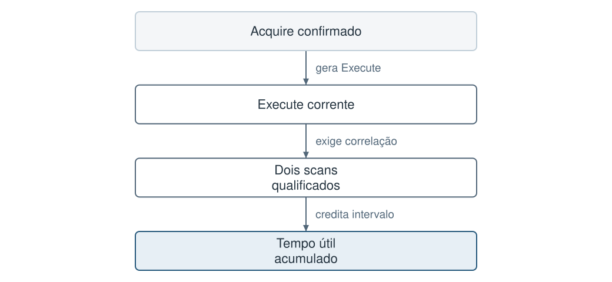

A qualificação começa na transação Execute e só credita intervalos comprovados.

**Condição inicial.** Demo com receita temporizada aplicada e xQualified=TRUE desde antes do Start. Manter o alvo de observação suficientemente longo para acompanhar scans.

**Alteração.** Iniciar lote e observar a passagem de Acquire para Execute. Comparar o instante de Running, o primeiro feedback de Execute e o primeiro incremento de tempo qualificado.

**Componentes afetados.** O núcleo exige resultado e runtime da intenção Execute corrente, Ready e token coerente. Ainda exige qualificação válida no ciclo anterior para creditar o intervalo.

**Onde observar.** stControlRequest.eAction/udiIntentID; stControlResult.udiIntentID; stRuntime.eState/udiQualifiedElapsedMs/udiStepElapsedMs; xQualified do mock.

**Resultado esperado.** Acquire aceito não acumula tempo qualificado. Na entrada em Running e no primeiro feedback qualificado da nova transação, o acumulado ainda não recebe aquele intervalo anterior; depois cresce com o delta dos intervalos qualificados. O teste nativo de lifecycle demonstra essa defasagem com scans de 10 ms.

**Divergência a investigar.** Creditar tempo antes do Execute correlacionado ou herdar qualificação da etapa anterior reprova o caso. Não comparar diretamente o relógio de parede com os 20 ms sintéticos da Demo.

**Retorno à referência.** Bloquear qualificação para inspecionar valores, depois retomar ou encerrar. Registrar a sequência de IntentID, estado e acumulado por scan para tornar a evidência reproduzível.

**Fonte.** [src/fb/FB_Sequence.st:124-132](https://github.com/luisauguszvc95-dot/FB_Sequence/blob/00f2953808e267bfdbc637347fea88737466e5bd/src/fb/FB_Sequence.st#L124); [src/fb/FB_Sequence.st:326-347](https://github.com/luisauguszvc95-dot/FB_Sequence/blob/00f2953808e267bfdbc637347fea88737466e5bd/src/fb/FB_Sequence.st#L326); [tests/PRG_SEQ_LifecycleTests.st:170-191](https://github.com/luisauguszvc95-dot/FB_Sequence/blob/00f2953808e267bfdbc637347fea88737466e5bd/tests/PRG_SEQ_LifecycleTests.st#L170)

### SEQ-016 - Pausa da qualificação sem apagar acumulado

Critérios de etapa | Limites e temporização | Essencial | Demo

Distinguir tempo decorrido da etapa de tempo em condição qualificada. Essa leitura permite explicar por que uma etapa continua ativa embora tenha permanecido muito tempo em Running.

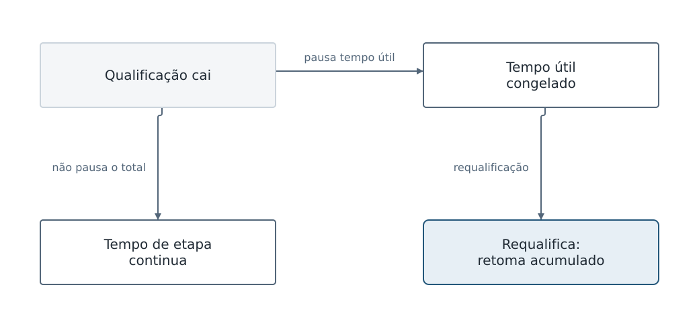

Perder a condição pausa o tempo útil, mas o prazo total da etapa continua vigente.

**Condição inicial.** Demo Running na etapa WaitQualified com alvo de observação longo; já existir tempo qualificado acumulado, mas menor que o alvo.

**Alteração.** Mudar xQualified para FALSE, manter por alguns ciclos e depois retornar TRUE sem trocar etapa ou enviar Hold.

**Componentes afetados.** O timer preserva o acumulado quando a condição não qualifica. O relógio de etapa continua contando Running; a volta da qualificação requer novamente a condição do intervalo anterior.

**Onde observar.** stRuntime.udiQualifiedElapsedMs/udiStepElapsedMs/uiStepID/eState; xQualified; stControlRequest.eAction e correlação do feedback.

**Resultado esperado.** Tempo qualificado fica estável na interrupção e continua do valor preservado após requalificação. Tempo de etapa cresce e pode alcançar o timeout mesmo sem atingir o alvo qualificado. Não existe regra de zerar o acumulado a cada perda de qualificação nesta implementação.

**Divergência a investigar.** Acumular durante FALSE ou zerar sem troca de etapa reprova o comportamento. Confundir tempo útil com tempo total pode levar a uma expectativa incorreta de término imediato após retorno.

**Retorno à referência.** Restaurar xQualified conforme o próximo ensaio. Se o timeout ocorrer, seguir cleanup e Reset; para repetir, usar outro lote com condições iniciais registradas.

**Fonte.** [src/fb/FB_Sequence.st:326-347](https://github.com/luisauguszvc95-dot/FB_Sequence/blob/00f2953808e267bfdbc637347fea88737466e5bd/src/fb/FB_Sequence.st#L326); [src/fb/FB_SEQ_QualifiedTimer.st:19-32](https://github.com/luisauguszvc95-dot/FB_Sequence/blob/00f2953808e267bfdbc637347fea88737466e5bd/src/fb/FB_SEQ_QualifiedTimer.st#L19)

### SEQ-017 - WaitComplete exige condição qualificada

Critérios de etapa | Funcional | Essencial | Demo

Verificar a combinação de feedback necessária para concluir uma etapa controlada por resultado externo. A Sequence consome a evidência entregue pelo Control, sem assumir conclusão pela aceitação da intenção.

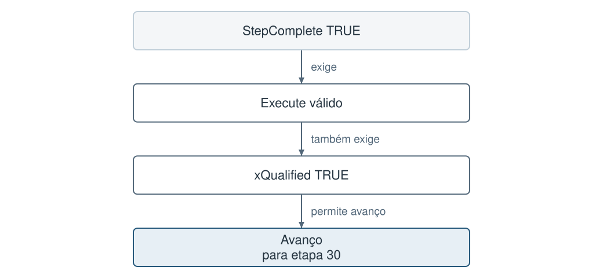

A conclusão externa só vale enquanto a etapa corrente está qualificada.

**Condição inicial.** Demo na etapa 20, WaitComplete. Obter essa etapa concluindo a temporizada; manter xFinishActions separado, pois ele se refere a ações de lifecycle.

**Alteração.** Comparar xStepComplete=TRUE com xQualified=FALSE e depois ambos TRUE, mantendo Execute correlacionado e recurso válido.

**Componentes afetados.** A regra de término combina xQualified e xStepComplete. A qualificação já incorpora Ready, ausência de falha, posse e identidade da transação corrente.

**Onde observar.** W1 xQualified/xStepComplete; W2 stRuntime.uiStepID/uiStepIndex; W3 runtime do mock e stControlRequest.eAction/udiIntentID.

**Resultado esperado.** Somente StepComplete não avança. Com as duas condições e feedback válido, avança à etapa 30 uma vez e cria nova intenção para a nova etapa. xAccepted do mock pode permanecer TRUE durante toda a espera, sem significar conclusão de etapa.

**Divergência a investigar.** Avançar apenas por aceitação ou apenas pelo bit de conclusão reprova a condição. Um token ou IntentID errado testa correlação e deve ser isolado em outra bancada, não misturado a esta ficha.

**Retorno à referência.** Retirar xStepComplete após a transição e preparar o ensaio do prompt. Se repetir, usar lote novo e registrar o momento em que cada condição passou a TRUE.

**Fonte.** [src/fb/FB_Sequence.st:364-381](https://github.com/luisauguszvc95-dot/FB_Sequence/blob/00f2953808e267bfdbc637347fea88737466e5bd/src/fb/FB_Sequence.st#L364)

### SEQ-018 - WaitOperator com confirmação contextual

Critérios de etapa | Funcional | Essencial | Demo

Demonstrar que a confirmação humana é uma transação identificada, vinculada ao lote e ao prompt atual, e que ainda depende da condição de execução da etapa.

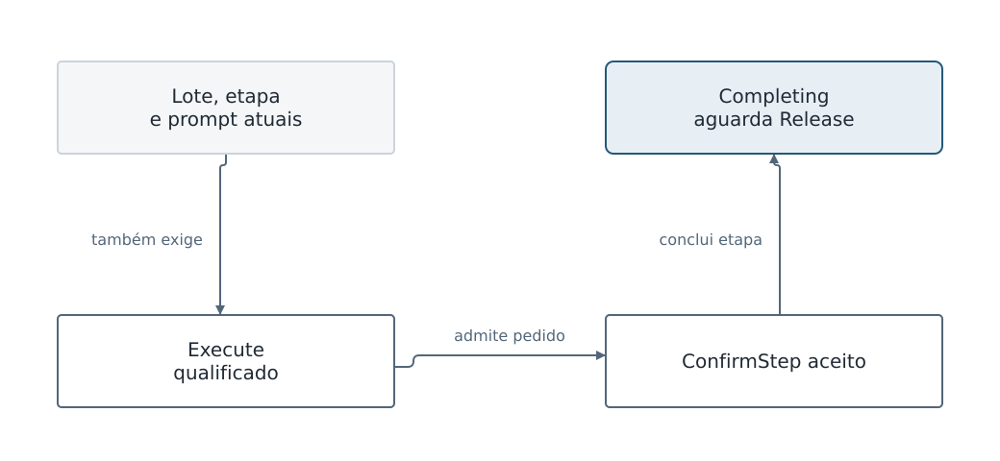

Confirmar a última etapa inicia o encerramento; o recurso ainda precisa ser liberado.

**Condição inicial.** Demo Running na etapa 30, xWaitingOperator=TRUE; xQualified=TRUE, feedback Execute já correlacionado. Publicação e requests permitidos.

**Alteração.** Enviar ConfirmStep com BatchID, StepID e PromptID lidos do runtime válido e novo RequestID; manter condições de processo estáveis durante a avaliação.

**Componentes afetados.** O núcleo compara o contexto completo e verifica a execução qualificada. Confirm admitido participa do critério da etapa; sendo a última da receita, abre o encerramento normal.

**Onde observar.** stCommand.udiBatchID/uiStepID/udiPromptID; stRuntime.xWaitingOperator/udiPromptID/eState; stCommandResult; intenção Complete e evento PromptConfirmed.

**Resultado esperado.** Accepted/None. A última etapa termina e entra em Completing, com intenção Complete; o estado Complete ainda depende de término da ação e Release. A confirmação gera evidência própria de operador além do resultado do comando.

**Divergência a investigar.** Chegar diretamente a Complete com recurso ainda concedido ou aceitar confirmação sem prompt válido reprova o caso. O ACK de um evento não substitui ConfirmStep.

**Retorno à referência.** Retirar xValid do comando; permitir xFinishActions=TRUE para concluir encerramento e liberação. Reset após a condição terminal; o próximo prompt não deve reutilizar o anterior na mesma sessão.

**Fonte.** [src/fb/FB_Sequence.st:306-324](https://github.com/luisauguszvc95-dot/FB_Sequence/blob/00f2953808e267bfdbc637347fea88737466e5bd/src/fb/FB_Sequence.st#L306); [src/fb/FB_Sequence.st:370-380](https://github.com/luisauguszvc95-dot/FB_Sequence/blob/00f2953808e267bfdbc637347fea88737466e5bd/src/fb/FB_Sequence.st#L370)

### SEQ-019 - Rejeição de confirmação fora do contexto

Critérios de etapa | Contrato e validação | Essencial | Demo

Proteger a etapa de operador contra comando atrasado, tela desatualizada ou condição de processo ainda inadequada. Cada rejeição deve preservar a espera atual.

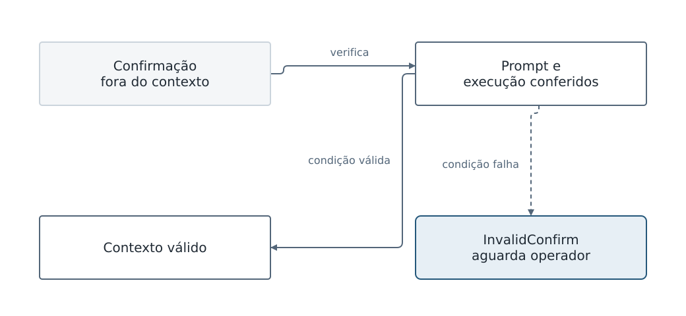

A correção exige um novo pedido com contexto atual e condição qualificada.

**Condição inicial.** Demo na etapa WaitOperator com prompt P e lote B. Para variante Ready falso ou feedback divergente, usar bancada dedicada com entradas controladas.

**Alteração.** Enviar ConfirmStep novo alterando um campo por vez: lote, StepID, PromptID ou PromptID zero. Em outro pedido, usar contexto correto com xQualified=FALSE.

**Componentes afetados.** A condição de confirmação exige igualdade do contexto, prompt positivo e Execute qualificado. Qualquer falha nessa conjunção conserva a etapa sem produzir confirmação válida.

**Onde observar.** stCommand; stRuntime.uiStepID/udiPromptID/xWaitingOperator; stCommandResult.eReason; eventos da tentativa; estado do feedback no momento do pedido.

**Resultado esperado.** Rejected/InvalidConfirm enquanto Running e aguardando operador. O prompt permanece pendente, não ocorre StepFinished nem PromptConfirmed para a tentativa rejeitada. ConfirmStep fora de Running/espera recebe InvalidState, por outro ramo da validação.

**Divergência a investigar.** Consumir prompt incorreto ou avançar apesar de qualificação ausente reprova o caso. Não reaproveitar RequestID ao corrigir os campos, pois o gate poderia suprimir a tentativa.

**Retorno à referência.** Restaurar o contexto publicado e a qualificação. Confirmar usando novo RequestID somente quando a intenção Execute e o runtime forem válidos; preservar as identidades rejeitadas na evidência.

**Fonte.** [src/fb/FB_Sequence.st:306-324](https://github.com/luisauguszvc95-dot/FB_Sequence/blob/00f2953808e267bfdbc637347fea88737466e5bd/src/fb/FB_Sequence.st#L306)

### SEQ-020 - Hold confirmado sem perder progresso

Pausa e encerramento | Funcional | Essencial | Demo

Separar o pedido de pausa da confirmação do Control, preservando a receita, a posse e os tempos já acumulados da etapa.

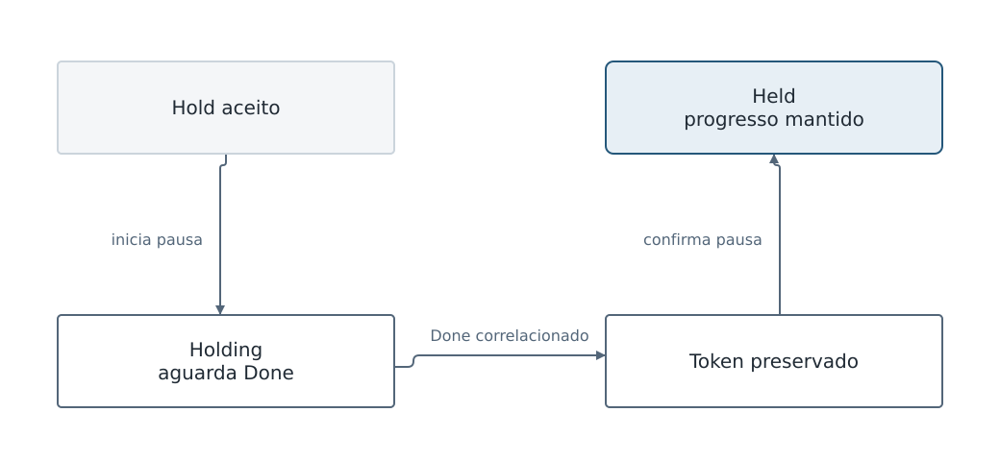

A pausa conserva a posse e só é confirmada após o retorno da ação Hold.

**Condição inicial.** Demo Running com algum tempo qualificado acumulado. xFinishActions=FALSE antes do pedido, permissões mantidas; reservar margem para não atingir o timeout de Holding.

**Alteração.** Enviar Hold novo para o lote corrente. Observar Holding; depois permitir xFinishActions=TRUE no mock.

**Componentes afetados.** O comando muda estado para Holding e gera intenção Hold. O runtime só chega a Held quando resultado e runtime correlacionados conservam o token e a ação sinaliza xDone.

**Onde observar.** stRuntime.eState/udiQualifiedElapsedMs/udiStepElapsedMs/udiResourceToken; stControlRequest.eAction; result.xAccepted/xDone e posse do mock.

**Resultado esperado.** Hold Accepted pode coexistir com Holding por vários ciclos. Quando Done chega, fica Held com token preservado; tempo qualificado permanece congelado, sem zerar. A pausa não libera o recurso nem encerra o lote, e o feedback de Hold não representa Execute.

**Divergência a investigar.** Publicar Held antes de Done, perder o acumulado ou assumir recurso livre em Held reprova o caso. Não manter Holding além do limite e depois atribuir TransitionTimeout ao Hold normal.

**Retorno à referência.** Manter grants e token; usar Resume contextual ou encerrar por Stop. Para observar a espera novamente, começar de Running e controlar xFinishActions antes do próximo pedido.

**Fonte.** [src/fb/FB_Sequence.st:250-256](https://github.com/luisauguszvc95-dot/FB_Sequence/blob/00f2953808e267bfdbc637347fea88737466e5bd/src/fb/FB_Sequence.st#L250); [src/fb/FB_Sequence.st:387-396](https://github.com/luisauguszvc95-dot/FB_Sequence/blob/00f2953808e267bfdbc637347fea88737466e5bd/src/fb/FB_Sequence.st#L387)

### SEQ-021 - Resume requer novo Execute

Pausa e encerramento | Contrato e validação | Essencial | bancada dedicada

Verificar a retomada sem creditar como execução um intervalo que ainda estava associado à pausa. A continuidade do acumulado não dispensa nova correlação.

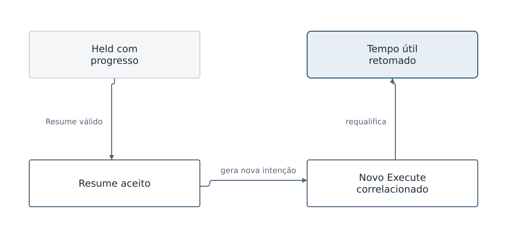

A retomada preserva progresso e abre uma transação Execute nova.

**Condição inicial.** Demo em Held com tempo qualificado preservado e token válido. Para qualificação artificial no feedback de Hold, usar PRG_SEQ_LifecycleTests ou bancada que copie explicitamente o runtime.

**Alteração.** Enviar Resume novo com contexto correto; observar o feedback de Hold ainda presente no primeiro ciclo e o Execute criado para a retomada.

**Componentes afetados.** Resume verifica prontidão, feedback e posse. A ação muda para Execute com novo IntentID; somente a transação corrente pode reativar qualificação e contagem de tempo útil.

**Onde observar.** stRuntime.eState/udiQualifiedElapsedMs; stControlRequest.eAction/udiIntentID; stControlResult.udiIntentID; token; resultado do comando Resume.

**Resultado esperado.** Com pré-condições válidas, Resume Accepted retorna a Running. O acumulado anterior é preservado, mas os primeiros intervalos sem Execute qualificado não são somados. Ready ausente ou posse inconsistente impede a admissão com NotReady.

**Divergência a investigar.** Usar feedback de Hold para adiantar tempo após Resume reprova o caso. Simplesmente deixar xQualified=TRUE no mock não transforma a intenção anterior em Execute.

**Retorno à referência.** Aguardar correlação da nova intenção e continuar a etapa; registrar IntentID anterior e posterior. Se a retomada for rejeitada, corrigir as condições e usar novo RequestID.

**Fonte.** [src/fb/FB_Sequence.st:257-268](https://github.com/luisauguszvc95-dot/FB_Sequence/blob/00f2953808e267bfdbc637347fea88737466e5bd/src/fb/FB_Sequence.st#L257); [tests/PRG_SEQ_LifecycleTests.st:48-70](https://github.com/luisauguszvc95-dot/FB_Sequence/blob/00f2953808e267bfdbc637347fea88737466e5bd/tests/PRG_SEQ_LifecycleTests.st#L48); [tests/PRG_SEQ_LifecycleTests.st:181-193](https://github.com/luisauguszvc95-dot/FB_Sequence/blob/00f2953808e267bfdbc637347fea88737466e5bd/tests/PRG_SEQ_LifecycleTests.st#L181)

### SEQ-022 - Encerramento normal em duas confirmações

Pausa e encerramento | Funcional | Essencial | Demo

Conferir a fronteira entre terminar o processo e liberar o recurso. Esse teste permite explicar uma sequência em Completing mesmo após a confirmação da última etapa.

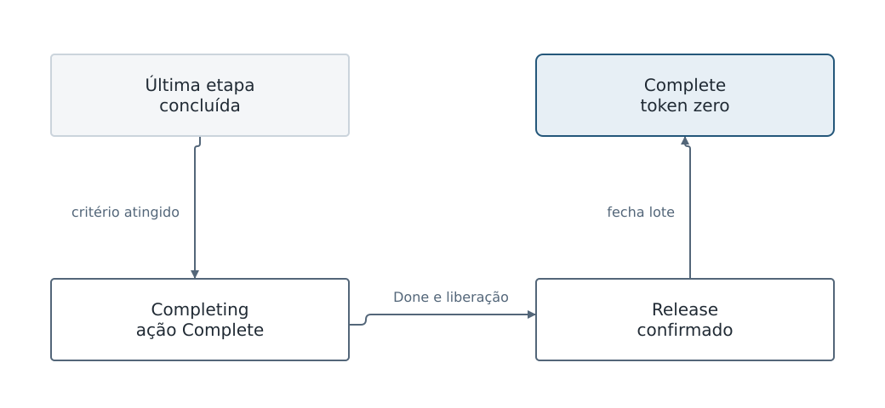

Encerramento do processo e liberação do recurso são confirmações separadas.

**Condição inicial.** Demo na última etapa com condição de término disponível. xFinishActions=FALSE para observar Complete pendente; grants preservados e ACKs controlados.

**Alteração.** Concluir a última etapa; depois mudar xFinishActions para TRUE. Acompanhar a intenção Complete e, em seguida, Release.

**Componentes afetados.** O núcleo abre Completing. Done da ação Complete autoriza pedir Release; a confirmação de liberação exige resultado e runtime coerentes, sem recurso concedido.

**Onde observar.** stRuntime.eState/udiResourceToken; stControlRequest.eAction/udiIntentID; result.xDone/xReleased/xResourceGranted; runtime.xResourceGranted.

**Resultado esperado.** Completing persiste enquanto Complete não está Done. Depois aparece Release com novo IntentID. Só a liberação confirmada leva a Complete, token zero e intenção inválida. Accepted do comando de confirmação ou da ação Complete não certifica liberação.

**Divergência a investigar.** Publicar Complete com posse ainda TRUE ou liberar só porque Complete foi aceito reprova o caso. Espera longa pode atingir o timeout de transição e deve ser registrada separadamente.

**Retorno à referência.** Com estado Complete e recurso livre, enviar Reset contextual com novo RequestID. Verificar Idle antes de iniciar outro lote; preservar eventos suficientes para comprovar as duas fases.

**Fonte.** [src/fb/FB_Sequence.st:397-414](https://github.com/luisauguszvc95-dot/FB_Sequence/blob/00f2953808e267bfdbc637347fea88737466e5bd/src/fb/FB_Sequence.st#L397)

### SEQ-023 - Parada controlada até Stopped

Pausa e encerramento | Funcional | Essencial | Demo

Verificar o percurso de parada solicitado durante uma execução e sua conclusão somente após encerramento e liberação do recurso.

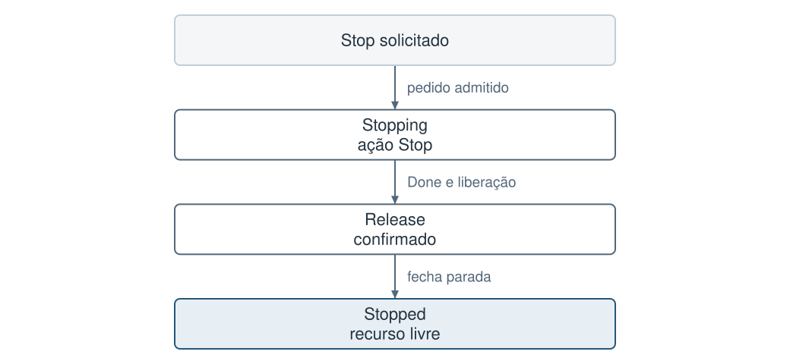

Stop conclui em Stopped após a mesma obrigação de liberação do recurso.

**Condição inicial.** Demo com lote Running ou Held; preparar Stop com BatchID corrente. Manter requests/publicação permitidos e xFinishActions=FALSE para observar a espera.

**Alteração.** Enviar Stop novo, observar intenção Stop e depois permitir xFinishActions=TRUE.

**Componentes afetados.** A admissão leva a Stopping. Done de Stop inicia Release; o retorno da liberação encerra a posse e determina o terminal Stopped, preservando a identidade do lote até Reset.

**Onde observar.** stCommandResult; stRuntime.eState/udiBatchID/udiResourceToken; stControlRequest.eAction; result.xDone/xReleased e runtime.xResourceGranted.

**Resultado esperado.** Stop Accepted não é Stopped imediato. O percurso é Stopping/Stop, Stopping/Release e Stopped com token zero. Não é necessário terminar o critério da etapa para atender à parada. A intenção fica inválida após fechamento confirmado.

**Divergência a investigar.** Chegar a Complete em vez de Stopped, continuar Execute após a parada admitida ou concluir terminal com recurso concedido reprova a semântica. Confrontar a identidade do resultado evita usar retorno antigo.

**Retorno à referência.** Manter condições de liberação até terminal; enviar Reset com novo RequestID e BatchID do lote parado. Uma nova partida deve usar BatchID maior, mesmo que a receita não tenha sido concluída.

**Fonte.** [src/fb/FB_Sequence.st:269-280](https://github.com/luisauguszvc95-dot/FB_Sequence/blob/00f2953808e267bfdbc637347fea88737466e5bd/src/fb/FB_Sequence.st#L269); [src/fb/FB_Sequence.st:397-414](https://github.com/luisauguszvc95-dot/FB_Sequence/blob/00f2953808e267bfdbc637347fea88737466e5bd/src/fb/FB_Sequence.st#L397)

### SEQ-024 - Abort solicitado até Aborted

Pausa e encerramento | Funcional | Completa | Demo

Distinguir cancelamento explícito do lote de uma falha latente do núcleo. Ambos podem usar uma intenção Abort para cleanup, mas o estado terminal esperado é diferente.

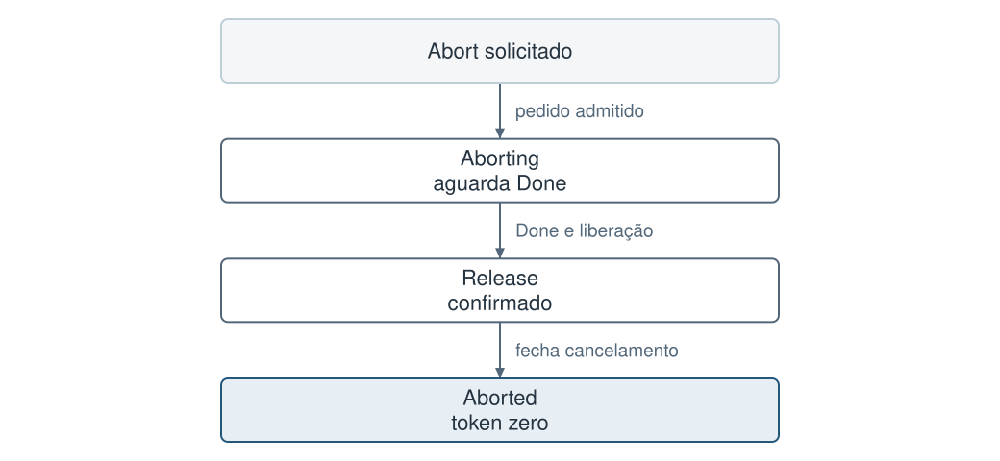

Cancelamento solicitado termina Aborted; uma falha continua Faulted após cleanup.

**Condição inicial.** Demo com lote ativo e requests/publicação permitidos. Evitar Faulted e Aborting como estado de partida; xFinishActions=FALSE para observar o pedido.

**Alteração.** Enviar Abort novo para o lote corrente; depois habilitar conclusão de ações no mock e acompanhar Release.

**Componentes afetados.** A ação admitida muda estado para Aborting. Conclusão do Abort autoriza Release; a liberação confirmada determina Aborted. Em Faulted, o cleanup não transforma automaticamente a falha em Aborted.

**Onde observar.** stRuntime.eState/eReason/udiResourceToken; stCommandResult; stControlRequest.eAction/udiIntentID; result.xDone/xReleased.

**Resultado esperado.** Aborting aguarda Done; em seguida há Release e terminal Aborted com token zero. Um Abort enviado em estado terminal ou já Faulted é incompatível com esse ramo e não deve ser tomado como recuperação da falha.

**Divergência a investigar.** Confundir ação Abort de cleanup com estado Aborted ou aceitar cancelamento como confirmação de liberação reprova a interpretação. Registrar o estado de origem é parte da evidência.

**Retorno à referência.** Após Aborted e recurso livre, aplicar Reset contextual. Para comparar cleanup de falha, realizar outro lote e injetar uma causa definida, sem reutilizar os resultados deste cancelamento.

**Fonte.** [src/fb/FB_Sequence.st:281-285](https://github.com/luisauguszvc95-dot/FB_Sequence/blob/00f2953808e267bfdbc637347fea88737466e5bd/src/fb/FB_Sequence.st#L281); [src/fb/FB_Sequence.st:397-414](https://github.com/luisauguszvc95-dot/FB_Sequence/blob/00f2953808e267bfdbc637347fea88737466e5bd/src/fb/FB_Sequence.st#L397)

### SEQ-025 - Reset condicionado ao fechamento e recurso livre

Pausa e encerramento | Falhas e recuperação | Essencial | Demo

Explicar o caminho de recuperação sem apagar a obrigação de encerrar o lote. Retirar a causa detectada e liberar o recurso são fatos diferentes.

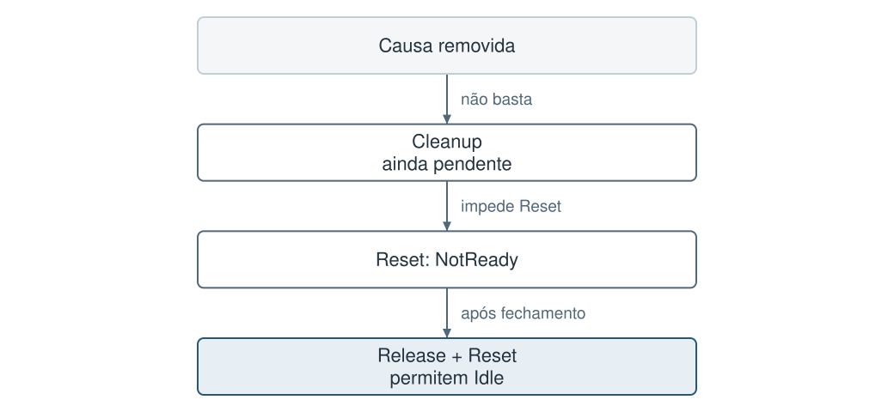

A recuperação exige fechamento confirmado além da remoção da causa.

**Condição inicial.** Demo Faulted com lote e recurso ainda concedido, requests/publicação válidos. Remover a causa original, mas manter xFinishActions=FALSE no mock.

**Alteração.** Enviar Reset novo para o lote corrente; depois permitir cleanup completo e tentar Reset novamente com outro RequestID.

**Componentes afetados.** Reset exige ciclo válido, runtime fresco, Ready, sem falha, sem recurso concedido e fechamento confirmado, salvo instância sem lote. Enquanto isso não ocorre, a falha permanece.

**Onde observar.** stRuntime.eState/eReason/udiResourceToken; stCommandResult.eReason; stControlRequest.eAction; result.xReleased; runtime.xReady/xFaulted/xResourceGranted.

**Resultado esperado.** Primeiro Reset é Rejected/NotReady. Abort e Release ainda precisam concluir; depois o núcleo continua Faulted, mas o Reset novo pode ser Accepted e levar a Idle com BatchID e token zero. Regrant ou retirada da falha sozinhos não reiniciam o lote.

**Divergência a investigar.** Reset aceito com posse pendente ou retomada automática da etapa após retirar a causa reprova o caso. Não usar apenas token publicado zero como prova de todos os critérios de recuperação.

**Retorno à referência.** Registrar a causa, o fechamento e o pedido de Reset aceito. Para executar novamente, usar Start novo e BatchID maior; não reusar a transação do lote encerrado.

**Fonte.** [src/fb/FB_Sequence.st:286-304](https://github.com/luisauguszvc95-dot/FB_Sequence/blob/00f2953808e267bfdbc637347fea88737466e5bd/src/fb/FB_Sequence.st#L286)

### SEQ-026 - Reset preserva receita, identidade e fila

Pausa e encerramento | Rastreabilidade e persistência | Completa | Demo

Evitar que o setor trate Reset como reinicialização total. A distinção importa para repetir testes, correlacionar lotes e interpretar eventos ainda aguardando consumo.

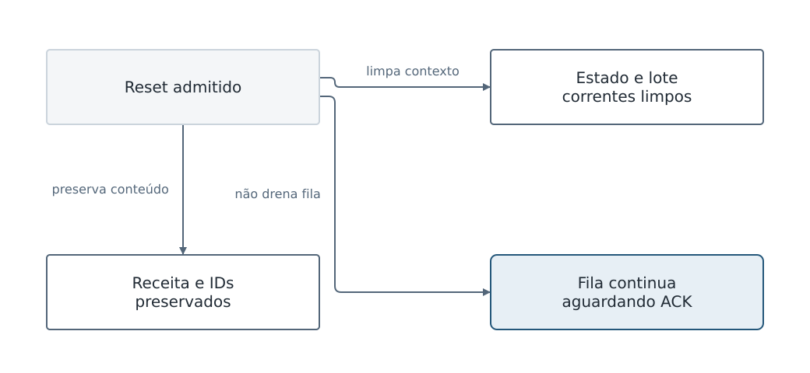

Reset operacional não equivale à recriação da instância.

**Condição inicial.** Demo em Complete, Stopped ou Aborted com recurso livre. Anotar receita aplicada, último RequestID e BatchID, prompt usado e EventID da cabeça; ACK zero.

**Alteração.** Enviar Reset novo para o lote encerrado e observar a instância durante alguns ciclos, sem outras operações.

**Componentes afetados.** Reset limpa estado operacional corrente, índice de etapa, lote corrente e token. Não recria gate, timer de IDs ou fila; a receita aplicada permanece disponível para uma nova partida.

**Onde observar.** stRuntime.eState/udiBatchID/uiStepIndex/xRecipeLoaded/udiRecipeRevision; stEvent.udiEventID; uiEventCount; identidade do comando e próximo prompt em lote posterior.

**Resultado esperado.** Estado Idle, BatchID=0, índice=0 e token=0. Receita permanece aplicada; eventos antigos continuam até ACK e eventos de Reset podem aumentar a fila. RequestID, BatchID admitido, PromptID e EventID não podem ser reciclados como consequência de Reset.

**Divergência a investigar.** Exigir fila vazia após Reset ou voltar contador da interface para 1 produziria testes incorretos. Cabeça ausente por consumo paralelo precisa ser diferenciada de perda causada pelo Reset.

**Retorno à referência.** Continuar os contadores do chamador e drenar somente eventos observados. Se o objetivo for uma instância inteiramente nova, recomeçar explicitamente a bancada com outra identidade de sessão.

**Fonte.** [src/fb/FB_Sequence.st:286-304](https://github.com/luisauguszvc95-dot/FB_Sequence/blob/00f2953808e267bfdbc637347fea88737466e5bd/src/fb/FB_Sequence.st#L286); [src/fb/FB_Sequence.st:543-564](https://github.com/luisauguszvc95-dot/FB_Sequence/blob/00f2953808e267bfdbc637347fea88737466e5bd/src/fb/FB_Sequence.st#L543)

### SEQ-027 - Consistência da confirmação de Release

Pausa e encerramento | Contrato e validação | Completa | bancada dedicada

Verificar a conjunção usada para confirmar liberação. O núcleo não deve unir um indicador positivo com outro envelope que ainda declara posse do recurso.

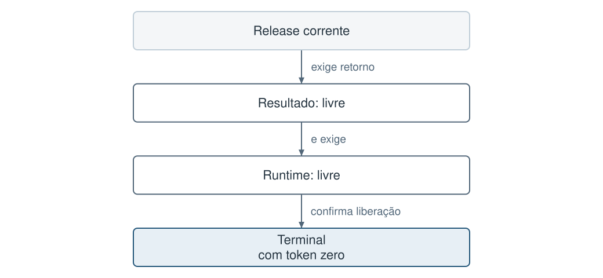

A liberação depende de resultado e runtime coerentes da mesma transação.

**Condição inicial.** Bancada dedicada em Completing, Stopping ou Aborting, já com intenção Release emitida. Entradas de resultado e runtime controladas e corretamente correlacionadas.

**Alteração.** Comparar xReleased=TRUE com result.xResourceGranted=TRUE; depois resultado livre mas runtime.xResourceGranted=TRUE. Finalmente apresentar os dois sem posse e xDone=TRUE.

**Componentes afetados.** O fechamento exige feedback correlacionado aceito, ação Release, Done, Released e ausência de concessão nos dois envelopes. Inconsistência impede o terminal de sucesso.

**Onde observar.** stControlRequest.eAction/udiIntentID; result.xAccepted/xRejected/xDone/xReleased/xResourceGranted; runtime.xResourceGranted; stRuntime.eState/udiResourceToken.

**Resultado esperado.** As combinações inconsistentes não concluem Complete, Stopped ou Aborted. A resposta íntegra e coerente libera token e permite o terminal correspondente. Se a espera exceder o prazo enquanto ainda em transição, pode resultar TransitionTimeout.

**Divergência a investigar.** Declarar encerramento só por xReleased ou por um dos dois recursos livres reprova o caso. Garantir que identidades permaneçam válidas para não confundir inconsistência de posse com rejeição por correlação.

**Retorno à referência.** Apresentar um par de feedbacks coerentes antes do limite ou concluir recuperação da falha, se atingido. Registrar o par inteiro, pois um print de um bit não demonstra fechamento.

**Fonte.** [src/fb/FB_Sequence.st:397-414](https://github.com/luisauguszvc95-dot/FB_Sequence/blob/00f2953808e267bfdbc637347fea88737466e5bd/src/fb/FB_Sequence.st#L397)

### SEQ-028 - Perda do recurso da etapa

Falhas e recuperação | Falhas e recuperação | Essencial | bancada dedicada

Verificar que uma etapa não continua operando sob uma posse diferente da adquirida pelo lote. A identidade do recurso faz parte do feedback de execução.

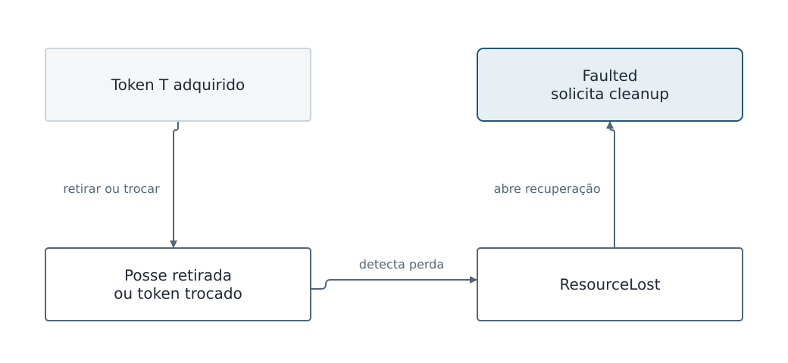

A posse observada precisa continuar compatível com o token adquirido pelo lote.

**Condição inicial.** Bancada dedicada em Running com Execute correlacionado e token T adquirido. Para variante de pausa, obter Holding ou Held por comandos normais.

**Alteração.** Manter resultado aceito e identidades corretas; retirar xResourceGranted do runtime ou trocar seu token para valor diferente de T.

**Componentes afetados.** No ramo de execução ou Hold, o núcleo detecta ausência ou divergência do recurso e registra ResourceLost. Essa condição é diferente de feedback que sequer pertence à transação corrente.

**Onde observar.** stRuntime.eState/eReason/udiResourceToken; stControlRuntime.xResourceGranted/udiResourceToken; stControlRequest.eAction; result.xAccepted e identidades.

**Resultado esperado.** Faulted/ResourceLost. Com requests permitidos, a intenção passa a Abort para cleanup. O bloco não adota automaticamente o token recebido nem continua a mesma etapa usando o novo recurso. Depois do fechamento, a falha exige Reset.

**Divergência a investigar.** Avançar etapa ou substituir token silenciosamente reprova isolamento. Alterar diretamente a saída do mock na Demo seria sobrescrito a cada scan e não constitui este ensaio.

**Retorno à referência.** Restaurar feedback consistente e permitir Abort/Release por entradas da bancada. Confirmar fechamento e aplicar Reset; uma nova aquisição deve ocorrer somente em um novo Start admitido.

**Fonte.** [src/fb/FB_Sequence.st:364-396](https://github.com/luisauguszvc95-dot/FB_Sequence/blob/00f2953808e267bfdbc637347fea88737466e5bd/src/fb/FB_Sequence.st#L364)

### SEQ-029 - Timeout total da etapa em Running

Limites e prazos | Limites e temporização | Essencial | Demo

Verificar o limite de duração de processo e distingui-lo do alvo qualificado. O prazo deve ser interpretado segundo a receita efetivamente aplicada.

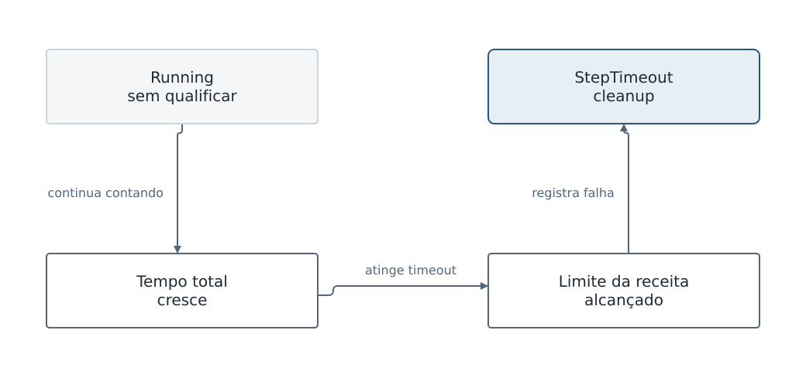

O prazo total da etapa continua contando mesmo quando o tempo qualificado não avança.

**Condição inicial.** Demo com receita original aplicada, timeout de 10000 ms na etapa 10. Confirmar revisão; a receita de observação usa prazo maior e não serve para o valor desta ficha.

**Alteração.** Manter xQualified=FALSE em Running, com Execute aceito e feedback fresco. Observar o crescimento do tempo total até o limite.

**Componentes afetados.** Tempo de etapa cresce em Running mesmo sem tempo útil qualificado. Quando não há conclusão e o acumulado alcança o timeout aplicado, o núcleo registra StepTimeout.

**Onde observar.** stRuntime.udiStepElapsedMs/udiQualifiedElapsedMs/eState/eReason; stControlRequest.eAction; result.xAccepted e runtime de Control.

**Resultado esperado.** Na fronteira igual ou superior a 10000 ms de tempo informado, ocorre Faulted/StepTimeout. O tempo qualificado pode continuar zero. Feedback fresco e aceito não elimina o prazo total; o valor em milissegundos é virtual na Demo.

**Divergência a investigar.** Aguardar ilimitadamente ou usar o prazo da candidata editada sem recarga reprova o comportamento. Não medir o ensaio apenas em segundos do relógio da estação.

**Retorno à referência.** Permitir conclusão do cleanup, confirmar recurso livre e aplicar Reset. Para comparar outro prazo, carregar nova revisão em Idle e registrar o valor aplicado antes do Start.

**Fonte.** [src/fb/FB_Sequence.st:340-347](https://github.com/luisauguszvc95-dot/FB_Sequence/blob/00f2953808e267bfdbc637347fea88737466e5bd/src/fb/FB_Sequence.st#L340); [src/fb/FB_Sequence.st:382-385](https://github.com/luisauguszvc95-dot/FB_Sequence/blob/00f2953808e267bfdbc637347fea88737466e5bd/src/fb/FB_Sequence.st#L382)

### SEQ-030 - Timeout de transição com feedback aceito

Limites e prazos | Limites e temporização | Essencial | Demo

Verificar o prazo de confirmação das ações de lifecycle. Essa ficha separa falta de Done de perda completa de feedback.

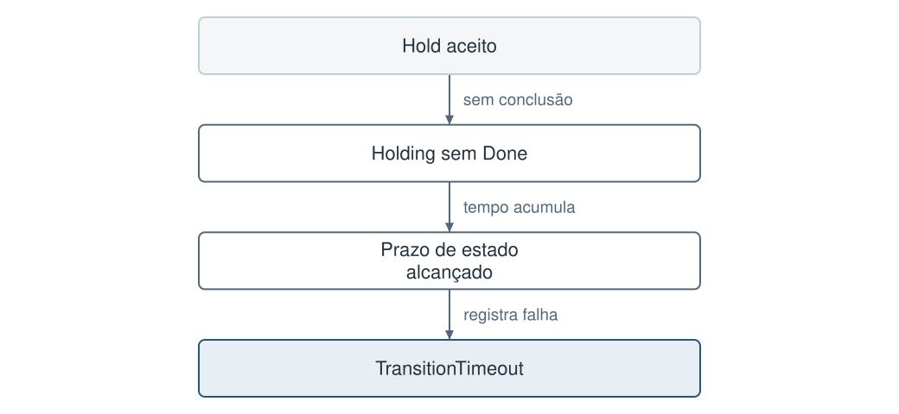

Feedback aceito prova recepção; o prazo de término da transição continua ativo.

**Condição inicial.** Demo Running; limite de transição original 5000 ms. Manter mock ativo e xFinishActions=FALSE antes de enviar Hold.

**Alteração.** Enviar Hold novo e conservar resultado correlacionado aceito, sem permitir Done. Acompanhar Holding até o limite.

**Componentes afetados.** O relógio de estado mede quanto tempo o núcleo permanece em Holding. Feedback aceito zera a espera por feedback, mas não zera o prazo de conclusão do estado transitório.

**Onde observar.** stRuntime.eState/udiStateElapsedMs/eReason; result.xAccepted/xDone/udiIntentID; stControlRequest.eAction; grants.

**Resultado esperado.** Ao alcançar o limite de transição, ocorre Faulted/TransitionTimeout. Holding aceito repetidamente não se torna Held nem permanece indefinidamente. A mesma proteção abrange Starting, Completing, Stopping e Aborting, cada um com sua condição de término.

**Divergência a investigar.** Classificar a falha como StaleFeedback apesar de retorno íntegro aceito indica expectativa ou implementação incorreta. Observar os envelopes impede confundir as duas causas.

**Retorno à referência.** Permitir xFinishActions=TRUE para executar cleanup; aguardar Release e aplicar Reset. Repetir outras transições somente se houver risco específico ou alteração do código correspondente.

**Fonte.** [src/fb/FB_Sequence.st:426-436](https://github.com/luisauguszvc95-dot/FB_Sequence/blob/00f2953808e267bfdbc637347fea88737466e5bd/src/fb/FB_Sequence.st#L426)

### SEQ-031 - Relógio próprio para cada transição

Limites e prazos | Limites e temporização | Completa | bancada dedicada

Validar que um novo estado transitório começa sua própria contagem. É uma regressão relevante quando a duração de processo excede o limite usado para ações do Control.

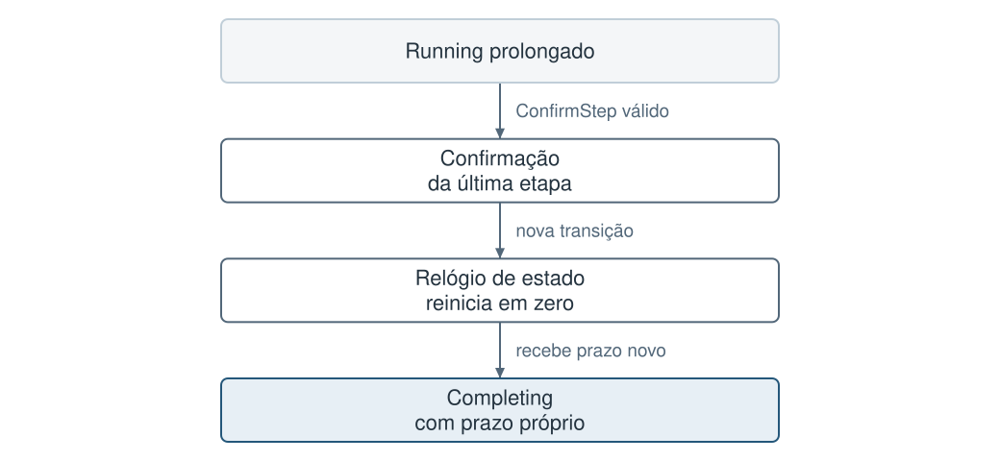

Cada estado transitório recebe sua própria janela de confirmação.

**Condição inicial.** Bancada dedicada com etapa WaitOperator e timeout de processo maior que o limite de transição. Usar PRG_SEQ_LifecycleTests como referência de sequência de chamadas.

**Alteração.** Manter Running por tempo superior ao limite de transição, sem ultrapassar o prazo da etapa. Depois confirmar o prompt corretamente e observar a entrada em Completing.

**Componentes afetados.** Ao mudar de estado, o núcleo zera o tempo de estado e a espera de intenção antes de aplicar o limite da nova transição. O tempo anterior de Running não pertence a Completing.

**Onde observar.** stRuntime.eState/udiStateElapsedMs/udiStepElapsedMs/eReason; stControlRequest.eAction; resultado do ConfirmStep.

**Resultado esperado.** A entrada em Completing publica tempo de estado zero e motivo None. O bloco não gera TransitionTimeout imediatamente por herdar a idade de Running. Se a nova ação demorar o limite inteiro, o timeout passa a ser válido a partir desse novo intervalo.

**Divergência a investigar.** Falha instantânea na entrada ou manutenção do relógio antigo reprova esta regressão. Não reduzir o timeout de etapa a ponto de falhar antes de confirmar o prompt.

**Retorno à referência.** Concluir Complete e Release dentro da nova janela; Reset após terminal. Guardar os valores do scan anterior e do scan de transição como evidência mínima suficiente.

**Fonte.** [src/fb/FB_Sequence.st:419-436](https://github.com/luisauguszvc95-dot/FB_Sequence/blob/00f2953808e267bfdbc637347fea88737466e5bd/src/fb/FB_Sequence.st#L419); [tests/PRG_SEQ_LifecycleTests.st:88-96](https://github.com/luisauguszvc95-dot/FB_Sequence/blob/00f2953808e267bfdbc637347fea88737466e5bd/tests/PRG_SEQ_LifecycleTests.st#L88); [tests/PRG_SEQ_LifecycleTests.st:220-225](https://github.com/luisauguszvc95-dot/FB_Sequence/blob/00f2953808e267bfdbc637347fea88737466e5bd/tests/PRG_SEQ_LifecycleTests.st#L220)

### SEQ-032 - Revogação da permissão de pedidos

Autoridade e correlação | Falhas e recuperação | Essencial | Demo

Verificar a reação à retirada da autoridade de emitir intenções e diferenciar bloqueio de comunicação de confirmação de liberação.

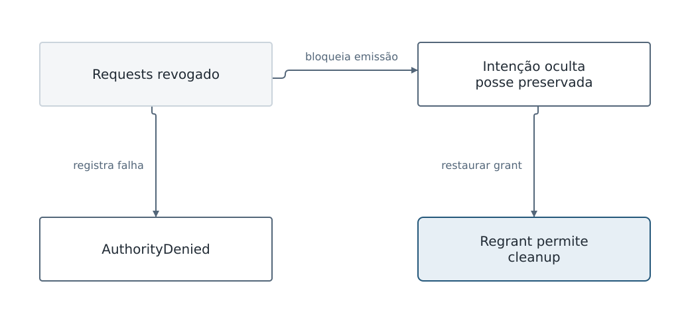

Perder permissão de pedir não equivale a devolver o recurso já adquirido.

**Condição inicial.** Demo Running com token concedido e publicação permitida. Registrar lote, token e intenção corrente; não alterar o estado interno do mock.

**Alteração.** Mudar xAllowRequests para FALSE, manter publicação TRUE e observar a falha. Depois devolver requests sem enviar Start ou Resume.

**Componentes afetados.** Sem requests, xCanExecute também fica falso. O núcleo registra AuthorityDenied e deixa de expor intenções; o mock preserva posse. Regrant permite cleanup, sem autorizar retomada automática.

**Onde observar.** stRuntime.eState/eReason; stControlRequest.xValid; mock.stRuntime.xResourceGranted/udiResourceToken; grants e resultado de comando anterior.

**Resultado esperado.** Faulted/AuthorityDenied; intenção pública inválida durante a revogação, mas recurso pode continuar concedido. Ao restaurar requests, aparece Abort/Release conforme progresso do cleanup; o estado continua Faulted até Reset válido.

**Divergência a investigar.** Interpretar ausência de intenção como recurso livre ou voltar a Running apenas pelo regrant reprova o caso. O Start anterior pode continuar Accepted no resultado publicado, pois a falha veio depois.

**Retorno à referência.** Restaurar grants necessários, permitir xFinishActions=TRUE, confirmar liberação e aplicar Reset. Registrar a posse observada durante o bloqueio para explicar a diferença entre permissão e propriedade.

**Fonte.** [src/fb/FB_Sequence.st:151-172](https://github.com/luisauguszvc95-dot/FB_Sequence/blob/00f2953808e267bfdbc637347fea88737466e5bd/src/fb/FB_Sequence.st#L151); [src/fb/FB_Sequence.st:530-532](https://github.com/luisauguszvc95-dot/FB_Sequence/blob/00f2953808e267bfdbc637347fea88737466e5bd/src/fb/FB_Sequence.st#L530); [tests/FB_SEQ_ControlMock.st:38-39](https://github.com/luisauguszvc95-dot/FB_Sequence/blob/00f2953808e267bfdbc637347fea88737466e5bd/tests/FB_SEQ_ControlMock.st#L38)

### SEQ-033 - Execução revogada com requests permitidos

Autoridade e correlação | Falhas e recuperação | Essencial | Demo

Verificar a independência entre permitir executar uma etapa e permitir enviar pedidos de encerramento ao Control. Essa distinção ajuda a diagnosticar a recuperação.

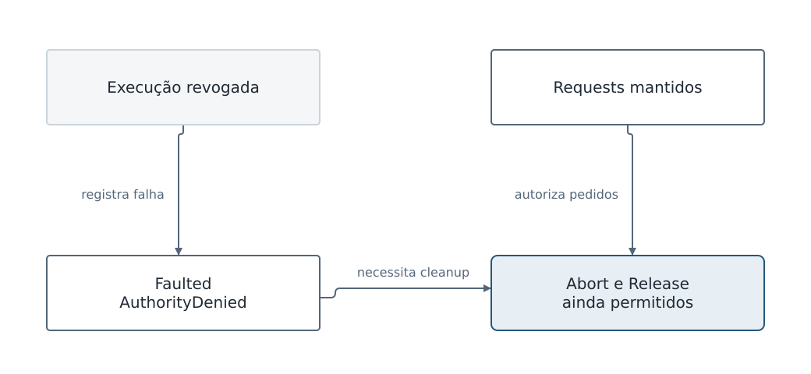

O grant de requests conserva o caminho de encerramento quando execução é retirada.

**Condição inicial.** Demo Running, requests e publicação TRUE. Manter xFinishActions=FALSE inicialmente para observar Abort pendente.

**Alteração.** Mudar apenas xAllowExecution para FALSE; requests continua permitido. Em seguida permitir xFinishActions=TRUE, sem devolver execução.

**Componentes afetados.** xCanExecute cai e o lote registra AuthorityDenied. Como xCanRequest permanece válido, o núcleo pode emitir Abort e Release; o mock aceita essas ações sem exigir o grant de execução.

**Onde observar.** stRuntime.eState/eReason/udiResourceToken; stControlRequest.eAction/xValid; grants; result.xDone/xReleased; runtime.xResourceGranted.

**Resultado esperado.** Faulted/AuthorityDenied com intenção Abort pública válida, seguida de Release após Done. O recurso pode ser liberado mesmo com execução negada. A recuperação do estado requer Reset; reabilitar execução não é confirmação de fechamento.

**Divergência a investigar.** Bloquear todo pedido de cleanup apenas porque execução foi negada reprova esta separação. Comparar com revogação de requests evita atribuir o mesmo efeito a grants diferentes.

**Retorno à referência.** Manter requests/publicação para concluir liberação; aplicar Reset com condições de runtime válidas. Antes de outro Start, devolver explicitamente a permissão de execução e usar novo lote.

**Fonte.** [src/fb/FB_Sequence.st:151-172](https://github.com/luisauguszvc95-dot/FB_Sequence/blob/00f2953808e267bfdbc637347fea88737466e5bd/src/fb/FB_Sequence.st#L151); [tests/FB_SEQ_ControlMock.st:114-138](https://github.com/luisauguszvc95-dot/FB_Sequence/blob/00f2953808e267bfdbc637347fea88737466e5bd/tests/FB_SEQ_ControlMock.st#L114)

### SEQ-034 - Troca de autoridade durante Release

Autoridade e correlação | Contrato e validação | Completa | bancada dedicada

Verificar a correlação de geração durante o fechamento. Mesmo BatchID e IntentID aparentemente compatíveis não tornam válidos envelopes originados sob autoridades diferentes.

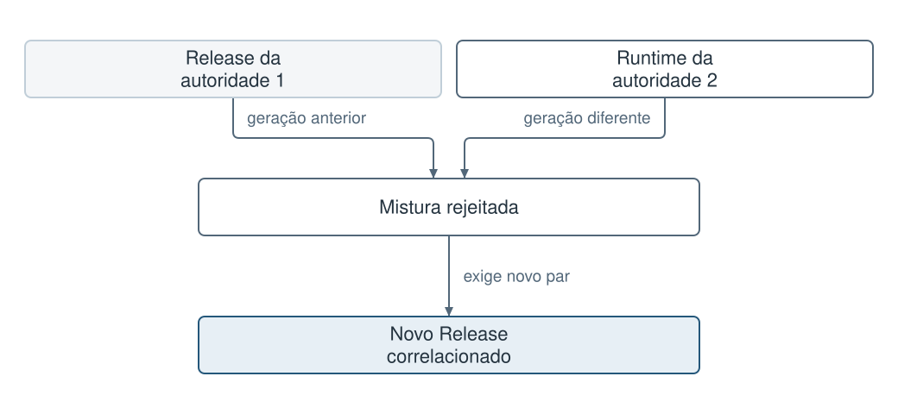

O fechamento exige uma geração coerente em todos os envelopes da transação.

**Condição inicial.** Usar PRG_SEQ_AuthorityTests em tarefa de simulação isolada ou reproduzir suas cópias de entrada. O ensaio prepara uma falha e chega a Release da autoridade 1.

**Alteração.** Apresentar resultado de Release da autoridade 1 junto de autoridade e runtime da geração 2; depois responder integralmente à nova geração.

**Componentes afetados.** Resultado precisa corresponder à intenção; runtime precisa corresponder à autoridade e à intenção. A mistura não confirma o fechamento. A mudança de autoridade cria nova identidade de intenção.

**Onde observar.** stControlRequest.udiAuthorityID/udiIntentID/eAction; result.udiAuthorityID/xReleased; runtime.udiAuthorityID; stRuntime.eState; contadores do PRG nativo.

**Resultado esperado.** O Release antigo não encerra a transação da geração 2. Surge intenção Release da nova autoridade com IntentID maior; feedback coerente permite fechar o recurso, mantendo Faulted até Reset. No PRG nativo, o alvo documentado é 8 verificações sem falha.

**Divergência a investigar.** Combinar Released antigo com runtime novo e autorizar Reset antecipado reprova a regressão. Apenas comparar idade e lote não demonstra correlação completa.

**Retorno à referência.** Responder à intenção atual com ambos os envelopes da mesma geração, confirmar fechamento e Reset. Registrar autoridades e IntentIDs dos dois momentos; a ficha não presume execução já aprovada no IDE.

**Fonte.** [src/fb/FB_Sequence.st:104-125](https://github.com/luisauguszvc95-dot/FB_Sequence/blob/00f2953808e267bfdbc637347fea88737466e5bd/src/fb/FB_Sequence.st#L104); [tests/PRG_SEQ_AuthorityTests.st:1-125](https://github.com/luisauguszvc95-dot/FB_Sequence/blob/00f2953808e267bfdbc637347fea88737466e5bd/tests/PRG_SEQ_AuthorityTests.st#L1)

### SEQ-035 - Desabilitação durante lote ativo

Autoridade e correlação | Falhas e recuperação | Essencial | Demo

Validar que o habilitador não é tratado como pausa reversível. A perda durante execução é uma condição de falha que preserva a obrigação de cleanup.

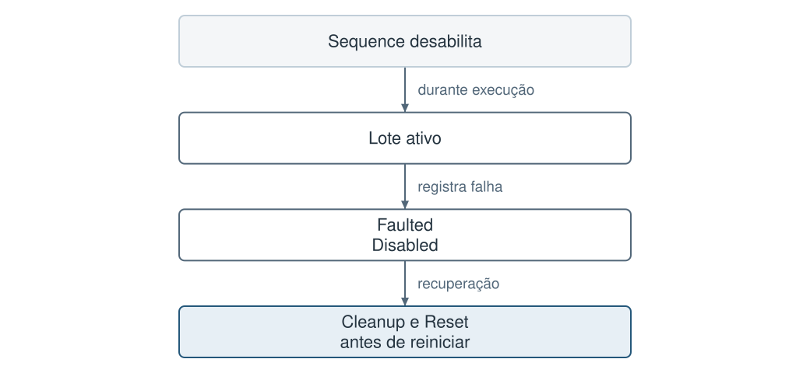

O habilitador retirado em execução gera falha latente, não pausa automática.

**Condição inicial.** Demo Running ou Held, mock e grants ainda ativos. Confirmar que a publicação está válida e identificar o token concedido.

**Alteração.** Mudar xSequenceEnabled para FALSE durante o lote. Depois restaurar TRUE sem enviar comandos de recuperação.

**Componentes afetados.** A supervisão de estado ativo detecta o habilitador retirado e registra Disabled. Permissões do Control continuam determinando se o núcleo pode emitir Abort/Release.

**Onde observar.** stRuntime.eState/eReason; xSequenceEnabled; stControlRequest.eAction; result.xDone/xReleased; runtime.xResourceGranted.

**Resultado esperado.** O lote entra em Faulted/Disabled. Restaurar TRUE não retorna à etapa nem remove o motivo automaticamente. Com requests válidos, cleanup pode prosseguir mesmo enquanto xSequenceEnabled permanece FALSE; Reset depende das condições de fechamento.

**Divergência a investigar.** Retomar Running apenas ao habilitar novamente ou limpar posse por software sem Release reprova o caso. Em Idle, a mesma entrada impede Start com Disabled, mas não representa uma falha de lote já ativo.

**Retorno à referência.** Restaurar habilitador para a próxima execução, permitir fechamento, conferir recurso livre e aplicar Reset. Iniciar novo lote com BatchID maior somente após recuperar Idle.

**Fonte.** [src/fb/FB_Sequence.st:155-162](https://github.com/luisauguszvc95-dot/FB_Sequence/blob/00f2953808e267bfdbc637347fea88737466e5bd/src/fb/FB_Sequence.st#L155)

### SEQ-036 - Falha do Control em lote ativo

Falhas e recuperação | Falhas e recuperação | Essencial | Demo

Verificar a propagação de diagnóstico da camada que controla recursos para a camada que coordena etapas, preservando a distinção entre resultado de comando e estado do processo.

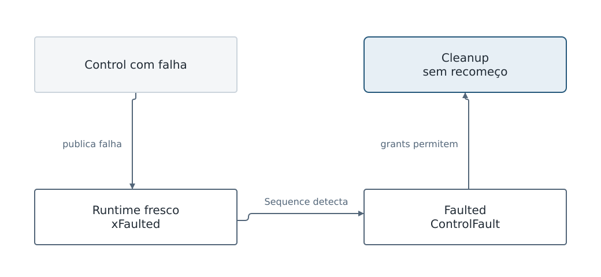

Falha posterior pertence ao runtime; o resultado do Start continua sendo o da admissão.

**Condição inicial.** Demo Running, grants válidos e lote identificado. Manter xRejectRequest=FALSE para isolar a causa; observar o resultado de Start já admitido.

**Alteração.** Alterar xFaulted do mock para TRUE. Depois retirar essa entrada e permitir conclusão de ações.

**Componentes afetados.** O mock publica runtime com falha e Ready falso. A supervisão do núcleo vê runtime fresco e registra ControlFault antes das regras normais de etapa; inicia cleanup se requests permitir.

**Onde observar.** mock.stRuntime.xFaulted/xReady/uiReasonID; fbSequence.stRuntime.eState/eReason; stCommandResult.eResult/udiRequestID; stControlRequest.eAction.

**Resultado esperado.** Faulted/ControlFault. O Start anterior pode continuar Accepted, porque sua admissão não foi desfeita. Retirar xFaulted não apaga o Faulted da Sequence; após Abort/Release, Reset é necessário para voltar a Idle.

**Divergência a investigar.** Exigir que stCommandResult mude para Rejected quando a falha aconteceu depois do Start seria incorreto. Continuar avançando etapas com runtime de Control em falha reprova o comportamento.

**Retorno à referência.** Retirar a falha simulada, manter requests e publicação, permitir xFinishActions e confirmar liberação. Registrar causa e lote antes do Reset; iniciar outra execução somente por novo Start.

**Fonte.** [src/fb/FB_Sequence.st:166-172](https://github.com/luisauguszvc95-dot/FB_Sequence/blob/00f2953808e267bfdbc637347fea88737466e5bd/src/fb/FB_Sequence.st#L166); [tests/FB_SEQ_ControlMock.st:60-61](https://github.com/luisauguszvc95-dot/FB_Sequence/blob/00f2953808e267bfdbc637347fea88737466e5bd/tests/FB_SEQ_ControlMock.st#L60)

### SEQ-037 - Intenção rejeitada pelo Control

Falhas e recuperação | Falhas e recuperação | Essencial | Demo

Identificar a rejeição explícita de uma transação de Control e sua consequência para o lote. O motivo local da Sequence e o código informado pelo Control pertencem a campos diferentes.

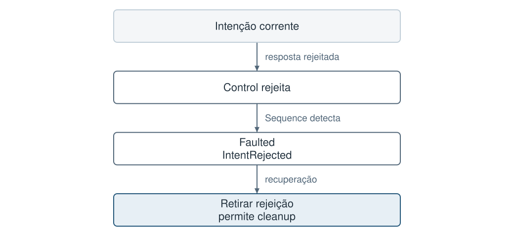

Rejeição da transação e falha de processo possuem diagnósticos distintos.

**Condição inicial.** Demo Running com mock sem falha, requests/publicação ativos. Guardar IntentID corrente; manter xFaulted=FALSE para isolar a rejeição.

**Alteração.** Mudar xRejectRequest para TRUE; observar a resposta da intenção correlacionada. Depois retirar a rejeição antes de esperar conclusão do cleanup.

**Componentes afetados.** O mock publica resultado xRejected=TRUE para o pedido atual. O núcleo registra IntentRejected; enquanto a injeção continuar ativa, o próprio Abort/Release também poderá ser rejeitado.

**Onde observar.** mock.stResult.xRejected/uiReasonID/udiIntentID; mock.stRuntime.xFaulted; stRuntime.eState/eReason/uiControlReasonID; stControlRequest.eAction.

**Resultado esperado.** Faulted/IntentRejected, com runtime de Control podendo permanecer sem falha. O valor uiReasonID=1 do mock não é o enum eReason=1 da Sequence. Retirar rejeição permite cleanup, mas não retoma automaticamente a execução.

**Divergência a investigar.** Classificar o caso como ControlFault apesar de xFaulted=FALSE ou usar resposta de IntentID antigo para rejeitar a intenção corrente reprova a interpretação/correlação.

**Retorno à referência.** Restaurar xRejectRequest=FALSE e permitir xFinishActions=TRUE; confirmar Release e recurso livre, então Reset. Preservar no registro os dois domínios de motivo para apoiar diagnóstico por equipes diferentes.

**Fonte.** [src/fb/FB_Sequence.st:169-172](https://github.com/luisauguszvc95-dot/FB_Sequence/blob/00f2953808e267bfdbc637347fea88737466e5bd/src/fb/FB_Sequence.st#L169); [tests/FB_SEQ_ControlMock.st:140-143](https://github.com/luisauguszvc95-dot/FB_Sequence/blob/00f2953808e267bfdbc637347fea88737466e5bd/tests/FB_SEQ_ControlMock.st#L140)

### SEQ-038 - Resultado sem identidade da intenção corrente

Autoridade e correlação | Contrato e validação | Completa | bancada dedicada

Verificar cada componente da identidade que vincula resultado ao pedido de Control. Aceitação sem correlação não representa evidência para avançar o processo.

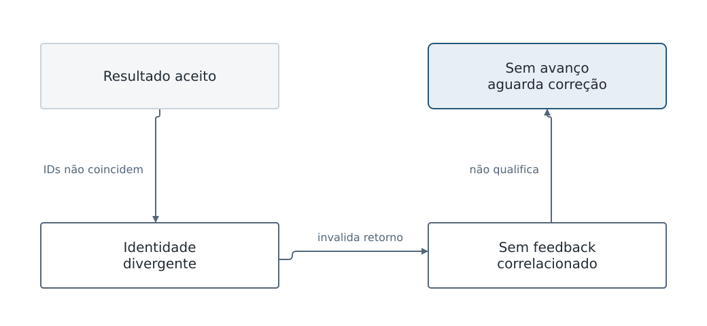

O resultado precisa identificar a transação inteira, não apenas informar aceitação.

**Condição inicial.** Bancada dedicada em Running, etapa longa, runtime fresco e correto. Copiar resultado do mock para variável de entrada e alterar apenas uma identidade em cada variante.

**Alteração.** Divergir SessionID, ProcessID, AuthorityID, BatchID ou IntentID do resultado, mantendo xValid e xAccepted TRUE. Restaurar a identidade antes do timeout na primeira parte.

**Componentes afetados.** xResultMatches fica falso. O núcleo não usa aquele resultado para qualificação, término de etapa ou confirmação de ação; começa a contar espera sem feedback completo.

**Onde observar.** stControlRequest e stControlResult com os cinco IDs; stRuntime.udiQualifiedElapsedMs/eState/eReason; runtime de Control mantido correto.

**Resultado esperado.** Enquanto a diferença existir, não há progresso baseado nesse retorno. Restaurar par coerente antes do limite permite continuar sem falha latente. Se mantiver a ausência além do limite em Running, resulta StaleFeedback. Resultado xRejected de outra identidade também não deve causar IntentRejected imediato.

**Divergência a investigar.** Aceitar retorno pela combinação parcial de lote e idade reprova o contrato. Para não mascarar o caso, manter autoridade atual válida e os limites de etapa maiores que o limite de feedback.

**Retorno à referência.** Repor cópia íntegra da resposta à intenção atual; se StaleFeedback ocorreu, concluir cleanup e Reset. Registrar qual campo foi divergente em cada variante sem criar um caso artificial para cada número.

**Fonte.** [src/fb/FB_Sequence.st:114-125](https://github.com/luisauguszvc95-dot/FB_Sequence/blob/00f2953808e267bfdbc637347fea88737466e5bd/src/fb/FB_Sequence.st#L114); [src/fb/FB_Sequence.st:437-445](https://github.com/luisauguszvc95-dot/FB_Sequence/blob/00f2953808e267bfdbc637347fea88737466e5bd/src/fb/FB_Sequence.st#L437)

### SEQ-039 - StaleFeedback por runtime não correlacionado

Autoridade e correlação | Falhas e recuperação | Completa | bancada dedicada

Distinguir ausência de um par de feedbacks válido de uma transição aceita sem Done. A espera de resposta também precisa ter limite.

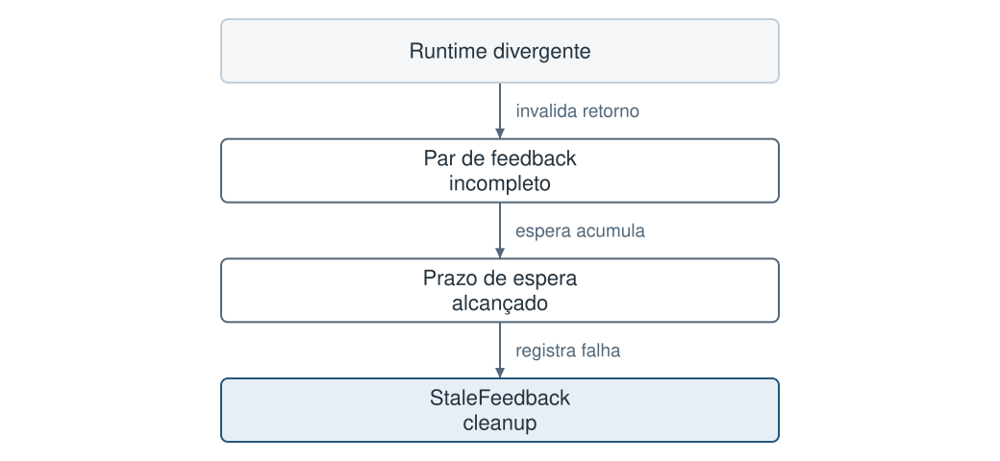

Em Running, a ausência prolongada de feedback correlacionado tem diagnóstico próprio.

**Condição inicial.** Bancada dedicada Running em etapa longa; timeout de etapa maior que udiTransitionTimeoutMs. Autoridade continua válida e resultado da intenção corrente continua aceito.

**Alteração.** Na cópia de runtime fornecida ao FB, usar xValid=FALSE ou BatchID/IntentID divergente; manter a condição por todo o limite de espera.

**Componentes afetados.** Sem xRuntimeMatches, xFeedbackOK permanece falso. Em Running, a espera de intenção acumula delta até registrar StaleFeedback; não existe timeout de estado transitório para mascarar essa causa.

**Onde observar.** stControlRuntime.xValid e identidades; stControlResult; stRuntime.eState/eReason/udiQualifiedElapsedMs; stControlRequest.udiIntentID/eAction.

**Resultado esperado.** Nenhuma conclusão é aceita a partir do runtime divergente. Ao alcançar o limite de espera, ocorre Faulted/StaleFeedback e cleanup é solicitado se requests estiver permitido. O diagnóstico não deve ser TransitionTimeout nesta condição estabilizada em Running.

**Divergência a investigar.** Avançar com runtime de outro lote ou esperar indefinidamente reprova o caso. Na Demo o mock sobrescreve esses campos; a injeção deve existir no chamador dedicado, entre a cópia do mock e a chamada do FB.

**Retorno à referência.** Restaurar feedback íntegro da intenção atualmente emitida, concluir Abort/Release e Reset. Guardar o último retorno válido e o intervalo acumulado para explicar o diagnóstico.

**Fonte.** [src/fb/FB_Sequence.st:109-125](https://github.com/luisauguszvc95-dot/FB_Sequence/blob/00f2953808e267bfdbc637347fea88737466e5bd/src/fb/FB_Sequence.st#L109); [src/fb/FB_Sequence.st:437-445](https://github.com/luisauguszvc95-dot/FB_Sequence/blob/00f2953808e267bfdbc637347fea88737466e5bd/src/fb/FB_Sequence.st#L437)

### SEQ-040 - Fronteira de frescor da autoridade e feedback

Autoridade e correlação | Limites e temporização | Completa | bancada dedicada

Validar a comparação inclusiva das idades e explicar por que envelhecer autoridade produz um efeito diferente de envelhecer apenas um retorno de Control.

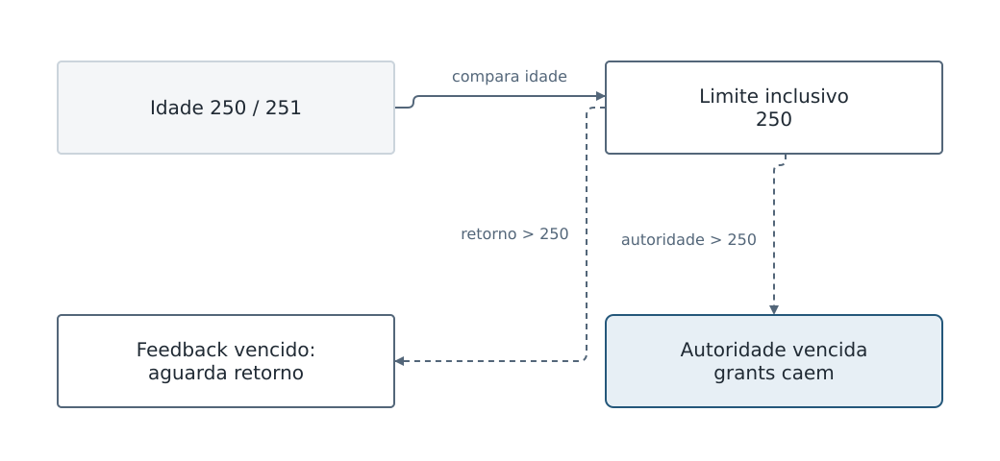

Frescor da autoridade controla permissões; frescor do feedback controla evidência de execução.

**Condição inicial.** Bancada dedicada com udiMaxFeedbackAgeMs=250 desde a inicialização. Usar uma cópia de autoridade, uma de resultado e uma de runtime como entradas controladas.

**Alteração.** Comparar idade 250 com 251 em um envelope por vez. Em lote ativo, preservar os demais campos e registrar se a autoridade continua válida.

**Componentes afetados.** A comparação usa idade menor ou igual ao limite. Autoridade vencida retira grants imediatamente; feedback vencido impede correlação e aciona a espera por retorno, conforme o estado.

**Onde observar.** stAuthority.udiAgeMs; result.udiAgeMs; runtime.udiAgeMs; stRuntime.xDataValid; após restauração da autoridade, eState/eReason; intenções.

**Resultado esperado.** 250 ainda satisfaz frescor. Autoridade com 251 bloqueia publicação e requests; ao restaurar, a falha ativa aparece como AuthorityDenied. Resultado/runtime vencido com autoridade fresca impede progresso e pode levar a StaleFeedback após o prazo em Running.

**Divergência a investigar.** Aceitar idade acima do limite ou tratar perda da autoridade como simples atraso de resultado reprova a separação. Envelope público inválido não prova estado Idle.

**Retorno à referência.** Restaurar idades coerentes no chamador; realizar cleanup/Reset se houve falha. Cada variante precisa registrar qual envelope envelheceu, pois a watch isolada de idade não identifica o impacto completo.

**Fonte.** [src/fb/FB_Sequence.st:104-124](https://github.com/luisauguszvc95-dot/FB_Sequence/blob/00f2953808e267bfdbc637347fea88737466e5bd/src/fb/FB_Sequence.st#L104)

### SEQ-041 - Publicação negada com núcleo preservado

Publicação e rastreabilidade | Rastreabilidade e persistência | Essencial | Demo

Demonstrar que a permissão de observar é independente da permissão de executar. A equipe deve sempre conferir validade antes de interpretar os campos de runtime.

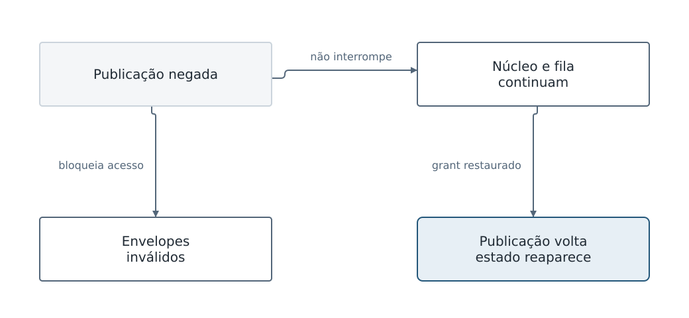

Indisponibilidade de observação não é confirmação de parada nem de fila vazia.

**Condição inicial.** Demo em Held com requests/execução válidos, token concedido e pelo menos um evento na fila. Registrar cabeça e manter ACKs zero.

**Alteração.** Mudar apenas xAllowPublication para FALSE por alguns ciclos e depois devolver TRUE. Durante bloqueio, preservar as outras entradas.

**Componentes afetados.** O núcleo continua seu processamento e intenção ao Control, mas expõe envelopes vazios para runtime, resultado e eventos. A fila interna permanece e nenhum ACK é encaminhado enquanto publicação negada.

**Onde observar.** stRuntime.xDataValid; stCommandResult.xValid; xEventAvailable/uiEventCount/udiEventsDropped; stControlRequest; mock.stRuntime; cabeça depois do retorno.

**Resultado esperado.** Durante bloqueio, campos públicos inválidos/zerados não comprovam Idle, fila vazia ou ausência de perdas. Held e posse reaparecem quando a publicação retorna; a cabeça não confirmada conserva EventID. A intenção Hold pode continuar disponível ao mock durante o bloqueio.

**Divergência a investigar.** Interpretar os zeros como reset real ou parar o núcleo apenas por revogar publicação reprova a separação. Se usar Running, o processo e seus prazos continuam ativos e podem mudar estado durante o intervalo.

**Retorno à referência.** Restaurar publicação e só então interpretar runtime ou confirmar eventos válidos. Registrar xDataValid junto aos valores para que a evidência possa ser entendida sem conhecimento prévio da bancada.

**Fonte.** [src/fb/FB_Sequence.st:543-580](https://github.com/luisauguszvc95-dot/FB_Sequence/blob/00f2953808e267bfdbc637347fea88737466e5bd/src/fb/FB_Sequence.st#L543)

### SEQ-042 - ACK de sessão e cabeça publicadas

Publicação e rastreabilidade | Rastreabilidade e persistência | Essencial | Demo

Verificar a combinação necessária para consumir a cabeça local da fila e evitar que um ACK de outra sessão ou de outro evento descarte evidência.

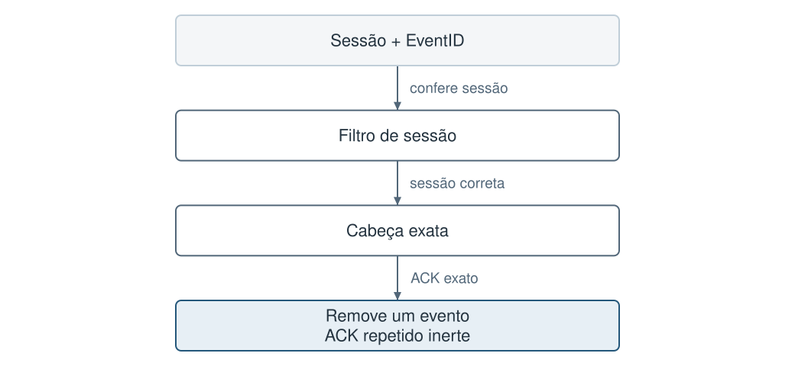

O ACK confirma somente a cabeça da sessão autorizada e representa consumo local.

**Condição inicial.** Demo com publicação permitida e fila não vazia. Estabilizar geração de eventos, anotar SessionID S e EventID E da cabeça; ACKEventID=0 durante a preparação.

**Alteração.** Comparar sessão errada com E, sessão S com ID errado e finalmente S com E. Preparar a sessão antes e escrever EventID por último; repetir o ACK aceito.

**Componentes afetados.** O núcleo filtra a sessão antes de encaminhar ACK à fila; a fila só remove a cabeça correspondente. A confirmação mantida não deve remover automaticamente o evento seguinte.

**Onde observar.** udiAckSessionID/udiAckEventID; stEvent.udiEventID; xEventAvailable/uiEventCount; stRuntime.udiSessionID; ausência de novos fatos durante a medição.

**Resultado esperado.** Pares incorretos preservam a cabeça. Par exato remove uma posição quando não há novos eventos; repetir esse ACK conserva a próxima cabeça. Este é consumo local e não comprova persistência em Service, banco ou historian.

**Divergência a investigar.** Remover por apenas EventID ou por sessão correta com ID diferente reprova o contrato. Não comparar contagem sem controlar novos eventos simultâneos.

**Retorno à referência.** Zerar ACKEventID antes de preparar outro par; identificar a nova cabeça válida. Se a publicação estiver negada, um ACK presente não será consumido até essa condição permitir o encaminhamento.

**Fonte.** [src/fb/FB_Sequence.st:543-547](https://github.com/luisauguszvc95-dot/FB_Sequence/blob/00f2953808e267bfdbc637347fea88737466e5bd/src/fb/FB_Sequence.st#L543); [src/fb/FB_SEQ_EventQueue.st:34-47](https://github.com/luisauguszvc95-dot/FB_Sequence/blob/00f2953808e267bfdbc637347fea88737466e5bd/src/fb/FB_SEQ_EventQueue.st#L34)

### SEQ-043 - Prontidão de rastreabilidade e tempo sintético

Publicação e rastreabilidade | Rastreabilidade e persistência | Essencial | bancada dedicada

Explicar os indicadores de qualidade da evidência sem converter uma simulação em declaração de tempo real. Validade do runtime e prontidão de trace avaliam condições diferentes.

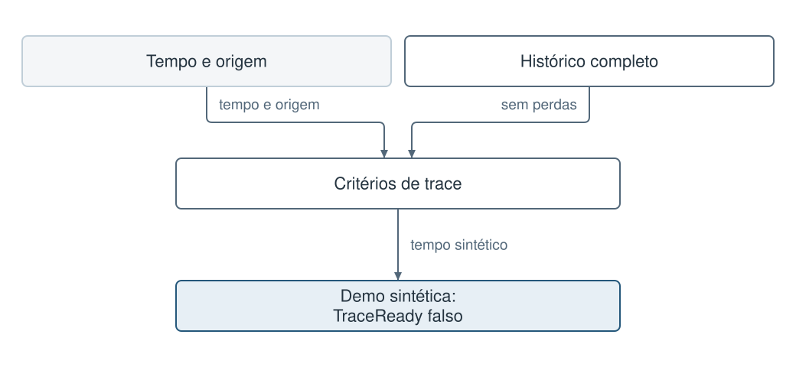

TraceReady informa critérios locais; tempo sintético continua explicitamente identificado.

**Condição inicial.** Demo nova com publicação válida e sem overflow. Para comparar relógio inválido e não sintético, usar PRG_SEQ_TraceEngineTests em bancada dedicada, sem alterar flags sobrescritas da Demo.

**Alteração.** Observar os indicadores na Demo. No PRG de trace, comparar timestamp válido não sintético, válido sintético e inválido com identidades de origem positivas.

**Componentes afetados.** xTraceReady exige configuração válida, máquina e produtor identificados, tempo válido não sintético, histórico sem perdas e revisão não saturada. xDataValid depende da publicação autorizada.

**Onde observar.** stRuntime.xDataValid/xTimeValid/xSyntheticTime/xTraceHistoryComplete/xTraceReady/udiRevision; stTraceTime no chamador; uiMachineID/uiProducerSourceID.

**Resultado esperado.** Na Demo, xSyntheticTime=TRUE e xTraceReady=FALSE são esperados mesmo sem perda e com runtime válido. Na fixture não sintética, os flags podem satisfazer a lógica de prontidão; isso não certifica sincronismo UTC nem existência de banco persistente.

**Divergência a investigar.** Forçar xSynthetic=FALSE para fazer a Demo parecer pronta produziria evidência inválida. Exigir TraceReady TRUE no ensaio sintético reprova a expectativa do teste, não o FB.

**Retorno à referência.** Manter a origem temporal declarada corretamente. Para implantação futura, definir fonte de tempo e identidade no contrato do chamador; esta ficha valida flags e não executa integração externa.

**Fonte.** [src/fb/FB_Sequence.st:561-565](https://github.com/luisauguszvc95-dot/FB_Sequence/blob/00f2953808e267bfdbc637347fea88737466e5bd/src/fb/FB_Sequence.st#L561); [tests/PRG_SEQ_TraceEngineTests.st:77-100](https://github.com/luisauguszvc95-dot/FB_Sequence/blob/00f2953808e267bfdbc637347fea88737466e5bd/tests/PRG_SEQ_TraceEngineTests.st#L77); [tests/PRG_SEQ_Demo.st:51-66](https://github.com/luisauguszvc95-dot/FB_Sequence/blob/00f2953808e267bfdbc637347fea88737466e5bd/tests/PRG_SEQ_Demo.st#L51)

### SEQ-044 - Tempo do fato preservado na fila

Publicação e rastreabilidade | Rastreabilidade e persistência | Completa | bancada dedicada

Verificar que o evento representa o instante registrado quando o fato ocorreu, e não o instante em que uma interface conseguiu consultar a cabeça.

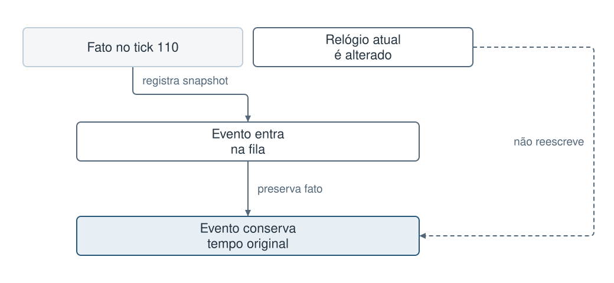

O runtime mostra o presente; a cabeça conserva o tempo declarado para sua ocorrência.

**Condição inicial.** PRG_SEQ_TraceEngineTests ou bancada equivalente: gerar RecipeLoaded com relógio válido e não sintético, manter ACK zero e anotar o evento retido.

**Alteração.** Depois da geração, alterar tick e flags do relógio de entrada em chamadas posteriores, incluindo tempo sintético e inválido, sem criar nova cabeça por ACK.

**Componentes afetados.** O runtime acompanha o relógio corrente; o evento foi construído com o snapshot da ocorrência e permanece copiado na fila. Flags posteriores não reescrevem o fato armazenado.

**Onde observar.** stRuntime.udiTickMs/xTimeValid/xSyntheticTime; stEvent.udiOccurrenceTickMs/xOccurrenceTimeValid/xSyntheticTime/udiEventID; uiEventCount.

**Resultado esperado.** A cabeça mantém EventID, tick e flags originais, enquanto runtime reflete os novos valores. A fixture nativa registra RecipeLoaded no tick 110 e confirma que mudanças posteriores do relógio não alteram essa ocorrência. Nenhum desses ticks é convertido automaticamente para UTC pelo núcleo.

**Divergência a investigar.** Recarimbar o evento a cada publicação ou invalidar retroativamente seu timestamp pela condição atual reprova a preservação. Não confundir evento novo com o mesmo evento retido.

**Retorno à referência.** Restaurar a política temporal da bancada e consumir a cabeça somente após registrar seus campos. Repetir com nova instância ou nova identidade de evento se for necessário comparar outra origem de tempo.

**Fonte.** [src/fb/FB_Sequence.st:142-146](https://github.com/luisauguszvc95-dot/FB_Sequence/blob/00f2953808e267bfdbc637347fea88737466e5bd/src/fb/FB_Sequence.st#L142); [src/fb/FB_Sequence.st:548-559](https://github.com/luisauguszvc95-dot/FB_Sequence/blob/00f2953808e267bfdbc637347fea88737466e5bd/src/fb/FB_Sequence.st#L548); [tests/PRG_SEQ_TraceEngineTests.st:83-96](https://github.com/luisauguszvc95-dot/FB_Sequence/blob/00f2953808e267bfdbc637347fea88737466e5bd/tests/PRG_SEQ_TraceEngineTests.st#L83)

### SEQ-045 - Overflow e histórico incompleto no núcleo

Publicação e rastreabilidade | Rastreabilidade e persistência | Essencial | Demo

Relacionar capacidade local, descarte de novos fatos e indicadores de confiabilidade. Essa ficha verifica o efeito no runtime completo, além do comportamento unitário da fila.

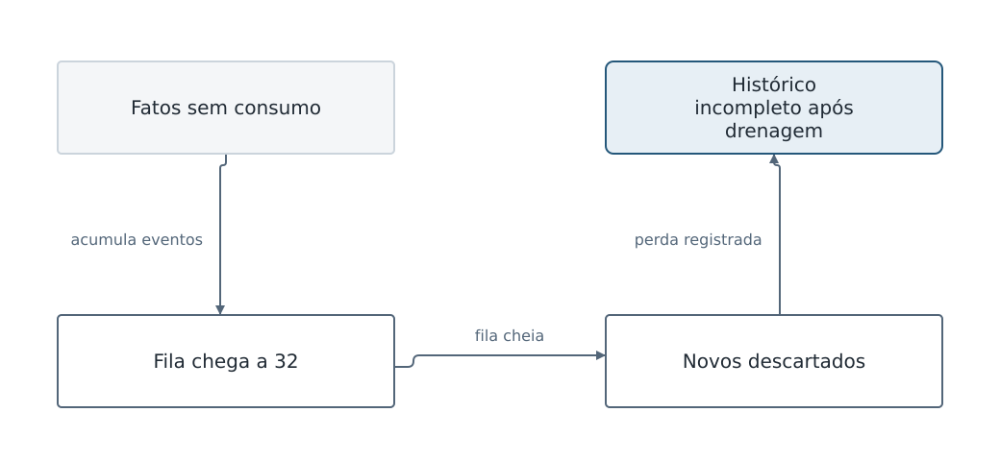

Drenagem recupera espaço; não recupera os fatos que já foram descartados.

**Condição inicial.** Demo em Idle com publicação e requests válidos; receita válida aplicada. Instância nova ou baseline documentado de perdas; manter ACK zero e registrar a cabeça.

**Alteração.** Enviar LoadRecipe válidos com RequestIDs novos até saturar; depois consumir algumas cabeças corretamente, sem reinicializar.

**Componentes afetados.** Cada carga admitida pode gerar mais de um evento. A fila preserva os antigos e descarta novos quando cheia; o núcleo transforma perdas conhecidas em histórico incompleto.

**Onde observar.** uiEventCount/udiEventsDropped; stEvent.udiEventID; stRuntime.xTraceHistoryComplete/xTraceReady; IDs dos pedidos geradores.

**Resultado esperado.** Capacidade máxima 32. Após lotação, perdas crescem e cabeça antiga é preservada. xTraceHistoryComplete torna-se FALSE; drenar reduz contagem, mas não limpa perdas nem restaura histórico completo. Na Demo, TraceReady já era FALSE por tempo sintético antes do overflow.

**Divergência a investigar.** Reescrever a cabeça para acomodar evento novo, ocultar perdas ou recuperar histórico completo apenas drenando reprova o contrato. A quantidade de comandos não equivale diretamente à quantidade de eventos.

**Retorno à referência.** Registrar a lacuna antes de reinicializar. Continuar ACKs exatos para liberar espaço; nova instância é necessária para histórico local limpo, com identidade de sessão estabelecida no chamador.

**Fonte.** [src/fb/FB_Sequence.st:548-565](https://github.com/luisauguszvc95-dot/FB_Sequence/blob/00f2953808e267bfdbc637347fea88737466e5bd/src/fb/FB_Sequence.st#L548); [src/fb/FB_SEQ_EventQueue.st:49-79](https://github.com/luisauguszvc95-dot/FB_Sequence/blob/00f2953808e267bfdbc637347fea88737466e5bd/src/fb/FB_SEQ_EventQueue.st#L49); [tests/PRG_SEQ_TraceEngineTests.st:108-121](https://github.com/luisauguszvc95-dot/FB_Sequence/blob/00f2953808e267bfdbc637347fea88737466e5bd/tests/PRG_SEQ_TraceEngineTests.st#L108)

### SEQ-046 - Receita válida e retorno após correção

Validação estrutural de receitas | Contrato e validação | Essencial | bancada dedicada

Confirmar que o validador recompõe o resultado a cada chamada e identifica a estrutura recebida naquele momento. Isso ajuda engenharia e qualidade a separar uma correção efetiva de um indicador antigo na watch.

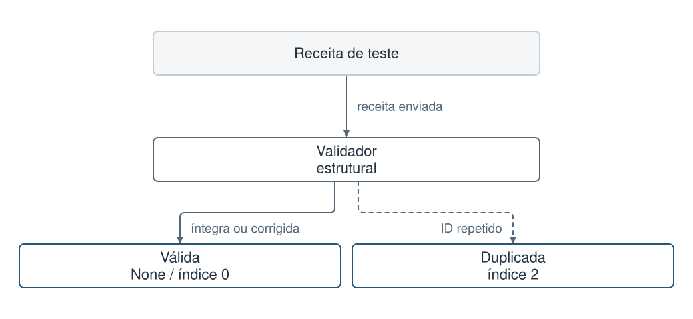

A mesma instância deve rejeitar o defeito e reconhecer a correção na chamada seguinte.

**Condição inicial.** Em um PRG temporário de simulação, instanciar FB_SEQ_RecipeValidator. Usar a receita de duas etapas do SupportTests: identidade e revisão 1, IDs distintos, WaitQualified, duração 100 ms e timeout 200 ms.

**Alteração.** Enviar a receita válida, duplicar o ID da segunda etapa e depois restaurar o ID distinto. Manter todos os demais campos iguais entre as três chamadas.

**Componentes afetados.** O candidato afeta xValid, eReason e uiInvalidStep. O bloco somente verifica estrutura; não carrega receita no núcleo nem solicita atuação ao Control.

**Onde observar.** Registrar a tripla de saídas após cada chamada e guardar os IDs da receita e das duas etapas junto à evidência.

**Resultado esperado.** A sequência esperada é TRUE/None/0, FALSE/RecipeInvalid/2 e TRUE/None/0. A recuperação ocorre pela nova entrada válida, sem reset especial do validador.

**Divergência a investigar.** Reprovar se a receita duplicada passar, se a correção continuar inválida ou se uiInvalidStep conservar 2 após a aprovação.

**Retorno à referência.** Restaurar o candidato válido e finalizar o PRG de bancada. Não interpretar xValid como aprovação dos parâmetros para uma máquina.

**Fonte.** [src/fb/FB_SEQ_RecipeValidator.st:21-75](https://github.com/luisauguszvc95-dot/FB_Sequence/blob/00f2953808e267bfdbc637347fea88737466e5bd/src/fb/FB_SEQ_RecipeValidator.st#L21-L75); [tests/PRG_SEQ_SupportTests.st:91-115](https://github.com/luisauguszvc95-dot/FB_Sequence/blob/00f2953808e267bfdbc637347fea88737466e5bd/tests/PRG_SEQ_SupportTests.st#L91-L115)

### SEQ-047 - Cabeçalho sem identidade ou revisão

Validação estrutural de receitas | Contrato e validação | Essencial | bancada dedicada

Validar a identificação mínima do documento de receita. Sem ID e revisão não é possível distinguir qual configuração foi avaliada, mesmo quando as etapas parecem completas na tela.

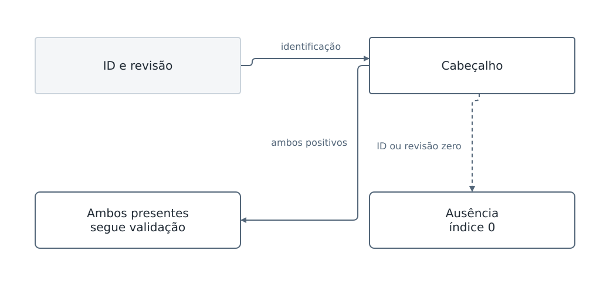

O índice zero sinaliza que a avaliação foi interrompida no cabeçalho da receita.

**Condição inicial.** Usar um validador isolado e uma receita estruturalmente válida de duas etapas. Preservar uma cópia íntegra para comparar os resultados de cada variante de cabeçalho.

**Alteração.** Comparar o candidato íntegro com variantes em que somente udiRecipeID vale 0 ou somente udiRevision vale 0. Restaurar o campo antes de avaliar a outra variante.

**Componentes afetados.** A verificação do cabeçalho encerra a avaliação antes do laço de etapas. O diagnóstico pertence à receita inteira, não a um item do array.

**Onde observar.** Observar stRecipe.udiRecipeID, udiRevision, fbRecipe.xValid, eReason e uiInvalidStep. Associar a captura ao valor alterado para evitar confundir dois defeitos independentes.

**Resultado esperado.** A receita íntegra retorna TRUE/None/0. Cada ausência retorna FALSE/RecipeInvalid/0. O índice zero distingue falha de cabeçalho de falha em uma etapa.

**Divergência a investigar.** Reprovar aprovação de identidade zero, indicação de uma etapa específica ou resultado herdado da chamada anterior após a troca de candidato.

**Retorno à referência.** Recolocar ID e revisão positivos da referência e confirmar a volta a xValid TRUE. Nenhum carregamento no núcleo é necessário.

**Fonte.** [src/fb/FB_SEQ_RecipeValidator.st:21-28](https://github.com/luisauguszvc95-dot/FB_Sequence/blob/00f2953808e267bfdbc637347fea88737466e5bd/src/fb/FB_SEQ_RecipeValidator.st#L21-L28); [tests/PRG_SEQ_SupportTests.st:135-141](https://github.com/luisauguszvc95-dot/FB_Sequence/blob/00f2953808e267bfdbc637347fea88737466e5bd/tests/PRG_SEQ_SupportTests.st#L135-L141)

### SEQ-048 - Cardinalidade do array de etapas

Validação estrutural de receitas | Limites e temporização | Completa | bancada dedicada

Confirmar os limites estruturais de 1 a 16 etapas antes de qualquer indexação. É um teste do contrato de dados e da previsibilidade do diagnóstico diante de arquivos incompletos ou malformados.

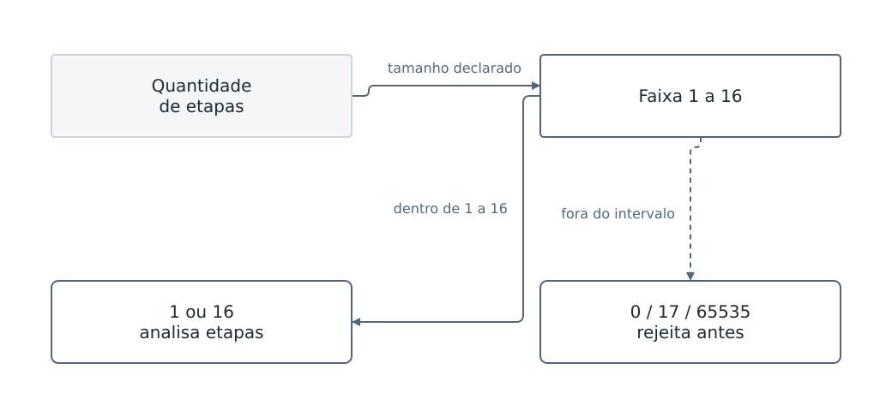

O contrato do array é validado antes da primeira leitura de etapa.

**Condição inicial.** Instanciar o validador em bancada. Preparar 16 etapas válidas e com IDs distintos; manter o cabeçalho válido. A receita deve conter dados suficientes para o limite superior aceito.

**Alteração.** Comparar uiStepCount igual a 1 e 16 com 0, 17 e UINT#65535. Alterar somente a cardinalidade; não acessar posições além do array no PRG de teste.

**Componentes afetados.** uiStepCount controla os limites do laço interno. Valores inválidos devem interromper a análise no cabeçalho e impedir dependência de conteúdo fora da região declarada.

**Onde observar.** Registrar quantidade declarada, xValid, eReason e uiInvalidStep, além da continuidade de execução do PRG após cada chamada.

**Resultado esperado.** As cardinalidades 1 e 16 são aceitas quando suas etapas são válidas. 0, 17 e 65535 retornam FALSE/RecipeInvalid/0, sem exceção de acesso.

**Divergência a investigar.** Reprovar travamento, erro de índice, aceitação de cardinalidade fora do intervalo ou rejeição do limite superior com todas as etapas válidas.

**Retorno à referência.** Restaurar a quantidade da receita de referência. O teste não altera limites do tipo nem amplia a capacidade declarada no código.

**Fonte.** [src/fb/FB_SEQ_RecipeValidator.st:30-36](https://github.com/luisauguszvc95-dot/FB_Sequence/blob/00f2953808e267bfdbc637347fea88737466e5bd/src/fb/FB_SEQ_RecipeValidator.st#L30-L36); [tests/PRG_SEQ_SupportTests.st:116-134](https://github.com/luisauguszvc95-dot/FB_Sequence/blob/00f2953808e267bfdbc637347fea88737466e5bd/tests/PRG_SEQ_SupportTests.st#L116-L134)

### SEQ-049 - Identificadores obrigatórios e localização do defeito

Validação estrutural de receitas | Contrato e validação | Essencial | bancada dedicada

Verificar a utilidade prática de uiInvalidStep na manutenção de receitas. O operador do ensaio precisa localizar o item incorreto sem confundir posição no array com o número funcional da etapa.

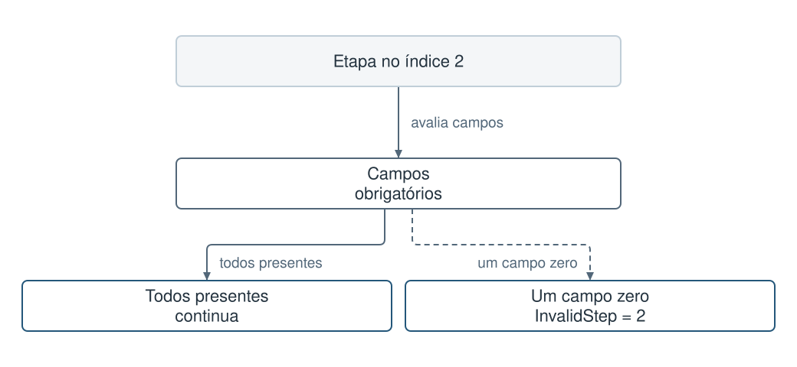

O diagnóstico localiza a posição da etapa defeituosa, independentemente de seu StepID.

**Condição inicial.** Usar três etapas válidas com uiStepID 10, 20 e 30. Na posição 2, manter uma cópia de todos os campos obrigatórios. Avaliar por chamadas públicas do validador.

**Alteração.** Na segunda etapa, zerar separadamente uiStepID, uiPhaseID, uiProfileID e udiTimeoutMs, restaurando a referência entre variantes. A posição do defeito permanece a mesma.

**Componentes afetados.** Qualquer ausência interrompe o laço na posição 2. As demais etapas não devem mascarar a ausência e os parâmetros genéricos não substituem os campos obrigatórios.

**Onde observar.** Observar a posição alterada e a tripla xValid/eReason/uiInvalidStep. Incluir o uiStepID original 20 na evidência para demonstrar a distinção entre identidade e índice.

**Resultado esperado.** Cada variante retorna FALSE/RecipeInvalid/2. O valor 2 é a posição do array, inclusive quando uiStepID foi zerado; não se espera 20 no diagnóstico.

**Divergência a investigar.** Reprovar aprovação parcial, índice 20, índice de outra etapa ou necessidade de reinicializar o bloco para reconhecer a correção.

**Retorno à referência.** Restaurar os quatro campos da segunda etapa e confirmar validação integral antes de reutilizar o candidato em outro ensaio.

**Fonte.** [src/fb/FB_SEQ_RecipeValidator.st:2-2](https://github.com/luisauguszvc95-dot/FB_Sequence/blob/00f2953808e267bfdbc637347fea88737466e5bd/src/fb/FB_SEQ_RecipeValidator.st#L2-L2); [src/fb/FB_SEQ_RecipeValidator.st:36-44](https://github.com/luisauguszvc95-dot/FB_Sequence/blob/00f2953808e267bfdbc637347fea88737466e5bd/src/fb/FB_SEQ_RecipeValidator.st#L36-L44); [tests/PRG_SEQ_SupportTests.st:142-148](https://github.com/luisauguszvc95-dot/FB_Sequence/blob/00f2953808e267bfdbc637347fea88737466e5bd/tests/PRG_SEQ_SupportTests.st#L142-L148)

### SEQ-050 - Unicidade das etapas e primeira ocorrência inválida

Validação estrutural de receitas | Contrato e validação | Completa | bancada dedicada

Confirmar que a receita não depende de IDs consecutivos e que uma repetição é localizada mesmo quando ocorre longe da primeira etapa. Isso evita ambiguidade em comandos, eventos e rastreamento.

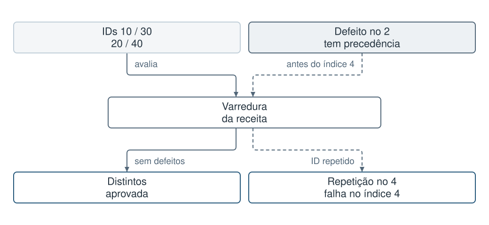

IDs precisam ser únicos; a ordem numérica é livre e o primeiro defeito encerra a análise.

**Condição inicial.** Preparar quatro etapas válidas com IDs 10, 30, 20 e 40. Usar durações e políticas válidas, mantendo uiStepCount 4 e cabeçalho identificado.

**Alteração.** Comparar a ordem não crescente, que deve ser válida, com a quarta etapa repetindo o ID 10. Acrescentar depois um defeito obrigatório na segunda etapa para verificar a precedência do diagnóstico.

**Componentes afetados.** O validador compara o ID atual com todas as posições anteriores e encerra no primeiro defeito encontrado durante a varredura. Ele não ordena nem renumera a receita.

**Onde observar.** Registrar os quatro IDs, o campo obrigatório alterado e as saídas após cada variante. Verificar que o candidato recebido não foi reescrito pelo bloco.

**Resultado esperado.** A lista 10/30/20/40 passa; 10/30/20/10 falha com índice 4. Havendo também um campo obrigatório zero na posição 2, o diagnóstico passa a apontar 2.

**Divergência a investigar.** Reprovar exigência de sequência numérica, perda de detecção da duplicação distante ou indicação de um defeito posterior quando já existe falha na posição 2.

**Retorno à referência.** Restaurar os IDs distintos e o campo obrigatório. Corrigir um defeito por vez ajuda a revelar eventuais falhas restantes do candidato.

**Fonte.** [src/fb/FB_SEQ_RecipeValidator.st:36-53](https://github.com/luisauguszvc95-dot/FB_Sequence/blob/00f2953808e267bfdbc637347fea88737466e5bd/src/fb/FB_SEQ_RecipeValidator.st#L36-L53)

### SEQ-051 - Duração qualificada coerente com o timeout

Validação estrutural de receitas | Limites e temporização | Essencial | bancada dedicada

Verificar a consistência entre meta de tempo e limite da etapa WaitQualified. Este teste ajuda quem configura receitas a compreender por que uma duração impossível é rejeitada antes da execução.

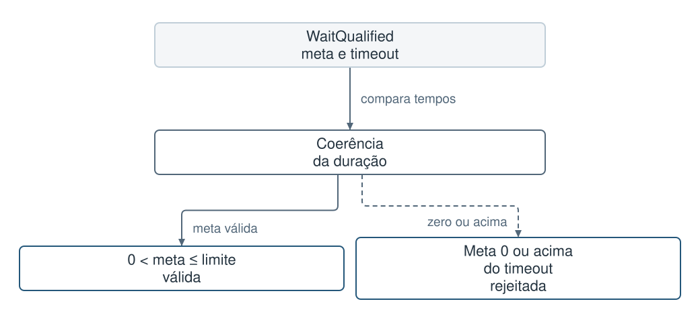

O limite temporal da receita é uma regra estrutural; a execução do núcleo exige outros contratos.

**Condição inicial.** Preparar uma receita válida com uma etapa WaitQualified, timeout 200 ms e duração qualificada 100 ms. Usar o validador isolado, sem temporizador ou núcleo em execução.

**Alteração.** Comparar duração qualificada 0, 200 e 201 ms mantendo o timeout em 200 ms. O valor igual ao timeout exercita a fronteira aceita pelo contrato estrutural.

**Componentes afetados.** O par udiQualifiedMs/udiTimeoutMs determina a coerência da política WaitQualified. A rejeição informa a posição da etapa, mas não calcula duração real nem simula permissivos.

**Onde observar.** Registrar os dois tempos, eKind, xValid, eReason e uiInvalidStep. Separar o resultado estrutural de qualquer ensaio posterior do avanço de etapa.

**Resultado esperado.** Zero e 201 ms retornam FALSE/RecipeInvalid/1. A igualdade 200/200 é estruturalmente válida e retorna TRUE/None/0; sua dinâmica será avaliada no núcleo em outro teste.

**Divergência a investigar.** Reprovar aceitação de duração nula ou superior ao timeout, ou rejeição da igualdade apenas por estar no limite.

**Retorno à referência.** Restaurar a referência 100/200 ms. Não inferir, desta aprovação isolada, que qualificação, disponibilidade do Control ou execução física estejam garantidas.

**Fonte.** [src/fb/FB_SEQ_RecipeValidator.st:55-61](https://github.com/luisauguszvc95-dot/FB_Sequence/blob/00f2953808e267bfdbc637347fea88737466e5bd/src/fb/FB_SEQ_RecipeValidator.st#L55-L61); [tests/PRG_SEQ_SupportTests.st:149-165](https://github.com/luisauguszvc95-dot/FB_Sequence/blob/00f2953808e267bfdbc637347fea88737466e5bd/tests/PRG_SEQ_SupportTests.st#L149-L165)

### SEQ-052 - Política de término e fronteira com parâmetros de processo

Validação estrutural de receitas | Contrato e validação | Completa | bancada dedicada

Documentar o que a aprovação estrutural realmente cobre. Essa distinção permite que engenharia, automação e qualidade encaminhem cada problema ao componente responsável sem atribuir ao validador uma análise de processo.

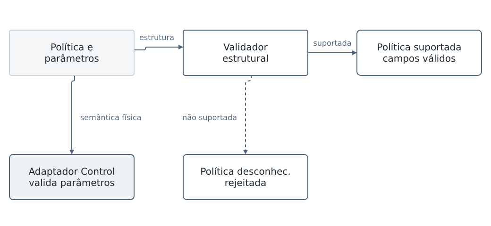

A aprovação desta camada não substitui a verificação de parâmetros pelo adaptador de Control.

**Condição inicial.** Usar uma etapa com IDs e timeout válidos. Preparar variantes WaitComplete, WaitOperator e um valor de enum não suportado aceito pelo ambiente de teste, sem modificar os tipos publicados.

**Alteração.** Comparar as políticas suportadas com udiQualifiedMs zero ou maior que o timeout. Em outra variante, alterar somente rParameter1/rParameter2 finitos. Avaliar também o enum não suportado.

**Componentes afetados.** WaitComplete e WaitOperator não utilizam duração qualificada. Valores genéricos de parâmetros não são interpretados aqui; identificação de perfil, unidades e faixas pertencem ao adaptador de Control.

**Onde observar.** Observar eKind, os tempos e parâmetros apresentados, xValid, eReason e uiInvalidStep. Registrar claramente qual dimensão foi alterada em cada variante.

**Resultado esperado.** As duas políticas suportadas passam quando os campos obrigatórios são válidos, independentemente da duração qualificada. Enum não suportado falha no índice da etapa. Alterar apenas parâmetros genéricos não causa rejeição estrutural.

**Divergência a investigar.** Reprovar aceitação de política não suportada ou interpretação documental de xValid como certificação dos parâmetros para a máquina.

**Retorno à referência.** Restaurar política e parâmetros da referência. Encaminhar validação de perfil e parâmetros ao catálogo de testes do adaptador correspondente.

**Fonte.** [src/fb/FB_SEQ_RecipeValidator.st:1-6](https://github.com/luisauguszvc95-dot/FB_Sequence/blob/00f2953808e267bfdbc637347fea88737466e5bd/src/fb/FB_SEQ_RecipeValidator.st#L1-L6); [src/fb/FB_SEQ_RecipeValidator.st:55-70](https://github.com/luisauguszvc95-dot/FB_Sequence/blob/00f2953808e267bfdbc637347fea88737466e5bd/src/fb/FB_SEQ_RecipeValidator.st#L55-L70)

### SEQ-053 - Acúmulo somente quando habilitado e qualificado

Temporizadores e aritmética | Funcional | Essencial | bancada dedicada

Confirmar que o temporizador mede a soma dos intervalos aprovados por duas condições independentes. O resultado deve permitir explicar a diferença entre tempo de tarefa, tempo de etapa e tempo efetivamente qualificado.

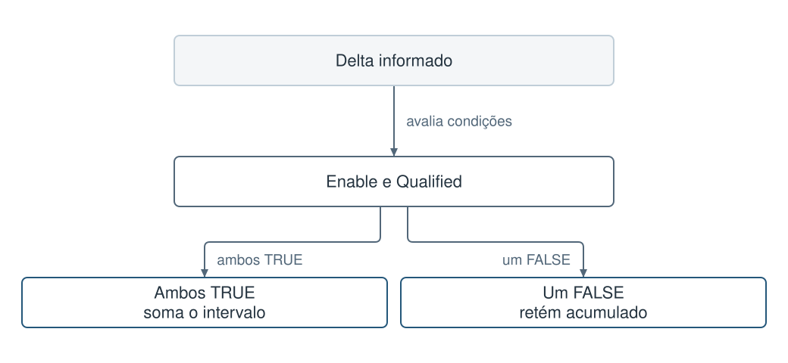

O tempo é a soma dos deltas qualificados; chamadas bloqueadas preservam o acumulado.

**Condição inicial.** Usar FB_SEQ_QualifiedTimer em um PRG isolado, com target 100 ms e reset inicial. Cada chamada da bancada representa um ciclo com delta explicitamente informado.

**Alteração.** Aplicar 40 ms com Enable e Qualified verdadeiros. Em seguida, aplicar 80 ms com Enable falso e depois 80 ms com Qualified falso. Finalizar com ambos verdadeiros e delta 20 ms.

**Componentes afetados.** xEnable e xQualified controlam a entrada do acumulador. O tempo previamente acumulado permanece guardado durante cada bloqueio, permitindo retomada sem reiniciar a medição.

**Onde observar.** Registrar os dois booleanos, udiDeltaMs, udiElapsedMs e xDone depois de cada chamada. O relógio do computador não é o instrumento de aceite deste bloco.

**Resultado esperado.** O acumulado evolui 40, 40, 40 e 60 ms; xDone permanece FALSE. As duas chamadas bloqueadas não somam nem apagam o valor existente.

**Divergência a investigar.** Reprovar aumento durante qualquer bloqueio, perda dos 40 ms armazenados ou conclusão antes de atingir o target.

**Retorno à referência.** Aplicar xReset TRUE com target positivo e confirmar elapsed zero. Desabilitar a instância antes de preparar outra série de entradas.

**Fonte.** [src/fb/FB_SEQ_QualifiedTimer.st:1-4](https://github.com/luisauguszvc95-dot/FB_Sequence/blob/00f2953808e267bfdbc637347fea88737466e5bd/src/fb/FB_SEQ_QualifiedTimer.st#L1-L4); [src/fb/FB_SEQ_QualifiedTimer.st:18-32](https://github.com/luisauguszvc95-dot/FB_Sequence/blob/00f2953808e267bfdbc637347fea88737466e5bd/src/fb/FB_SEQ_QualifiedTimer.st#L18-L32); [tests/PRG_SEQ_SupportTests.st:48-65](https://github.com/luisauguszvc95-dot/FB_Sequence/blob/00f2953808e267bfdbc637347fea88737466e5bd/tests/PRG_SEQ_SupportTests.st#L48-L65)

### SEQ-054 - Prioridade do reset sobre a acumulação

Temporizadores e aritmética | Falhas e recuperação | Essencial | bancada dedicada

Verificar uma condição de concorrência lógica importante para a preparação de etapas. Mesmo que habilitação e qualificação estejam verdadeiras, a reinicialização solicitada deve prevalecer naquele ciclo.

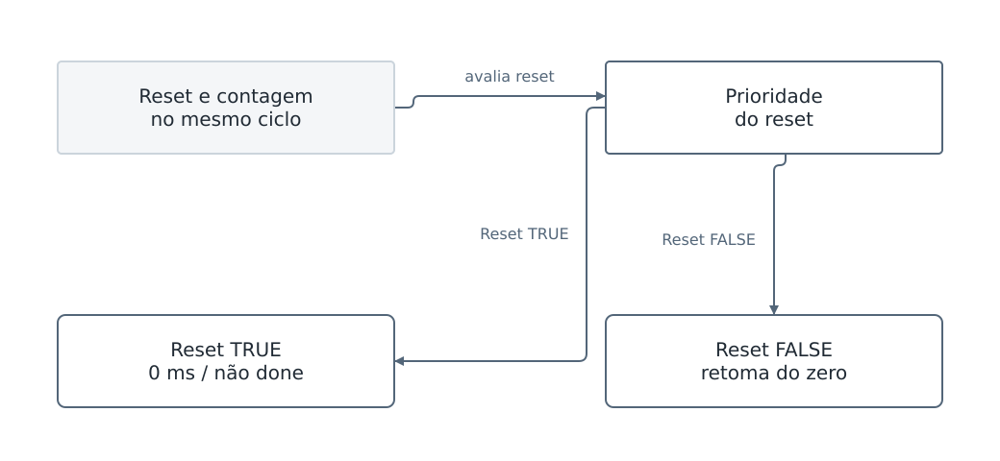

Reset domina a soma, inclusive quando o timer estava concluído.

**Condição inicial.** Instanciar o timer em bancada, target 100 ms. Preparar primeiro um acumulado parcial e depois repetir o cenário com o timer já concluído, sempre usando chamadas públicas.

**Alteração.** Apresentar xReset TRUE, xEnable TRUE, xQualified TRUE e delta 100 ms na mesma chamada. Na chamada seguinte, retirar apenas o reset e informar delta 20 ms.

**Componentes afetados.** O ramo de reset antecede a soma e a limitação ao target. xDone é recalculado a partir do acumulado resultante; não deve ficar memorizado de uma conclusão anterior.

**Onde observar.** Observar as três entradas booleanas junto a udiElapsedMs e xDone. Guardar as evidências antes, durante e depois do reset para mostrar a dominância.

**Resultado esperado.** No reset, elapsed fica 0 e xDone FALSE para target positivo. Após retirar o reset, o timer começa em 20 ms, independentemente de ter estado parcial ou concluído.

**Divergência a investigar.** Reprovar resultado 100 ms na chamada de reset, xDone retido ou retomada a partir do valor anterior. Esses sintomas confundiriam o início de uma nova etapa.

**Retorno à referência.** Deixar o timer zerado e desabilitado. A recuperação usa xReset da interface; não exige escrever diretamente em udiElapsedMs ou nas saídas.

**Fonte.** [src/fb/FB_SEQ_QualifiedTimer.st:18-32](https://github.com/luisauguszvc95-dot/FB_Sequence/blob/00f2953808e267bfdbc637347fea88737466e5bd/src/fb/FB_SEQ_QualifiedTimer.st#L18-L32); [tests/PRG_SEQ_SupportTests.st:41-47](https://github.com/luisauguszvc95-dot/FB_Sequence/blob/00f2953808e267bfdbc637347fea88737466e5bd/tests/PRG_SEQ_SupportTests.st#L41-L47); [tests/PRG_SEQ_SupportTests.st:78-83](https://github.com/luisauguszvc95-dot/FB_Sequence/blob/00f2953808e267bfdbc637347fea88737466e5bd/tests/PRG_SEQ_SupportTests.st#L78-L83)

### SEQ-055 - Saturação no target e retenção da conclusão

Temporizadores e aritmética | Limites e temporização | Essencial | bancada dedicada

Validar que uma chamada maior que o tempo restante conclui a duração exatamente no target. O teste também verifica se o estado de conclusão permanece compreensível quando a qualificação deixa de existir.

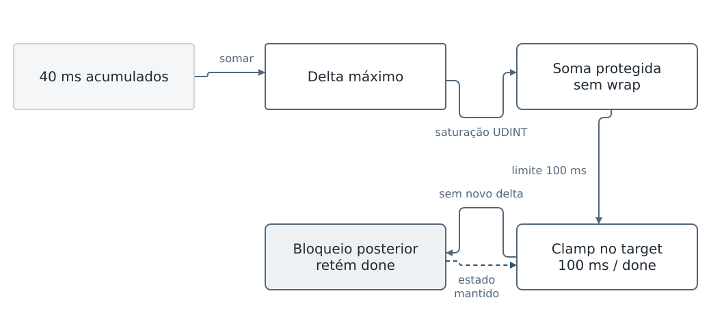

A soma satura com segurança e o timer limita o resultado à meta configurada.

**Condição inicial.** Usar target 100 ms e acumular 40 ms em uma instância zerada. A bancada deve registrar números UDINT como inteiros sem convertê-los para um tipo menor.

**Alteração.** Aplicar delta UDINT#4294967295 com Enable e Qualified verdadeiros. Depois chamar o bloco com as duas condições falsas, mantendo o mesmo target positivo.

**Componentes afetados.** F_SEQ_AddMs protege a soma contra overflow; a limitação posterior ajusta elapsed ao target. Perder habilitação ou qualificação não desfaz uma meta já atingida.

**Onde observar.** Observar o delta, target, elapsed e xDone nas chamadas de excesso e retenção. Não utilizar tempo de parede para produzir o valor extremo.

**Resultado esperado.** Após o delta extremo, elapsed vale 100 e xDone TRUE. Na chamada bloqueada, ambos permanecem 100/TRUE, sem retorno a um número pequeno por overflow.

**Divergência a investigar.** Reprovar acumulado negativo, reduzido por wrap, acima de 100 ou perda de xDone causada somente pela desabilitação.

**Retorno à referência.** Aplicar reset explícito com target positivo para retornar a 0/FALSE. Manter o caso isolado de qualquer temporização real de tarefa ou saída física.

**Fonte.** [src/fb/FB_SEQ_QualifiedTimer.st:21-32](https://github.com/luisauguszvc95-dot/FB_Sequence/blob/00f2953808e267bfdbc637347fea88737466e5bd/src/fb/FB_SEQ_QualifiedTimer.st#L21-L32); [tests/PRG_SEQ_SupportTests.st:66-77](https://github.com/luisauguszvc95-dot/FB_Sequence/blob/00f2953808e267bfdbc637347fea88737466e5bd/tests/PRG_SEQ_SupportTests.st#L66-L77); [src/functions/F_SEQ_AddMs.st:8-16](https://github.com/luisauguszvc95-dot/FB_Sequence/blob/00f2953808e267bfdbc637347fea88737466e5bd/src/functions/F_SEQ_AddMs.st#L8-L16)

### SEQ-056 - Target zero nunca conclui automaticamente

Temporizadores e aritmética | Contrato e validação | Completa | bancada dedicada

Confirmar a semântica explícita de meta inválida. A interpretação deve ser uniforme para manutenção e configuração: zero não representa uma duração imediatamente concluída neste bloco.

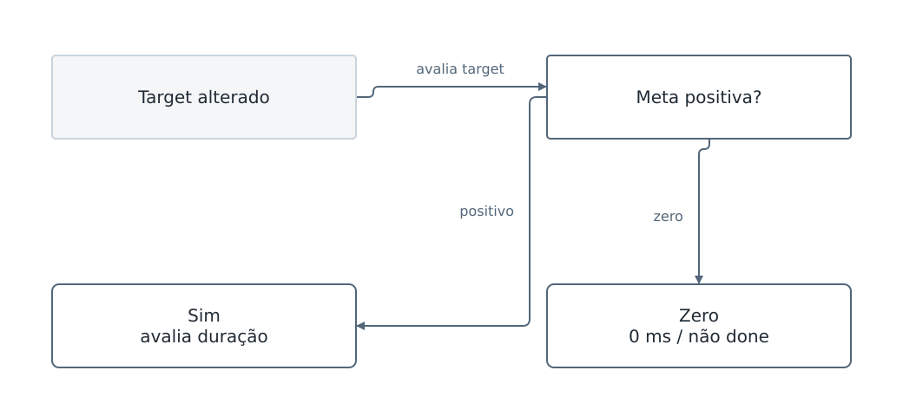

A meta zero apaga o acumulado pelo clamp e nunca sinaliza duração cumprida.

**Condição inicial.** Usar uma instância com target positivo e algum tempo acumulado. Preparar a transição do target por entrada pública, sem alterar a saída elapsed diretamente.

**Alteração.** Alterar udiTargetMs para zero com Enable e Qualified verdadeiros e delta positivo. Repetir uma chamada bloqueada e depois voltar a target 100 ms com delta 20 ms.

**Componentes afetados.** O clamp reduz o acumulado para zero quando a meta vale zero. A expressão de xDone exige target positivo, portanto o resultado não segue a comparação usual zero maior ou igual a zero.

**Onde observar.** Registrar target, elapsed e xDone antes e depois da alteração. Anotar que esta é uma prova do helper; a validação de receita deve barrar uma meta nula de WaitQualified.

**Resultado esperado.** Enquanto target for zero, elapsed fica 0 e xDone FALSE. Ao restaurar 100 ms, a nova chamada qualificada soma 20 ms e permanece não concluída.

**Divergência a investigar.** Reprovar xDone TRUE com target zero, retenção de tempo acima de zero ou recuperação a partir do valor que existia antes da meta nula.

**Retorno à referência.** Restaurar target e aplicar reset. Em uso normal, manter a meta fixa durante a etapa e tratar a configuração inválida na camada de receita.

**Fonte.** [src/fb/FB_SEQ_QualifiedTimer.st:26-32](https://github.com/luisauguszvc95-dot/FB_Sequence/blob/00f2953808e267bfdbc637347fea88737466e5bd/src/fb/FB_SEQ_QualifiedTimer.st#L26-L32); [tests/PRG_SEQ_SupportTests.st:84-89](https://github.com/luisauguszvc95-dot/FB_Sequence/blob/00f2953808e267bfdbc637347fea88737466e5bd/tests/PRG_SEQ_SupportTests.st#L84-L89)

### SEQ-057 - Mudança de meta e perda irreversível do tempo limitado

Temporizadores e aritmética | Limites e temporização | Aprofundamento | bancada dedicada

Caracterizar uma alteração de configuração que pode surpreender quem observa o timer. A evidência deve mostrar que o acumulador guarda somente o valor limitado, sem histórico oculto para recompor tempo anterior.

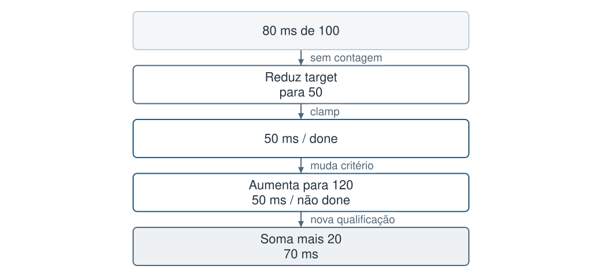

Alterar o target muda o valor armazenado e a conclusão; tempo removido pelo clamp não é recuperado.

**Condição inicial.** Em bancada dedicada, acumular 80 ms com target 100 ms. Usar chamadas seguintes desabilitadas para que a mudança observada venha apenas do target.

**Alteração.** Reduzir a meta para 50 ms, mantendo Enable FALSE. Em seguida, aumentar a meta para 120 ms e aplicar finalmente uma chamada habilitada e qualificada de 20 ms.

**Componentes afetados.** A comparação com o target ocorre mesmo sem contagem habilitada. Reduzir a meta limita o valor guardado; aumentá-la apenas muda o critério de conclusão e o teto das somas futuras.

**Onde observar.** Observar target, elapsed e xDone em cada chamada. Identificar a transição em que xDone muda sem entrada de tempo novo.

**Resultado esperado.** Os resultados são 50/TRUE após a redução, 50/FALSE após aumentar para 120 e 70/FALSE após somar 20. Os 30 ms eliminados não retornam.

**Divergência a investigar.** Reprovar retorno automático a 80 ms, ausência de clamp quando desabilitado ou xDone permanecendo TRUE após aumentar a meta acima do acumulado.

**Retorno à referência.** Restaurar target e resetar. O comportamento justifica a orientação do código de manter o target fixo durante uma etapa normal.

**Fonte.** [src/fb/FB_SEQ_QualifiedTimer.st:1-4](https://github.com/luisauguszvc95-dot/FB_Sequence/blob/00f2953808e267bfdbc637347fea88737466e5bd/src/fb/FB_SEQ_QualifiedTimer.st#L1-L4); [src/fb/FB_SEQ_QualifiedTimer.st:18-32](https://github.com/luisauguszvc95-dot/FB_Sequence/blob/00f2953808e267bfdbc637347fea88737466e5bd/src/fb/FB_SEQ_QualifiedTimer.st#L18-L32)

### SEQ-058 - Soma UDINT com saturação e sem retorno a zero

Temporizadores e aritmética | Limites e temporização | Completa | bancada dedicada

Validar a função compartilhada pelos acumuladores e diagnósticos. Um contador que reinicia por overflow pode sugerir uma recuperação inexistente; a soma saturada deve preservar o limite máximo representável.

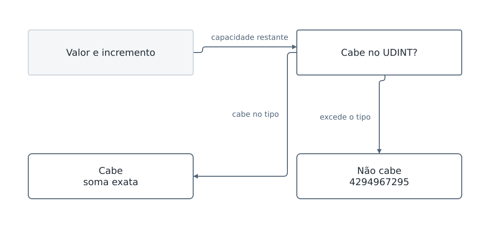

A checagem de capacidade precede a adição e torna previsível o comportamento no limite.

**Condição inicial.** Chamar F_SEQ_AddMs em um PRG temporário com pares constantes e armazenar cada retorno em uma variável de resultado. A função não possui estado interno entre chamadas.

**Alteração.** Comparar uma soma comum, uma adição de delta zero, a igualdade 4294967294 + 1, o excesso 4294967294 + 2 e máximo + máximo.

**Componentes afetados.** O cálculo verifica a capacidade restante antes de somar. Quando o incremento não cabe, retorna 4294967295; quando cabe exatamente, a adição normal chega ao mesmo máximo.

**Onde observar.** Registrar udiValue, udiDelta e retorno para cada vetor. Manter o tipo UDINT em toda a bancada para que uma conversão de tipo não distorça o ensaio.

**Resultado esperado.** 100 + 20 retorna 120; 100 + 0 retorna 100. Os três vetores de fronteira e excesso retornam 4294967295 sem exceção ou wrap.

**Divergência a investigar.** Reprovar valor pequeno após excesso, erro aritmético ou mudança causada por chamadas anteriores. O último valor é um teto, não uma contagem circular.

**Retorno à referência.** Limpar apenas as variáveis de resultado do PRG; a função não exige reset. Os vetores extremos são gerados por argumentos e não por forçamento de memória interna.

**Fonte.** [src/functions/F_SEQ_AddMs.st:1-17](https://github.com/luisauguszvc95-dot/FB_Sequence/blob/00f2953808e267bfdbc637347fea88737466e5bd/src/functions/F_SEQ_AddMs.st#L1-L17); [tests/PRG_SEQ_SupportTests.st:27-39](https://github.com/luisauguszvc95-dot/FB_Sequence/blob/00f2953808e267bfdbc637347fea88737466e5bd/tests/PRG_SEQ_SupportTests.st#L27-L39)

### SEQ-059 - Repetição, validade e imutabilidade de uma requisição

Admissão de comandos no suporte | Contrato e validação | Essencial | bancada dedicada

Verificar a proteção contra repetição na porta de entrada. Quem implementa uma IHM ou um dispatcher precisa entender que identidade de requisição e conteúdo enviado formam uma única solicitação imutável.

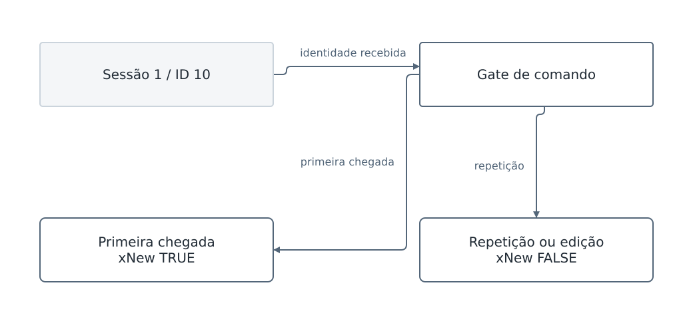

A mesma identidade não é reavaliada por alternância de xValid nem por edição do comando.

**Condição inicial.** Usar FB_SEQ_CommandGate isolado, sessão esperada 1 e processo 1. Enviar Start válido com sessão 1, processo 1 e RequestID 10; nenhuma execução do núcleo é necessária.

**Alteração.** Repetir a mesma entrada, alternar xValid FALSE/TRUE e alterar somente eCommand para Stop mantendo RequestID 10. Comparar cada chamada com a primeira admissão.

**Componentes afetados.** O gate memoriza a identidade vista e o maior ID consumido. xValid FALSE suspende a avaliação, mas não apaga essas memórias; o comando em si não muda a identidade.

**Onde observar.** Observar xNew, eReason e udiLastRequestID. xNew significa entrada nova para avaliação, não prova de que o núcleo aceitou executar Start ou Stop.

**Resultado esperado.** A primeira chamada produz TRUE/None/10. As repetições, a retomada de validade e a troca isolada de comando produzem xNew FALSE e preservam o último ID 10.

**Divergência a investigar.** Reprovar novo pulso para o mesmo par sessão/ID ou avanço da marca apenas por alternar validade. Registrar qualquer reexecução observada na integração separadamente.

**Retorno à referência.** Usar RequestID 11 para a próxima solicitação real da bancada ou reinicializar somente a aplicação isolada para repetir o cenário do zero.

**Fonte.** [src/fb/FB_SEQ_CommandGate.st:18-42](https://github.com/luisauguszvc95-dot/FB_Sequence/blob/00f2953808e267bfdbc637347fea88737466e5bd/src/fb/FB_SEQ_CommandGate.st#L18-L42); [tests/PRG_SEQ_SupportTests.st:223-249](https://github.com/luisauguszvc95-dot/FB_Sequence/blob/00f2953808e267bfdbc637347fea88737466e5bd/tests/PRG_SEQ_SupportTests.st#L223-L249)

### SEQ-060 - IDs antigos e retorno ao maior ID já consumido

Admissão de comandos no suporte | Contrato e validação | Completa | bancada dedicada

Confirmar que a referência de ordem não retrocede quando chegam mensagens antigas. O teste separa o último pacote visto do maior RequestID consumido, distinção relevante para explicar rejeições de replay.

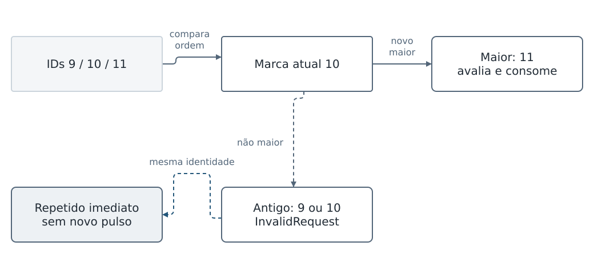

A memória do último pacote não substitui a marca crescente dos IDs consumidos.

**Condição inicial.** Inicializar o gate em sessão e processo 1 e admitir RequestID 10. Manter a requisição válida durante a sequência de entradas antigas e futuras.

**Alteração.** Apresentar RequestID 9, repetir 9, voltar a 10 e finalmente enviar 11. Alterar somente a identidade numérica, preservando sessão e processo corretos.

**Componentes afetados.** A identidade vista controla o pulso de avaliação. A marca udiLastRequestID controla a ordem admitida; receber um número antigo não deve reduzir essa marca.

**Onde observar.** Registrar RequestID, xNew, eReason e udiLastRequestID por chamada. Interpretar xNew TRUE com InvalidRequest como rejeição nova que pode ser reportada, não como aceite.

**Resultado esperado.** ID 9 gera TRUE/InvalidRequest mantendo marca 10; sua repetição não gera xNew. Voltar a 10 após 9 também gera TRUE/InvalidRequest. ID 11 gera TRUE/None e atualiza a marca para 11.

**Divergência a investigar.** Reprovar marca reduzida para 9, aprovação de 10 no retorno ou bloqueio de 11 causado pela passagem de um ID antigo.

**Retorno à referência.** Continuar com IDs superiores a 11 ou reinicializar a bancada isolada. Não corrigir a marca escrevendo na saída do bloco.

**Fonte.** [src/fb/FB_SEQ_CommandGate.st:23-40](https://github.com/luisauguszvc95-dot/FB_Sequence/blob/00f2953808e267bfdbc637347fea88737466e5bd/src/fb/FB_SEQ_CommandGate.st#L23-L40); [tests/PRG_SEQ_SupportTests.st:250-265](https://github.com/luisauguszvc95-dot/FB_Sequence/blob/00f2953808e267bfdbc637347fea88737466e5bd/tests/PRG_SEQ_SupportTests.st#L250-L265); [tests/PRG_SEQ_SupportTests.st:275-281](https://github.com/luisauguszvc95-dot/FB_Sequence/blob/00f2953808e267bfdbc637347fea88737466e5bd/tests/PRG_SEQ_SupportTests.st#L275-L281)

### SEQ-061 - Sessão incorreta sem contaminação da ordem

Admissão de comandos no suporte | Contrato e validação | Essencial | bancada dedicada

Verificar o isolamento de sessão na admissão. Uma mensagem atrasada de outra inicialização não pode deslocar a marca de RequestID e impedir um comando legítimo do produtor esperado.

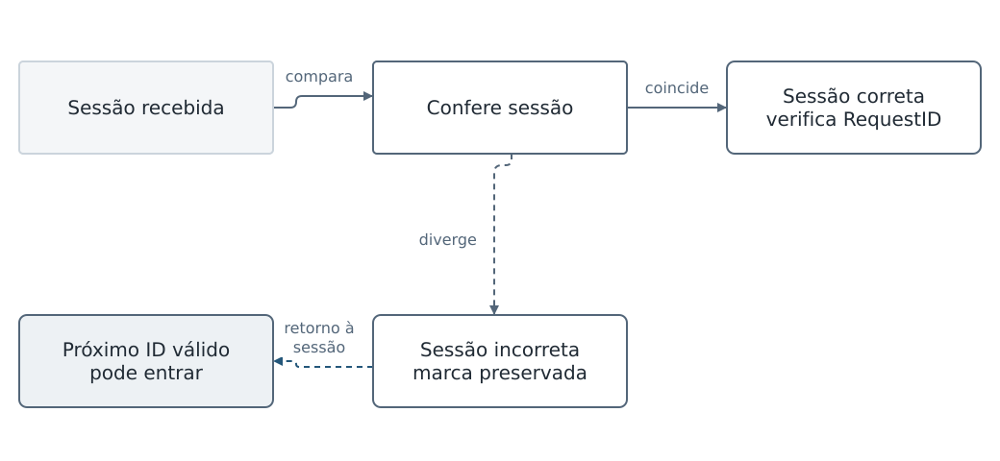

Sessão rejeitada não consome a numeração da sessão válida.

**Condição inicial.** Usar o gate com sessão esperada 1 e processo 1; admitir primeiro RequestID 10 da sessão 1. Preparar também uma entrada de sessão 2 com ID 1000.

**Alteração.** Enviar a mensagem da sessão 2, repeti-la e retornar à sessão 1 com ID 11. Em instância nova, comparar ainda uma sessão esperada zero, mesmo com a entrada identificada.

**Componentes afetados.** A verificação de sessão ocorre antes da comparação de IDs. Uma sessão inválida gera diagnóstico sem consumir o ID alto da mensagem recusada.

**Onde observar.** Observar sessão esperada, sessão recebida, xNew, eReason e udiLastRequestID. A repetição imediata do mesmo pacote rejeitado não deve produzir pulsos indefinidos.

**Resultado esperado.** A primeira entrada de sessão 2 gera TRUE/SessionMismatch e mantém marca 10; sua repetição gera xNew FALSE. Sessão 1/ID 11 passa e atualiza para 11. Sessão esperada zero gera SessionMismatch.

**Divergência a investigar.** Reprovar marca 1000 após a sessão errada, rejeição de 11 por esse ID externo ou aceitação com sessão esperada zero.

**Retorno à referência.** Restaurar a sessão de referência e seguir com IDs crescentes. Reinicialização de bancada exige nova preparação das identidades; não representa persistência de sessão no PLC.

**Fonte.** [src/fb/FB_SEQ_CommandGate.st:23-40](https://github.com/luisauguszvc95-dot/FB_Sequence/blob/00f2953808e267bfdbc637347fea88737466e5bd/src/fb/FB_SEQ_CommandGate.st#L23-L40); [tests/PRG_SEQ_SupportTests.st:267-281](https://github.com/luisauguszvc95-dot/FB_Sequence/blob/00f2953808e267bfdbc637347fea88737466e5bd/tests/PRG_SEQ_SupportTests.st#L267-L281)

### SEQ-062 - Processo incorreto consome a identidade da solicitação

Admissão de comandos no suporte | Contrato e validação | Completa | bancada dedicada

Confirmar a regra de imutabilidade após admissão da identidade, mesmo quando a semântica de roteamento está errada. Essa regra evita que um mesmo ID represente dois pedidos diferentes nas evidências.

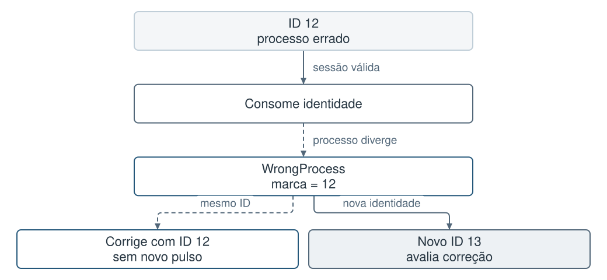

O erro de processo é semântico; a identidade já consumida não pode ser reutilizada.

**Condição inicial.** Usar sessão esperada 1, processo esperado 1 e marca inicial 10. Preparar RequestID 12 na sessão correta, porém com uiProcessID 2.

**Alteração.** Enviar a requisição destinada ao processo errado. Corrigir somente uiProcessID para 1, preservando ID 12, e depois emitir uma nova solicitação com ID 13.

**Componentes afetados.** O gate consome o ID crescente antes de validar o processo. Editar conteúdo mantendo identidade já vista não cria uma requisição nova; a correção precisa de outro ID.

**Onde observar.** Observar uiProcessID recebido e esperado, xNew, eReason e udiLastRequestID. Guardar a rejeição original com ID 12 e a nova solicitação corrigida com ID 13.

**Resultado esperado.** A entrada errada produz TRUE/WrongProcess e marca 12. A edição para processo correto com o mesmo ID produz xNew FALSE. ID 13 correto produz TRUE/None e marca 13.

**Divergência a investigar.** Reprovar preservação indevida da marca 10 após WrongProcess, aceite da edição com ID 12 ou rejeição de 13 pelo erro de roteamento anterior.

**Retorno à referência.** Manter o processo correto e utilizar IDs superiores a 13. Não retirar xValid esperando apagar o histórico do gate.

**Fonte.** [src/fb/FB_SEQ_CommandGate.st:31-40](https://github.com/luisauguszvc95-dot/FB_Sequence/blob/00f2953808e267bfdbc637347fea88737466e5bd/src/fb/FB_SEQ_CommandGate.st#L31-L40); [tests/PRG_SEQ_SupportTests.st:283-300](https://github.com/luisauguszvc95-dot/FB_Sequence/blob/00f2953808e267bfdbc637347fea88737466e5bd/tests/PRG_SEQ_SupportTests.st#L283-L300)

### SEQ-063 - ID zero, salto de numeração e limite da sessão

Admissão de comandos no suporte | Limites e temporização | Aprofundamento | bancada dedicada

Caracterizar o limite da numeração sem criar bilhões de comandos. O contrato exige crescimento, não consecutividade; ao consumir o maior UDINT, não há outro ID maior disponível na mesma instância.

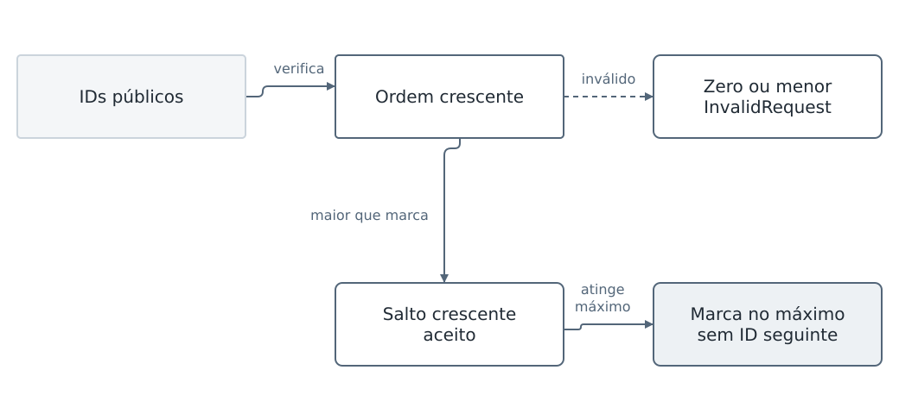

A ordem aceita saltos, mas nunca admite zero nem reutilização após atingir o teto numérico.

**Condição inicial.** Em um gate novo, usar sessão e processo esperados iguais a 1. Os valores extremos entram pela estrutura pública da requisição, sem tocar na marca interna.

**Alteração.** Enviar ID zero, depois 100, depois UDINT#4294967295. Em seguida, tentar ID 1 mantendo a mesma sessão. Registrar os resultados como fronteiras do helper.

**Componentes afetados.** O zero é inválido; um salto para um número maior é admitido. A marca não retorna a zero nem se reinicia por esgotamento; o bloco não fornece comando público de reset da numeração.

**Onde observar.** Observar xNew, eReason e udiLastRequestID em todas as variantes. A aceitação aqui significa ausência de defeito de identidade, ainda sujeita às regras do núcleo.

**Resultado esperado.** Zero gera InvalidRequest e mantém marca 0. Os IDs 100 e máximo geram None e atualizam a marca. O retorno a 1 gera InvalidRequest e preserva o máximo.

**Divergência a investigar.** Reprovar exigência de ID 101 após 100, aceitação de zero ou wrap da marca depois do máximo. Não interpretar esgotamento como perda silenciosa da proteção contra replay.

**Retorno à referência.** Reinicializar somente a aplicação de bancada e preparar nova sessão para novos ensaios. O procedimento de reinicialização operacional pertence ao contrato de integração.

**Fonte.** [src/fb/FB_SEQ_CommandGate.st:18-40](https://github.com/luisauguszvc95-dot/FB_Sequence/blob/00f2953808e267bfdbc637347fea88737466e5bd/src/fb/FB_SEQ_CommandGate.st#L18-L40)

### SEQ-064 - Push por chamada e atribuição de identidade pela fila

Fila de eventos no suporte | Funcional | Essencial | bancada dedicada

Confirmar a semântica de inserção para quem escreve o produtor de eventos. O helper trata cada chamada verdadeira como um pedido, portanto não depende de borda de subida para produzir novas entradas.

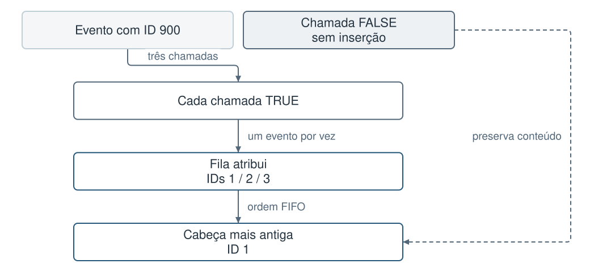

xPush é um pedido por chamada; a fila é responsável pelos IDs dos eventos aceitos.

**Condição inicial.** Instanciar uma fila nova em PRG isolado. Preparar um evento com sessão 1, processo 1 e EventID de entrada 900, mantendo ACK zero.

**Alteração.** Chamar a fila três vezes com xPush TRUE, sem alternar o sinal. Fazer uma quarta chamada com xPush FALSE e depois drenar os três eventos por seus IDs observados.

**Componentes afetados.** Cada push copia o evento e atribui um EventID da própria fila. O EventID sugerido pelo produtor é substituído; a cabeça permanece sendo o mais antigo ainda não confirmado.

**Onde observar.** Observar uiCount, xAvailable, stHead.udiEventID e os IDs sucessivos durante a drenagem. Registrar também udiDropped, que deve permanecer zero neste ensaio.

**Resultado esperado.** A contagem cresce 1, 2 e 3; a chamada FALSE preserva 3. A cabeça inicial tem ID 1 e a drenagem apresenta 1, 2 e 3, nunca 900.

**Divergência a investigar.** Reprovar apenas um evento após três chamadas TRUE, reutilização de 900, repetição de IDs aceitos ou inserção produzida por xPush FALSE.

**Retorno à referência.** Drenar por ACK da cabeça observada e manter xPush FALSE. Na integração, o produtor deve gerar somente as chamadas correspondentes a fatos reais do ciclo.

**Fonte.** [src/fb/FB_SEQ_EventQueue.st:1-8](https://github.com/luisauguszvc95-dot/FB_Sequence/blob/00f2953808e267bfdbc637347fea88737466e5bd/src/fb/FB_SEQ_EventQueue.st#L1-L8); [src/fb/FB_SEQ_EventQueue.st:48-71](https://github.com/luisauguszvc95-dot/FB_Sequence/blob/00f2953808e267bfdbc637347fea88737466e5bd/src/fb/FB_SEQ_EventQueue.st#L48-L71); [tests/PRG_SEQ_SupportTests.st:167-178](https://github.com/luisauguszvc95-dot/FB_Sequence/blob/00f2953808e267bfdbc637347fea88737466e5bd/tests/PRG_SEQ_SupportTests.st#L167-L178)

### SEQ-065 - ACK exato, incorreto e repetido

Fila de eventos no suporte | Contrato e validação | Essencial | bancada dedicada

Verificar a condição de retirada e a resistência a confirmações repetidas. O consumidor precisa saber que o ACK identifica somente a cabeça existente, sem busca por eventos no meio da fila.

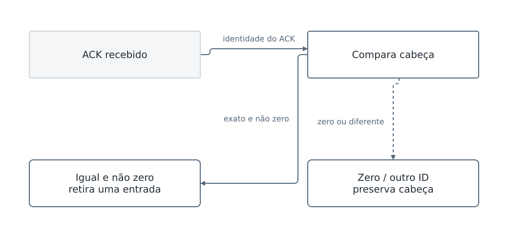

Somente a identidade da cabeça existente autoriza sua retirada; repetição não avança a fila.

**Condição inicial.** Usar uma fila nova com três eventos aceitos e xPush FALSE durante a avaliação. Registrar os IDs 1, 2 e 3 como referência da ordem esperada.

**Alteração.** Apresentar ACK zero e ACK 3 enquanto a cabeça vale 1. Depois confirmar 1 e repetir esse mesmo ACK quando a cabeça já passou a 2.

**Componentes afetados.** O comparador só remove a cabeça quando o ID recebido é não nulo e idêntico ao evento mais antigo. Um ACK repetido não alcança automaticamente a entrada seguinte.

**Onde observar.** Observar uiCount, stHead.udiEventID e xAvailable antes e depois de cada confirmação. Não aceitar somente uma mudança no valor escrito pelo consumidor como evidência de retirada.

**Resultado esperado.** ACKs zero e 3 preservam contagem 3 e cabeça 1. ACK 1 reduz para 2 e expõe cabeça 2. Repetir ACK 1 mantém esses valores.

**Divergência a investigar.** Reprovar remoção fora de ordem, retirada de duas entradas por um ACK ou aceitação de zero como confirmação. Este helper não comprova armazenamento durável pelo consumidor.

**Retorno à referência.** Limpar ACK e drenar os IDs restantes, observando cada cabeça. Usar uma instância nova para repetir as identidades iniciais.

**Fonte.** [src/fb/FB_SEQ_EventQueue.st:34-46](https://github.com/luisauguszvc95-dot/FB_Sequence/blob/00f2953808e267bfdbc637347fea88737466e5bd/src/fb/FB_SEQ_EventQueue.st#L34-L46); [tests/PRG_SEQ_SupportTests.st:185-195](https://github.com/luisauguszvc95-dot/FB_Sequence/blob/00f2953808e267bfdbc637347fea88737466e5bd/tests/PRG_SEQ_SupportTests.st#L185-L195)

### SEQ-066 - Fila cheia preserva eventos antigos e conta a perda

Fila de eventos no suporte | Falhas e recuperação | Essencial | bancada dedicada

Validar a política de descarte de novas entradas. A evidência deve deixar claro ao setor que preservar a cabeça não significa ausência de perda: a nova tentativa excedente precisa aparecer no diagnóstico.

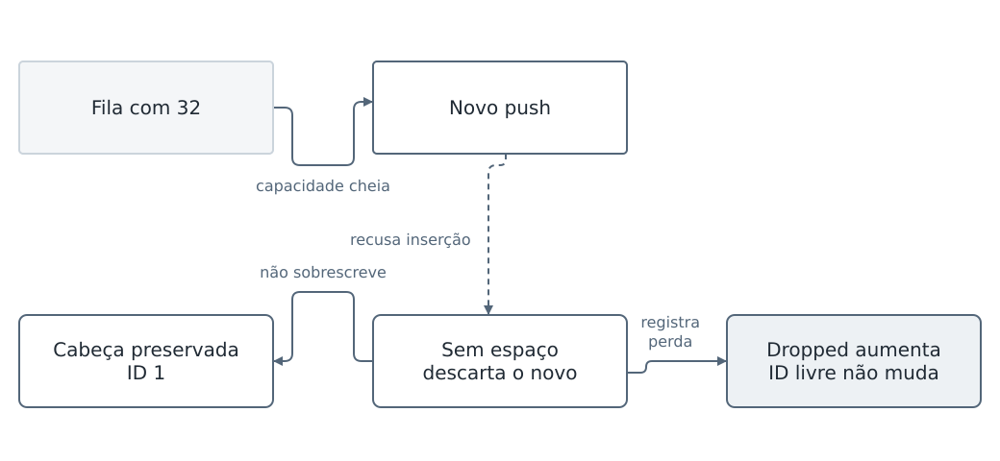

A política drop-new conserva os eventos pendentes e torna a perda de novas entradas visível.

**Condição inicial.** Instanciar fila nova e aceitar 32 eventos identificáveis por um campo de payload, sem ACK. Registrar a cabeça, a ocupação e o contador de descartes antes da saturação.

**Alteração.** Apresentar um 33º evento com payload distinto e depois repetir outra tentativa de push enquanto a fila continua cheia. Não confirmar entradas durante essas duas chamadas.

**Componentes afetados.** Capacidade cheia impede cópia da nova entrada, incrementa udiDropped e preserva os eventos mais antigos. A rejeição não consome o próximo EventID disponível.

**Onde observar.** Observar uiCount 32, stHead ID 1 e udiDropped. Drenar depois os eventos para confirmar que os payloads excedentes não substituíram uma entrada existente.

**Resultado esperado.** A contagem e a cabeça permanecem 32/1; os descartes crescem para 1 e 2. Após liberar uma posição e aceitar nova entrada, seu ID é 33, sem lacuna causada pelos descartes.

**Divergência a investigar.** Reprovar sobrescrita de evento antigo, contador inalterado, ocupação acima de 32 ou consumo de IDs para pushes recusados por capacidade.

**Retorno à referência.** Drenar a fila por ACKs corretos e registrar udiDropped acumulado. O contador permanece como evidência da perda até reinicialização da instância de bancada.

**Fonte.** [src/fb/FB_SEQ_EventQueue.st:48-71](https://github.com/luisauguszvc95-dot/FB_Sequence/blob/00f2953808e267bfdbc637347fea88737466e5bd/src/fb/FB_SEQ_EventQueue.st#L48-L71); [tests/PRG_SEQ_SupportTests.st:179-183](https://github.com/luisauguszvc95-dot/FB_Sequence/blob/00f2953808e267bfdbc637347fea88737466e5bd/tests/PRG_SEQ_SupportTests.st#L179-L183); [tests/PRG_SEQ_SupportTests.st:196-202](https://github.com/luisauguszvc95-dot/FB_Sequence/blob/00f2953808e267bfdbc637347fea88737466e5bd/tests/PRG_SEQ_SupportTests.st#L196-L202)

### SEQ-067 - ACK e push simultâneos com capacidade cheia

Fila de eventos no suporte | Limites e temporização | Completa | bancada dedicada

Confirmar a ordem de processamento entre retirada e inserção. Essa condição permite consumir e produzir continuamente sem descarte desnecessário quando a fila estava cheia no início da chamada.

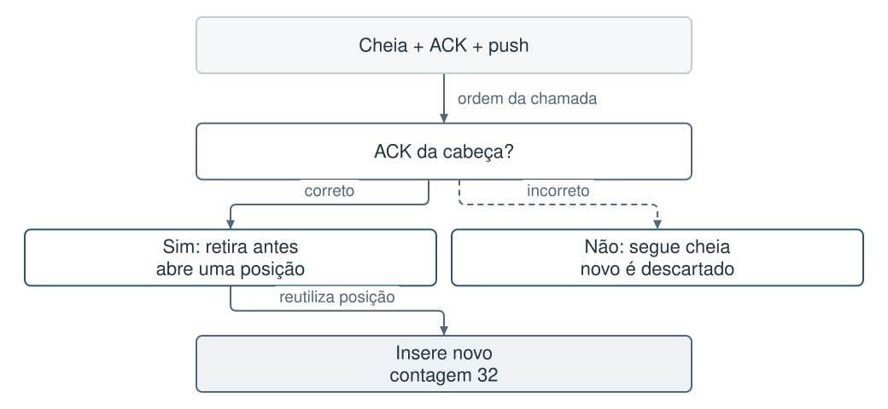

A retirada precede a inserção, permitindo manter ocupação cheia sem perda quando há ACK válido.

**Condição inicial.** Preparar uma fila com 32 eventos e cabeça ID 1. Guardar um novo evento de payload distinto e manter o contador de descartes em zero antes da chamada combinada.

**Alteração.** Apresentar xPush TRUE junto de udiAckEventID 1. Em uma repetição separada da bancada, apresentar o mesmo push com ACK incorreto para comparar a diferença.

**Componentes afetados.** O pop da cabeça existente ocorre antes da análise de espaço para push. Um ACK correto abre a posição necessária; um ACK incorreto deixa a fila cheia e conduz à política de descarte.

**Onde observar.** Observar ocupação, cabeça, descartes e o novo ID ao drenar a cauda. Registrar os valores antes e depois da chamada, sem depender de índices internos do anel.

**Resultado esperado.** Com ACK correto, a contagem continua 32, a cabeça passa a 2, o novo evento recebe ID 33 e nenhum descarte é contado. Com ACK incorreto, cabeça e conteúdo permanecem e o descarte aumenta.

**Divergência a investigar.** Reprovar descarte com ACK correto, aceitação acima de capacidade ou retirada do evento recém-inserido pela mesma confirmação.

**Retorno à referência.** Drenar por ACKs observados e reinicializar a bancada para comparar a variante incorreta sob a mesma ocupação inicial.

**Fonte.** [src/fb/FB_SEQ_EventQueue.st:34-58](https://github.com/luisauguszvc95-dot/FB_Sequence/blob/00f2953808e267bfdbc637347fea88737466e5bd/src/fb/FB_SEQ_EventQueue.st#L34-L58); [tests/PRG_SEQ_SupportTests.st:196-202](https://github.com/luisauguszvc95-dot/FB_Sequence/blob/00f2953808e267bfdbc637347fea88737466e5bd/tests/PRG_SEQ_SupportTests.st#L196-L202)

### SEQ-068 - Reutilização circular com ordem FIFO preservada

Fila de eventos no suporte | Limites e temporização | Completa | bancada dedicada

Validar a memória circular usando somente a interface pública. O teste demonstra que reutilizar posições físicas de armazenamento não altera a ordem lógica dos fatos nem faz a identidade voltar ao início.

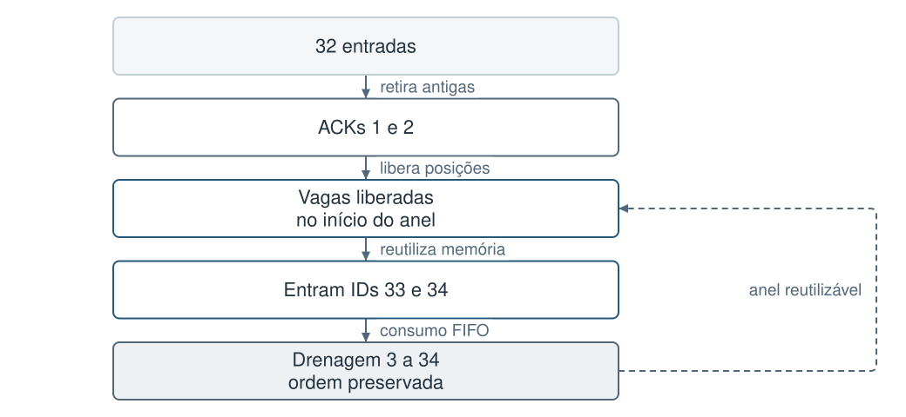

O anel reutiliza posições; os EventIDs e a ordem FIFO seguem crescentes.

**Condição inicial.** Usar uma fila nova, preencher 32 posições e registrar a sequência aceita. Preparar um pequeno registro no PRG para armazenar os IDs e payloads vistos durante a drenagem.

**Alteração.** Confirmar IDs 1 e 2, inserir dois novos eventos e drenar todos os restantes. A movimentação faz a escrita reutilizar as primeiras posições do anel.

**Componentes afetados.** Índices de cabeça e cauda retornam à posição 1 no limite físico. EventID continua crescente e permite ao consumidor interpretar a sequência independentemente da posição de memória.

**Onde observar.** Observar somente stHead, uiCount, xAvailable e udiDropped. Comparar a lista de IDs drenados com os payloads preparados pelo produtor.

**Resultado esperado.** Após as duas retiradas e inserções, a cabeça é 3 e a contagem 32. A drenagem apresenta exatamente IDs 3 a 34 em ordem; ao final há contagem zero e cabeça vazia.

**Divergência a investigar.** Reprovar salto, duplicação, reordenação, retorno de EventID a 1 ou perda de um payload sem incremento de descarte. A capacidade física não redefine a identidade lógica.

**Retorno à referência.** Deixar xPush FALSE e ACK zero após a drenagem. A instância preserva a numeração para novos eventos; somente a bancada reinicializada volta ao estado inicial.

**Fonte.** [src/fb/FB_SEQ_EventQueue.st:34-80](https://github.com/luisauguszvc95-dot/FB_Sequence/blob/00f2953808e267bfdbc637347fea88737466e5bd/src/fb/FB_SEQ_EventQueue.st#L34-L80); [tests/PRG_SEQ_SupportTests.st:196-214](https://github.com/luisauguszvc95-dot/FB_Sequence/blob/00f2953808e267bfdbc637347fea88737466e5bd/tests/PRG_SEQ_SupportTests.st#L196-L214)

### SEQ-069 - Fila vazia, ACK especulativo e limpeza da cabeça

Fila de eventos no suporte | Contrato e validação | Completa | bancada dedicada

Confirmar a fronteira entre eventos já existentes e o primeiro evento recém-recebido. A prova também verifica se a saída vazia deixa dados antigos aparentando disponibilidade após a última retirada.

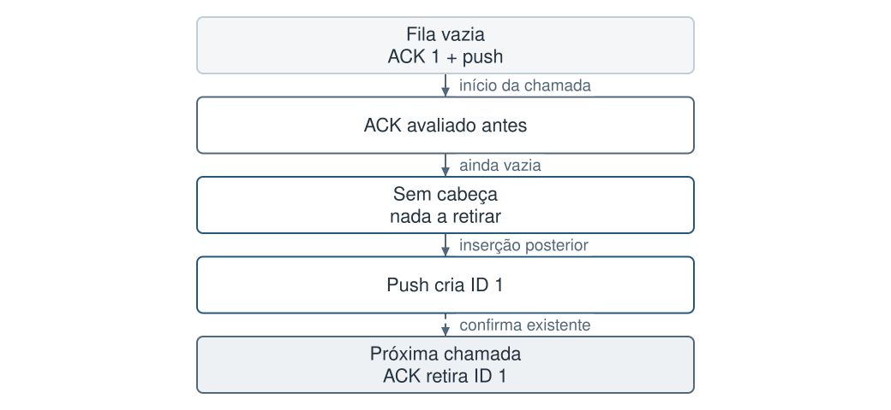

ACK não confirma antecipadamente um evento que ainda não existia no início da chamada.

**Condição inicial.** Usar fila nova vazia com próximo ID natural 1. Preparar um evento válido para a bancada e um ACK de valor 1, ainda sem haver cabeça para confirmar.

**Alteração.** Enviar xPush TRUE e ACK 1 na mesma chamada. Na chamada seguinte, usar xPush FALSE e ACK 1 para retirar a entrada agora existente; repetir uma chamada sem ACK.

**Componentes afetados.** O processamento de ACK acontece antes do push e só considera uma cabeça já existente. Quando a fila fica vazia, o bloco substitui stHead por uma estrutura vazia.

**Onde observar.** Observar xAvailable, uiCount e stHead.udiEventID, além de algum campo de payload não nulo para comprovar a limpeza das saídas após a drenagem.

**Resultado esperado.** A chamada combinada cria uma entrada com ID 1 e contagem 1. Somente a chamada seguinte a remove. A fila vazia apresenta xAvailable FALSE, contagem 0 e campos da cabeça zerados.

**Divergência a investigar.** Reprovar desaparecimento imediato do primeiro evento, cabeça com ID antigo quando indisponível ou decremento de contagem abaixo de zero.

**Retorno à referência.** Manter xPush FALSE e ACK zero. Nas integrações, confirmar somente a cabeça efetivamente recebida; o ensaio de ACK antecipado é exclusivo da bancada.

**Fonte.** [src/fb/FB_SEQ_EventQueue.st:34-46](https://github.com/luisauguszvc95-dot/FB_Sequence/blob/00f2953808e267bfdbc637347fea88737466e5bd/src/fb/FB_SEQ_EventQueue.st#L34-L46); [src/fb/FB_SEQ_EventQueue.st:75-80](https://github.com/luisauguszvc95-dot/FB_Sequence/blob/00f2953808e267bfdbc637347fea88737466e5bd/src/fb/FB_SEQ_EventQueue.st#L75-L80); [tests/PRG_SEQ_SupportTests.st:215-221](https://github.com/luisauguszvc95-dot/FB_Sequence/blob/00f2953808e267bfdbc637347fea88737466e5bd/tests/PRG_SEQ_SupportTests.st#L215-L221)

### SEQ-070 - Cópia do payload e responsabilidade pela sessão

Fila de eventos no suporte | Contrato e validação | Aprofundamento | bancada dedicada

Delimitar a responsabilidade do helper para evitar expectativas incorretas em testes de integração. A fila guarda uma cópia do evento e compara EventID; a filtragem de sessão do ACK acontece na camada que a chama.

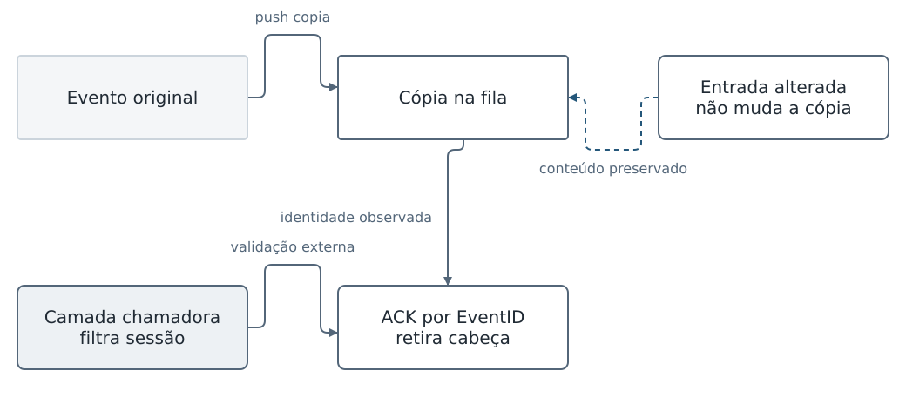

O helper copia o evento e compara EventID; sessão do ACK deve ser validada por seu chamador.

**Condição inicial.** Em bancada, inserir um evento com sessão 7, processo 3 e payload reconhecível. Manter ACK zero e guardar uma cópia externa do candidato original.

**Alteração.** Após o push, alterar somente a variável de entrada para outra sessão e outro payload, chamando novamente com xPush FALSE. Depois confirmar usando o EventID observado na cabeça.

**Componentes afetados.** A atribuição ao buffer copia a estrutura no momento da inserção, substituindo apenas EventID. Alterações posteriores no candidato não devem reescrever o evento armazenado. A interface do helper não recebe AckSessionID.

**Onde observar.** Observar stHead.udiSessionID, uiProcessID, o campo de payload escolhido e udiEventID. Verificar as entradas disponíveis na assinatura pública para localizar onde cabe a validação adicional.

**Resultado esperado.** A cabeça conserva sessão 7, processo 3 e payload original até o ACK. O ID observado a remove. Este resultado não comprova proteção de sessão no FB_Sequence completo.

**Divergência a investigar.** Reprovar alteração retroativa do conteúdo pendente ou documentar este helper como responsável por autenticação, sessão do consumidor ou persistência durável.

**Retorno à referência.** Drenar a fila e limpar o candidato. Validar a filtragem de sessão separadamente nos testes da interface pública do núcleo.

**Fonte.** [src/fb/FB_SEQ_EventQueue.st:9-14](https://github.com/luisauguszvc95-dot/FB_Sequence/blob/00f2953808e267bfdbc637347fea88737466e5bd/src/fb/FB_SEQ_EventQueue.st#L9-L14); [src/fb/FB_SEQ_EventQueue.st:34-38](https://github.com/luisauguszvc95-dot/FB_Sequence/blob/00f2953808e267bfdbc637347fea88737466e5bd/src/fb/FB_SEQ_EventQueue.st#L34-L38); [src/fb/FB_SEQ_EventQueue.st:55-57](https://github.com/luisauguszvc95-dot/FB_Sequence/blob/00f2953808e267bfdbc637347fea88737466e5bd/src/fb/FB_SEQ_EventQueue.st#L55-L57)

### SEQ-071 - Ciclo sem fatos limpa todas as saídas do builder

Construção de fatos de rastreabilidade | Funcional | Essencial | bancada dedicada

Confirmar que a saída do construtor descreve somente a chamada atual. Isso evita que consumidores confundam conteúdo residual em um array com a repetição real de um fato.

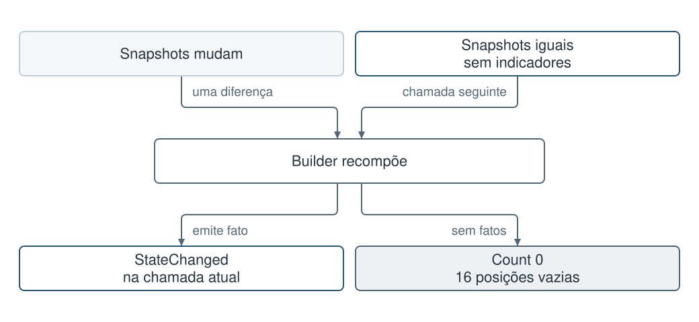

O array é limpo em toda chamada; a ausência de fatos não mantém eventos do ciclo anterior.

**Condição inicial.** Usar FB_SEQ_EventBuilder isolado em PRG de simulação. Alimentá-lo com duas estruturas ST_SEQ_RUNTIME preparadas como snapshots coerentes e com todos os indicadores de evento explicitamente controlados.

**Alteração.** Primeiro apresentar uma mudança de estado Running para Held, sem outras diferenças. Depois usar snapshots idênticos em Idle, sem comando novo, carga de receita, conclusão de etapa ou confirmação.

**Componentes afetados.** Cada chamada zera uiCount e todas as 16 posições de astEvents antes de avaliar os predicados. A instância reutilizada permite detectar qualquer conteúdo indevidamente retido.

**Onde observar.** Observar uiCount e, nas 16 posições, udiSessionID, udiRequestID, udiBatchID e demais campos antes ocupados. A posição do array sozinha não informa se há evento disponível.

**Resultado esperado.** A primeira chamada emite apenas StateChanged quando não há outras diferenças. A chamada quieta retorna uiCount 0 e estruturas vazias em todas as posições, inclusive na anteriormente utilizada.

**Divergência a investigar.** Reprovar contagem residual, identidade de lote antiga em posição fora da contagem ou evento reaparecendo sem novo predicado verdadeiro.

**Retorno à referência.** Deixar os snapshots iguais e todos os indicadores FALSE. Os fixtures 0 e 14 do TraceTests exercitam essa limpeza antes e depois de chamadas com fatos.

**Fonte.** [src/fb/FB_SEQ_EventBuilder.st:30-33](https://github.com/luisauguszvc95-dot/FB_Sequence/blob/00f2953808e267bfdbc637347fea88737466e5bd/src/fb/FB_SEQ_EventBuilder.st#L30-L33); [tests/PRG_SEQ_TraceTests.st:67-70](https://github.com/luisauguszvc95-dot/FB_Sequence/blob/00f2953808e267bfdbc637347fea88737466e5bd/tests/PRG_SEQ_TraceTests.st#L67-L70); [tests/PRG_SEQ_TraceTests.st:180-188](https://github.com/luisauguszvc95-dot/FB_Sequence/blob/00f2953808e267bfdbc637347fea88737466e5bd/tests/PRG_SEQ_TraceTests.st#L180-L188)

### SEQ-072 - Carga de receita: ordem dos fatos e identidade aplicada

Construção de fatos de rastreabilidade | Rastreabilidade e persistência | Essencial | bancada dedicada

Verificar como uma carga bem-sucedida vira fatos correlacionados. Qualidade e suporte devem conseguir identificar a revisão efetiva e a solicitação que a estabeleceu sem depender da ordem de leitura da tela.

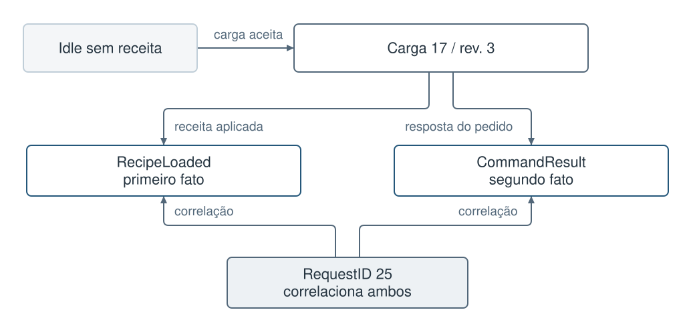

A ordem dos fatos preserva a carga aplicada e sua relação explícita com a requisição.

**Condição inicial.** Preparar snapshots em Idle, antes sem receita e depois com receita 17 revisão 3. Usar resultado LoadRecipe Accepted válido, sessão 9001, RequestID 25 e SourceID 7.

**Alteração.** Chamar o builder com xRecipeLoaded e xCommandNew TRUE. Manter lote, etapa, recurso e estado inalterados para não acrescentar outros fatos à mesma chamada.

**Componentes afetados.** O indicador de carga emite RecipeLoaded; o novo resultado válido emite CommandResult. A correlação associa a identidade da requisição aos fatos diretamente ligados ao comando.

**Onde observar.** Observar uiCount, eKind das primeiras posições, udiRecipeID, udiRecipeRevision, udiRecipeIDBefore, udiRequestID e uiSourceID. Conferir que EventID permanece reservado para a fila.

**Resultado esperado.** A contagem é 2, em ordem RecipeLoaded e CommandResult. O primeiro evento informa receita 17/revisão 3, receita anterior zero e RequestID 25. Ambos têm EventID zero nesta camada.

**Divergência a investigar.** Reprovar inversão da ordem contratada, receita solicitada aparecendo sem a revisão aplicada ou perda da correlação com a requisição válida.

**Retorno à referência.** Zerar os indicadores e reutilizar snapshots idênticos para encerrar a fixture. A saída do builder ainda precisa ser enfileirada e consumida para chegar ao historiador.

**Fonte.** [src/fb/FB_SEQ_EventBuilder.st:66-74](https://github.com/luisauguszvc95-dot/FB_Sequence/blob/00f2953808e267bfdbc637347fea88737466e5bd/src/fb/FB_SEQ_EventBuilder.st#L66-L74); [src/fb/FB_SEQ_EventBuilder.st:120-138](https://github.com/luisauguszvc95-dot/FB_Sequence/blob/00f2953808e267bfdbc637347fea88737466e5bd/src/fb/FB_SEQ_EventBuilder.st#L120-L138); [tests/PRG_SEQ_TraceTests.st:143-155](https://github.com/luisauguszvc95-dot/FB_Sequence/blob/00f2953808e267bfdbc637347fea88737466e5bd/tests/PRG_SEQ_TraceTests.st#L143-L155); [tests/PRG_SEQ_TraceTests.st:273-279](https://github.com/luisauguszvc95-dot/FB_Sequence/blob/00f2953808e267bfdbc637347fea88737466e5bd/tests/PRG_SEQ_TraceTests.st#L273-L279)

### SEQ-073 - Receita rejeitada e mudança de Control no mesmo ciclo

Construção de fatos de rastreabilidade | Rastreabilidade e persistência | Completa | bancada dedicada

Evitar atribuição causal incorreta nas evidências. Uma solicitação recusada pode coexistir com uma mudança de estado causada pelo Control; os fatos precisam conservar essa distinção para análise posterior.

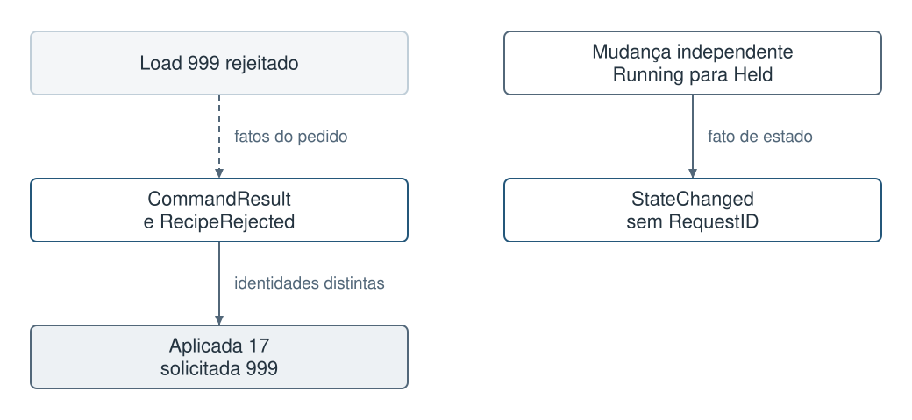

A coexistência no mesmo ciclo não transforma um comando rejeitado em causa da mudança de estado.

**Condição inicial.** Preparar snapshots com receita aplicada 17/revisão 3 e mudança Running para Held, preservando etapa e token. Preparar LoadRecipe 999/revisão 5 rejeitado, RequestID 25 e SourceID 7.

**Alteração.** Chamar o builder com xCommandNew TRUE e resultado válido Rejected/InvalidRecipeRef. Manter xRecipeLoaded, xStepCompleted e xConfirmed FALSE; os snapshots representam a mudança independente de estado.

**Componentes afetados.** Os predicados emitem mudança de estado e resultado do comando. Somente fatos diretamente ligados ao pedido recebem seus dados de correlação; a identidade solicitada ocupa campos distintos da identidade aplicada.

**Onde observar.** Observar eKind, udiRequestID, udiRecipeID, udiRequestedRecipeID e udiRequestedRecipeRevision em cada evento. Comparar SourceID do pedido com ProducerSourceID da Sequence.

**Resultado esperado.** A ordem é StateChanged, CommandResult e RecipeRejected. StateChanged mantém RequestID zero. RecipeRejected informa aplicada 17 e solicitada 999/revisão 5, com RequestID 25.

**Divergência a investigar.** Reprovar StateChanged atribuído ao pedido rejeitado, receita aplicada trocada para 999 ou perda do motivo de rejeição no fato correspondente.

**Retorno à referência.** Retornar a snapshots idênticos e retirar xCommandNew. Esta fixture verifica a construção da evidência, não executa uma rejeição real no núcleo.

**Fonte.** [src/fb/FB_SEQ_EventBuilder.st:110-138](https://github.com/luisauguszvc95-dot/FB_Sequence/blob/00f2953808e267bfdbc637347fea88737466e5bd/src/fb/FB_SEQ_EventBuilder.st#L110-L138); [tests/PRG_SEQ_TraceTests.st:79-88](https://github.com/luisauguszvc95-dot/FB_Sequence/blob/00f2953808e267bfdbc637347fea88737466e5bd/tests/PRG_SEQ_TraceTests.st#L79-L88); [tests/PRG_SEQ_TraceTests.st:200-212](https://github.com/luisauguszvc95-dot/FB_Sequence/blob/00f2953808e267bfdbc637347fea88737466e5bd/tests/PRG_SEQ_TraceTests.st#L200-L212)

### SEQ-074 - Conclusão de etapa conserva identidade e tempos anteriores

Construção de fatos de rastreabilidade | Rastreabilidade e persistência | Essencial | bancada dedicada

Verificar a passagem de contexto quando o núcleo já selecionou outra etapa no mesmo ciclo. O histórico precisa registrar o tempo final da etapa encerrada, mesmo que os acumuladores atuais tenham sido zerados.

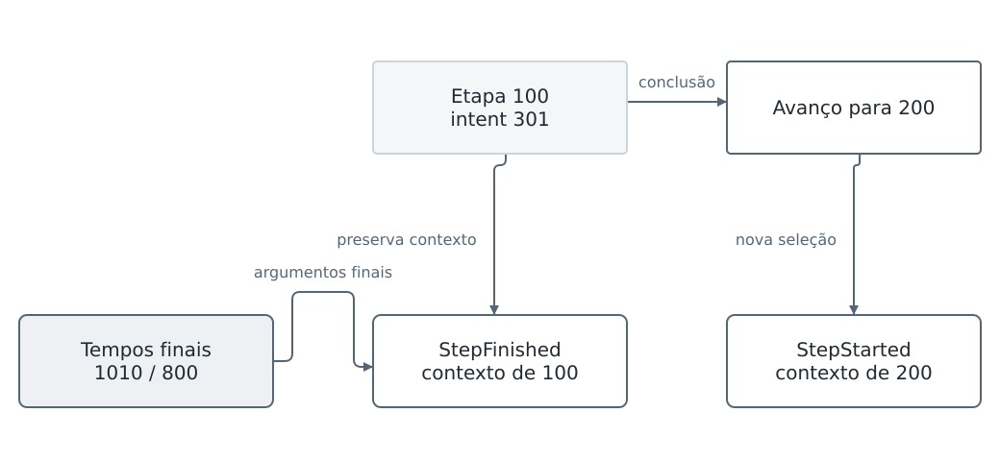

O término guarda o contexto anterior; a seleção da próxima etapa usa o snapshot posterior.

**Condição inicial.** Usar os snapshots da fixture 3 do TraceTests: Running, etapa anterior 100, fase 10, perfil 20, intent 301 e prompt 54; depois etapa 200 com intent 302 e timers atuais zero.

**Alteração.** Chamar o builder com xStepCompleted TRUE, udiCompletedStepElapsedMs 1010 e udiCompletedQualifiedMs 800. Deixar os indicadores de comando, receita e confirmação FALSE.

**Componentes afetados.** A mudança de StepID emite StepChanged e StepStarted. O indicador de conclusão emite StepFinished usando o contexto anterior e os tempos finais fornecidos por entradas próprias.

**Onde observar.** Observar a ordem de eKind e os campos StepID, PhaseID, ProfileID, IntentID, PromptID e tempos em StepFinished e StepStarted.

**Resultado esperado.** A ordem é StepChanged, StepFinished e StepStarted. StepFinished informa etapa 100, intent 301, prompt 54 e tempos 1010/800; StepStarted informa etapa 200 e intent 302.

**Divergência a investigar.** Reprovar conclusão atribuída à etapa 200, duração final zero ou mistura de fase/perfil antigos com a identidade da nova etapa.

**Retorno à referência.** Zerar xStepCompleted e usar snapshots iguais da etapa atual. Os tempos finais são argumentos do builder, não escritas em memória interna do núcleo.

**Fonte.** [src/fb/FB_SEQ_EventBuilder.st:85-92](https://github.com/luisauguszvc95-dot/FB_Sequence/blob/00f2953808e267bfdbc637347fea88737466e5bd/src/fb/FB_SEQ_EventBuilder.st#L85-L92); [src/fb/FB_SEQ_EventBuilder.st:139-150](https://github.com/luisauguszvc95-dot/FB_Sequence/blob/00f2953808e267bfdbc637347fea88737466e5bd/src/fb/FB_SEQ_EventBuilder.st#L139-L150); [tests/PRG_SEQ_TraceTests.st:89-98](https://github.com/luisauguszvc95-dot/FB_Sequence/blob/00f2953808e267bfdbc637347fea88737466e5bd/tests/PRG_SEQ_TraceTests.st#L89-L98); [tests/PRG_SEQ_TraceTests.st:213-226](https://github.com/luisauguszvc95-dot/FB_Sequence/blob/00f2953808e267bfdbc637347fea88737466e5bd/tests/PRG_SEQ_TraceTests.st#L213-L226)

### SEQ-075 - Prompt retomado e prompt realmente novo

Construção de fatos de rastreabilidade | Contrato e validação | Completa | bancada dedicada

Confirmar que a identidade do prompt, e não apenas um booleano de espera, define sua emissão. Isso ajuda a evitar contagem duplicada de solicitações ao operador após Hold/Resume.

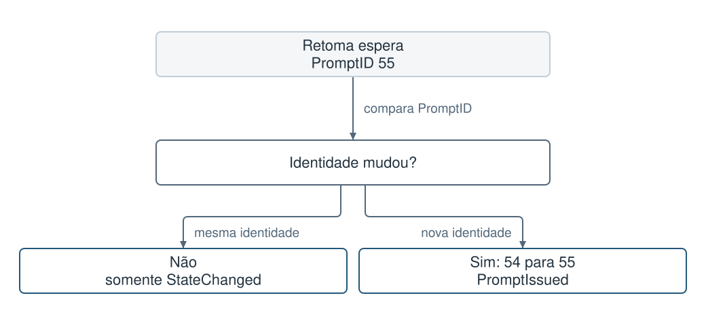

Retomar a espera com o mesmo PromptID não representa uma nova solicitação ao operador.

**Condição inicial.** Preparar snapshots da fixture 6: antes Held, depois Running, ambos com etapa 100 e PromptID 55; xWaitingOperator muda de FALSE para TRUE. Deixar todos os indicadores explícitos FALSE.

**Alteração.** Comparar essa retomada com uma segunda fixture em Running que troca PromptID 54 por 55 e mantém xWaitingOperator TRUE. Não enviar comando novo para esta comparação do helper.

**Componentes afetados.** A retomada pode produzir StateChanged, mas PromptIssued exige identidade positiva diferente da anterior. StepStarted também possui predicados próprios e não é gerado por Held para Running.

**Onde observar.** Observar uiCount, eKind e udiPromptID. Registrar estado e prompt antes/depois para demonstrar qual condição realmente mudou em cada fixture.

**Resultado esperado.** Na retomada com PromptID 55 preservado, surge somente StateChanged. Na troca de 54 para 55 em Running estável, surge somente PromptIssued com ID 55.

**Divergência a investigar.** Reprovar emissão duplicada de PromptIssued ou StepStarted durante a retomada, ou ausência de emissão ao apresentar uma identidade nova com espera ativa.

**Retorno à referência.** Usar snapshots idênticos e indicadores FALSE. A geração do PromptID pertence ao núcleo; aqui são entradas públicas de uma fixture do builder.

**Fonte.** [src/fb/FB_SEQ_EventBuilder.st:88-96](https://github.com/luisauguszvc95-dot/FB_Sequence/blob/00f2953808e267bfdbc637347fea88737466e5bd/src/fb/FB_SEQ_EventBuilder.st#L88-L96); [tests/PRG_SEQ_TraceTests.st:105-115](https://github.com/luisauguszvc95-dot/FB_Sequence/blob/00f2953808e267bfdbc637347fea88737466e5bd/tests/PRG_SEQ_TraceTests.st#L105-L115); [tests/PRG_SEQ_TraceTests.st:239-245](https://github.com/luisauguszvc95-dot/FB_Sequence/blob/00f2953808e267bfdbc637347fea88737466e5bd/tests/PRG_SEQ_TraceTests.st#L239-L245)

### SEQ-076 - Confirmação do operador mantém o prompt encerrado

Construção de fatos de rastreabilidade | Rastreabilidade e persistência | Essencial | bancada dedicada

Verificar a rastreabilidade da confirmação quando o prompt já desapareceu do runtime atual. O fato deve permitir relacionar solicitação, resposta, etapa anterior e tempos de conclusão em uma mesma evidência.

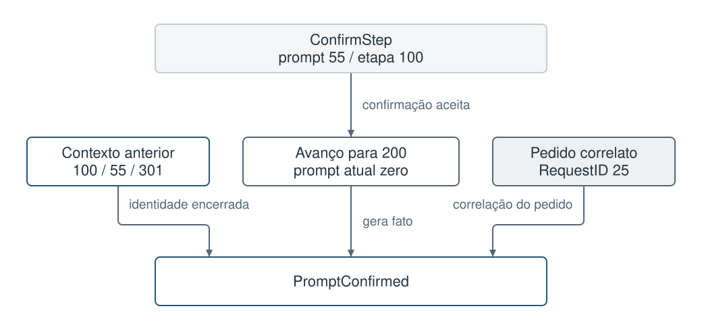

A confirmação guarda o prompt e a etapa encerrados, mesmo após o runtime selecionar a etapa seguinte.

**Condição inicial.** Usar a fixture 8: antes Running na etapa 100, prompt 55 e intent 301; depois etapa 200, prompt zero e intent 302. Preparar ConfirmStep Accepted com RequestID 25 e referência ao prompt 55.

**Alteração.** Chamar o builder com xCommandNew, xConfirmed e xStepCompleted TRUE. Informar tempos finais 1010/800 e preservar a identidade de sessão e do processo nos snapshots e no resultado.

**Componentes afetados.** PromptConfirmed recebe correlação do comando e contexto da etapa anterior. A referência solicitada permanece em campos próprios, permitindo comparar o pedido com o prompt efetivamente encerrado.

**Onde observar.** Observar a quinta posição, além da ordem completa: StepChanged, CommandResult, StepFinished, StepStarted e PromptConfirmed. Conferir StepID, PromptID, campos solicitados, IntentID e tempos.

**Resultado esperado.** PromptConfirmed informa StepID 100, PromptID 55, RequestedStepID 100, RequestedPromptID 55, intent 301 e tempos 1010/800. O prompt zero do snapshot posterior não apaga essa identidade.

**Divergência a investigar.** Reprovar confirmação atribuída à etapa 200, PromptID zero, ausência de RequestID ou perda dos tempos finais ao avançar a etapa.

**Retorno à referência.** Retirar todos os indicadores e igualar os snapshots posteriores. A fixture testa metadados do evento, sem substituir a validação de ConfirmStep no núcleo.

**Fonte.** [src/fb/FB_SEQ_EventBuilder.st:97-98](https://github.com/luisauguszvc95-dot/FB_Sequence/blob/00f2953808e267bfdbc637347fea88737466e5bd/src/fb/FB_SEQ_EventBuilder.st#L97-L98); [src/fb/FB_SEQ_EventBuilder.st:120-150](https://github.com/luisauguszvc95-dot/FB_Sequence/blob/00f2953808e267bfdbc637347fea88737466e5bd/src/fb/FB_SEQ_EventBuilder.st#L120-L150); [tests/PRG_SEQ_TraceTests.st:117-131](https://github.com/luisauguszvc95-dot/FB_Sequence/blob/00f2953808e267bfdbc637347fea88737466e5bd/tests/PRG_SEQ_TraceTests.st#L117-L131); [tests/PRG_SEQ_TraceTests.st:246-257](https://github.com/luisauguszvc95-dot/FB_Sequence/blob/00f2953808e267bfdbc637347fea88737466e5bd/tests/PRG_SEQ_TraceTests.st#L246-L257)

### SEQ-077 - Falha, recuperação e preservação do lote anterior

Construção de fatos de rastreabilidade | Falhas e recuperação | Essencial | bancada dedicada

Validar a distinção entre falha e encerramento de lote nos fatos. A recuperação também precisa conservar o contexto anterior quando Reset remove BatchID e StepID do runtime atual.

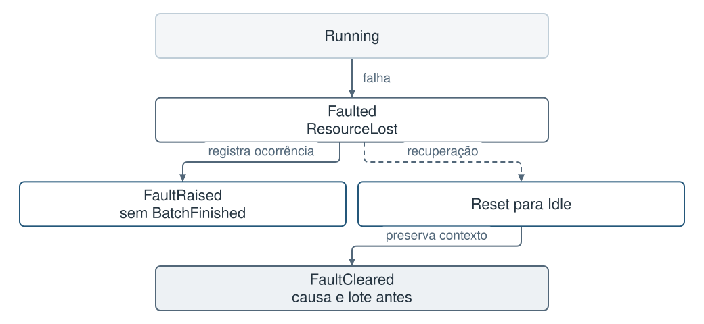

Faulted não encerra o lote; a recuperação conserva o motivo e o lote que existiam antes do reset.

**Condição inicial.** Preparar primeiro Running para Faulted com motivo ResourceLost, preservando lote e etapa. Em outra fixture, usar Faulted/StepTimeout com lote 81 e etapa 100, seguido de Idle com lote e etapa zero.

**Alteração.** Chamar o builder com todos os indicadores de comando, receita, conclusão e confirmação FALSE. As diferenças dos snapshots são suficientes para gerar os fatos de estado e falha.

**Componentes afetados.** FaultRaised depende da entrada em Faulted, que não é terminal para BatchFinished. Ao sair de Faulted, FaultCleared conserva o motivo anterior; o lote do evento usa o anterior quando o posterior foi zerado.

**Onde observar.** Observar eKind, eReason, BatchID, BatchIDBefore e StepIDBefore. Conferir que nenhuma das duas fixtures fabrica uma conclusão bem-sucedida do lote.

**Resultado esperado.** A entrada em falha gera StateChanged e FaultRaised, sem BatchFinished. A recuperação com etapa zerada gera StateChanged, StepChanged e FaultCleared; o lote permanece 81 no evento e FaultCleared informa StepTimeout.

**Divergência a investigar.** Reprovar BatchFinished ao entrar em Faulted, motivo None apagando a causa resolvida ou perda de associação ao lote 81 durante Reset.

**Retorno à referência.** Retornar a snapshots iguais e vazios. A recuperação funcional e liberação de recursos continuam sendo ensaios do núcleo, separados desta construção de fatos.

**Fonte.** [src/fb/FB_SEQ_EventBuilder.st:44-46](https://github.com/luisauguszvc95-dot/FB_Sequence/blob/00f2953808e267bfdbc637347fea88737466e5bd/src/fb/FB_SEQ_EventBuilder.st#L44-L46); [src/fb/FB_SEQ_EventBuilder.st:80-84](https://github.com/luisauguszvc95-dot/FB_Sequence/blob/00f2953808e267bfdbc637347fea88737466e5bd/src/fb/FB_SEQ_EventBuilder.st#L80-L84); [src/fb/FB_SEQ_EventBuilder.st:106-109](https://github.com/luisauguszvc95-dot/FB_Sequence/blob/00f2953808e267bfdbc637347fea88737466e5bd/src/fb/FB_SEQ_EventBuilder.st#L106-L109); [src/fb/FB_SEQ_EventBuilder.st:160-160](https://github.com/luisauguszvc95-dot/FB_Sequence/blob/00f2953808e267bfdbc637347fea88737466e5bd/src/fb/FB_SEQ_EventBuilder.st#L160-L160); [tests/PRG_SEQ_TraceTests.st:189-199](https://github.com/luisauguszvc95-dot/FB_Sequence/blob/00f2953808e267bfdbc637347fea88737466e5bd/tests/PRG_SEQ_TraceTests.st#L189-L199); [tests/PRG_SEQ_TraceTests.st:227-231](https://github.com/luisauguszvc95-dot/FB_Sequence/blob/00f2953808e267bfdbc637347fea88737466e5bd/tests/PRG_SEQ_TraceTests.st#L227-L231)

### SEQ-078 - Troca de token registra liberação e aquisição separadas

Construção de fatos de rastreabilidade | Rastreabilidade e persistência | Completa | bancada dedicada

Verificar a proveniência de uma mudança de posse observada em snapshots. Somente registrar o token novo esconderia qual autorização deixou de valer e dificultaria reconstruir a sequência de recursos.

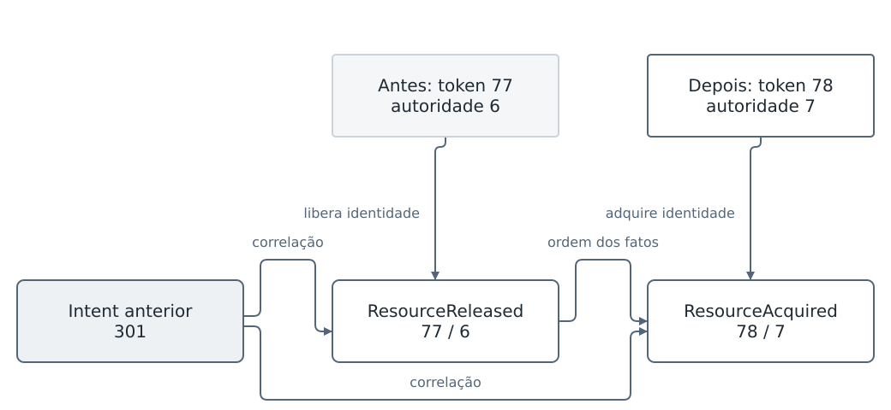

Substituir um token gera dois fatos ordenados, preservando as duas autoridades e a intenção anterior.

**Condição inicial.** Usar a fixture 15 com estado, lote e etapa iguais. O snapshot anterior tem token 77, AuthorityID 6 e intent 301; o posterior tem token 78, AuthorityID 7 e intent atual 302.

**Alteração.** Chamar o builder com os indicadores explícitos FALSE. A única transição relevante para os predicados é a substituição de um token não zero por outro também não zero.

**Componentes afetados.** O construtor emite liberação antes de aquisição. A liberação usa token e autoridade anteriores; ambos os fatos apontam para a intenção anterior, associada à resposta que gerou a transição.

**Onde observar.** Observar uiCount, ordem de eKind, ResourceToken, ResourceTokenBefore, AuthorityID e IntentID. Comparar o intent dos fatos com os dois snapshots.

**Resultado esperado.** A contagem é 2: ResourceReleased com token 77/autoridade 6, seguido de ResourceAcquired com token 78/autoridade 7. Ambos usam intent 301, sem atribuição ao intent posterior 302.

**Divergência a investigar.** Reprovar perda da liberação antiga, ordem invertida, autoridade 7 associada ao token 77 ou correlação com a intenção nova selecionada no mesmo ciclo.

**Retorno à referência.** Igualar os snapshots após a troca e confirmar ausência de nova emissão. A fixture não concede recursos ao Control; apenas verifica o registro da mudança observada.

**Fonte.** [src/fb/FB_SEQ_EventBuilder.st:99-105](https://github.com/luisauguszvc95-dot/FB_Sequence/blob/00f2953808e267bfdbc637347fea88737466e5bd/src/fb/FB_SEQ_EventBuilder.st#L99-L105); [src/fb/FB_SEQ_EventBuilder.st:151-159](https://github.com/luisauguszvc95-dot/FB_Sequence/blob/00f2953808e267bfdbc637347fea88737466e5bd/src/fb/FB_SEQ_EventBuilder.st#L151-L159); [tests/PRG_SEQ_TraceTests.st:167-171](https://github.com/luisauguszvc95-dot/FB_Sequence/blob/00f2953808e267bfdbc637347fea88737466e5bd/tests/PRG_SEQ_TraceTests.st#L167-L171); [tests/PRG_SEQ_TraceTests.st:288-297](https://github.com/luisauguszvc95-dot/FB_Sequence/blob/00f2953808e267bfdbc637347fea88737466e5bd/tests/PRG_SEQ_TraceTests.st#L288-L297)

### SEQ-079 - Início admitido e desfechos terminais do lote

Construção de fatos de rastreabilidade | Contrato e validação | Completa | bancada dedicada

Uniformizar a interpretação do histórico para automação, qualidade e suporte. Os nomes dos fatos precisam ser lidos junto ao estado associado para distinguir admissão de partida e os diferentes desfechos terminais.

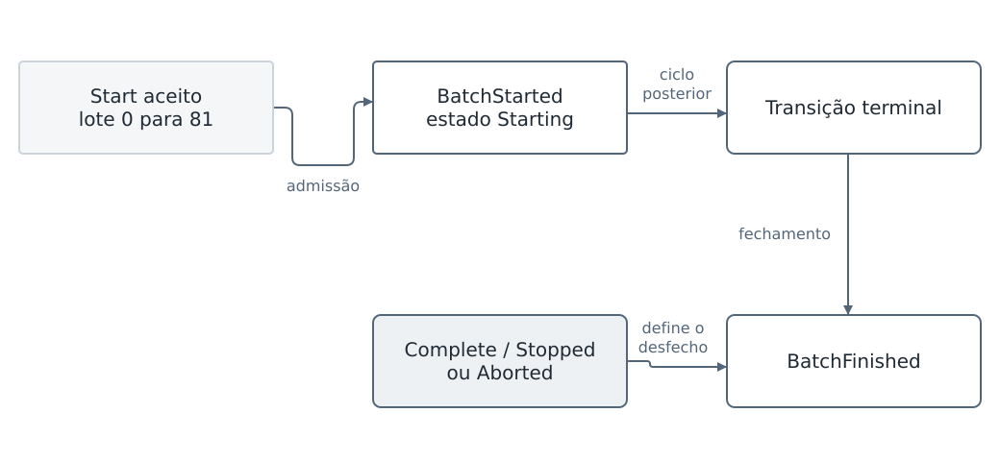

Os fatos devem ser interpretados com o estado: admissão não é execução e encerramento pode ter três desfechos.

**Condição inicial.** Preparar a fixture de Start: antes Idle sem lote e etapa, depois Starting com lote 81 e etapa 100; resultado Start Accepted válido. Preparar também transições para Complete, Stopped e Aborted.

**Alteração.** No Start, usar xCommandNew TRUE. Nas fixtures terminais, manter lote, etapa e token inalterados e todos os indicadores FALSE, variando apenas o estado anterior de fechamento e o estado terminal correspondente.

**Componentes afetados.** BatchStarted exige Start aceito e passagem de lote zero para não zero. BatchFinished depende da transição para um dos três estados terminais; o estado diferencia conclusão normal, parada e aborto.

**Onde observar.** Observar eKind, eState, BatchID e RequestedBatchID. Separar o evento de admissão de qualquer evidência de Execute aceito pelo Control.

**Resultado esperado.** O Start gera StateChanged, StepChanged, CommandResult e BatchStarted com estado Starting. Cada transição terminal isolada gera StateChanged e BatchFinished com Complete, Stopped ou Aborted, conforme a fixture.

**Divergência a investigar.** Reprovar interpretação de BatchStarted como execução física confirmada ou classificação automática de todo BatchFinished como lote concluído com sucesso.

**Retorno à referência.** Retirar indicadores e igualar snapshots. Usar os testes do núcleo para verificar os caminhos funcionais que realmente produzem essas transições.

**Fonte.** [src/fb/FB_SEQ_EventBuilder.st:75-92](https://github.com/luisauguszvc95-dot/FB_Sequence/blob/00f2953808e267bfdbc637347fea88737466e5bd/src/fb/FB_SEQ_EventBuilder.st#L75-L92); [tests/PRG_SEQ_TraceTests.st:133-141](https://github.com/luisauguszvc95-dot/FB_Sequence/blob/00f2953808e267bfdbc637347fea88737466e5bd/tests/PRG_SEQ_TraceTests.st#L133-L141); [tests/PRG_SEQ_TraceTests.st:157-166](https://github.com/luisauguszvc95-dot/FB_Sequence/blob/00f2953808e267bfdbc637347fea88737466e5bd/tests/PRG_SEQ_TraceTests.st#L157-L166); [tests/PRG_SEQ_TraceTests.st:258-272](https://github.com/luisauguszvc95-dot/FB_Sequence/blob/00f2953808e267bfdbc637347fea88737466e5bd/tests/PRG_SEQ_TraceTests.st#L258-L272); [tests/PRG_SEQ_TraceTests.st:280-287](https://github.com/luisauguszvc95-dot/FB_Sequence/blob/00f2953808e267bfdbc637347fea88737466e5bd/tests/PRG_SEQ_TraceTests.st#L280-L287)

### SEQ-080 - Metadados de origem, tempo sintético e EventID reservado

Construção de fatos de rastreabilidade | Rastreabilidade e persistência | Completa | bancada dedicada

Confirmar a proveniência publicada pelo construtor. O consumidor precisa distinguir identificação da Sequence, rota do comando, tempo informado pela fonte e identidade que será atribuída posteriormente pela fila.

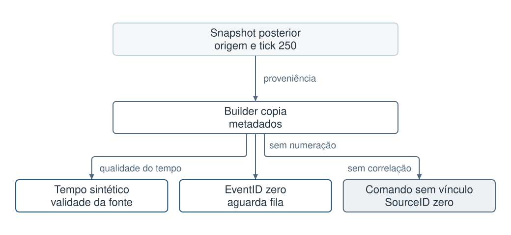

O builder preserva metadados da fonte; não fornece relógio de parede, autenticação ou EventID definitivo.

**Condição inicial.** Preparar snapshots com MachineID 2, ProducerSourceID 31, ProcessID 4, SessionID 9001 e tick posterior 250. Usar uma mudança simples de estado para garantir exatamente um fato.

**Alteração.** Comparar xTimeValid TRUE e FALSE mantendo xSyntheticTime TRUE. Deixar uma estrutura de comando preenchida com SourceID 7, porém xCommandNew FALSE e sem resultado novo válido.

**Componentes afetados.** Os metadados vêm do snapshot posterior. O builder copia a qualidade temporal e não cria relógio de parede. Sem correlação de comando, SourceID e RequestID permanecem vazios; EventID será atribuído pela fila.

**Onde observar.** Observar contrato, identidades de produtor, OccurrenceTickMs, OccurrenceTimeValid, SyntheticTime, EventID, SourceID e RequestID em cada variante.

**Resultado esperado.** O fato conserva contrato 0.2, identidades 2/31/4/9001 e tick 250. A validade temporal acompanha a entrada; SyntheticTime permanece TRUE. EventID, SourceID e RequestID permanecem zero nesta fixture.

**Divergência a investigar.** Reprovar horário fabricado, validade temporal promovida sem entrada, SourceID herdado de comando não correlacionado ou EventID definitivo atribuído pelo builder.

**Retorno à referência.** Igualar snapshots e limpar o comando de bancada. A persistência e o vínculo com atores autenticados precisam de contratos próprios no consumidor e na integração.

**Fonte.** [src/fb/FB_SEQ_EventBuilder.st:30-64](https://github.com/luisauguszvc95-dot/FB_Sequence/blob/00f2953808e267bfdbc637347fea88737466e5bd/src/fb/FB_SEQ_EventBuilder.st#L30-L64); [src/fb/FB_SEQ_EventBuilder.st:120-138](https://github.com/luisauguszvc95-dot/FB_Sequence/blob/00f2953808e267bfdbc637347fea88737466e5bd/src/fb/FB_SEQ_EventBuilder.st#L120-L138); [tests/PRG_SEQ_TraceTests.st:299-305](https://github.com/luisauguszvc95-dot/FB_Sequence/blob/00f2953808e267bfdbc637347fea88737466e5bd/tests/PRG_SEQ_TraceTests.st#L299-L305)

## Evidências

| Campo | Registrar |
| --- | --- |
| Identificação | ID e título da ficha, data, responsável pelo registro e resultado: Não executado / Aprovado / Falhou / Inconclusivo. |
| Versão e bancada | Commit ou pacote importado, versão do ambiente, programa raiz e variante de configuração/receita utilizada. |
| Condição de partida | Identidades, valores e contadores iniciais que demonstram as pré-condições. |
| Alteração aplicada | Caminho completo da entrada, valor anterior/novo, ordem das alterações e tempo ou número de chamadas quando relevante. |
| Resultado observado | Valores finais e diferenças antes/depois; comparar com cada critério da ficha. |
| Evidência vinculada | Nome do arquivo, captura, log ou consulta; registrar os filtros de identidade usados. |
| Reposição e desvio | Retorno à referência confirmado; se houver divergência, condição reproduzível e referência da ocorrência no repositório. |

## Manutenção

Manter o PDF específico deste FB, o Markdown e os diagramas no seu repositório. Ao mudar estado, comando, contrato, prazo, receita ou regra da fila, revisar fichas e diagramas dependentes e regenerar índice e PDF. Registrar nome da variante de bancada junto da evidência; resultados de uma receita não validam automaticamente outra. Evidência dos programas nativos de teste deve citar programa, contagem de verificações, falhas e commit.

## Correspondência com a edição inicial

| ID anterior | Fichas desta edição |
| --- | --- |
| SEQ-01 | [SEQ-001](#seq-001) · [SEQ-040](#seq-040) |
| SEQ-02 | [SEQ-005](#seq-005) · [SEQ-006](#seq-006) · [SEQ-007](#seq-007) · [SEQ-046](#seq-046) · [SEQ-047](#seq-047) · [SEQ-048](#seq-048) · [SEQ-049](#seq-049) · [SEQ-050](#seq-050) · [SEQ-051](#seq-051) · [SEQ-052](#seq-052) |
| SEQ-03 | [SEQ-008](#seq-008) · [SEQ-009](#seq-009) · [SEQ-010](#seq-010) · [SEQ-011](#seq-011) · [SEQ-012](#seq-012) |
| SEQ-08 | [SEQ-013](#seq-013) · [SEQ-023](#seq-023) · [SEQ-024](#seq-024) · [SEQ-026](#seq-026) · [SEQ-027](#seq-027) |
| SEQ-04 | [SEQ-015](#seq-015) · [SEQ-016](#seq-016) · [SEQ-053](#seq-053) · [SEQ-054](#seq-054) · [SEQ-055](#seq-055) · [SEQ-056](#seq-056) · [SEQ-057](#seq-057) |
| SEQ-05 | [SEQ-017](#seq-017) |
| SEQ-06 | [SEQ-018](#seq-018) · [SEQ-019](#seq-019) · [SEQ-022](#seq-022) |
| SEQ-07 | [SEQ-020](#seq-020) · [SEQ-021](#seq-021) |
| SEQ-09 | [SEQ-025](#seq-025) · [SEQ-032](#seq-032) · [SEQ-033](#seq-033) · [SEQ-034](#seq-034) · [SEQ-035](#seq-035) |
| SEQ-11 | [SEQ-029](#seq-029) · [SEQ-030](#seq-030) · [SEQ-031](#seq-031) · [SEQ-038](#seq-038) · [SEQ-039](#seq-039) |
| SEQ-10 | [SEQ-036](#seq-036) · [SEQ-037](#seq-037) |
| SEQ-12 | [SEQ-041](#seq-041) |
| SEQ-14 | [SEQ-042](#seq-042) · [SEQ-043](#seq-043) · [SEQ-044](#seq-044) · [SEQ-045](#seq-045) · [SEQ-064](#seq-064) · [SEQ-065](#seq-065) · [SEQ-066](#seq-066) · [SEQ-067](#seq-067) · [SEQ-068](#seq-068) · [SEQ-069](#seq-069) · [SEQ-070](#seq-070) · [SEQ-071](#seq-071) · [SEQ-072](#seq-072) · [SEQ-073](#seq-073) · [SEQ-074](#seq-074) · [SEQ-075](#seq-075) · [SEQ-076](#seq-076) · [SEQ-077](#seq-077) · [SEQ-078](#seq-078) · [SEQ-079](#seq-079) · [SEQ-080](#seq-080) |
| SEQ-13 | [SEQ-059](#seq-059) · [SEQ-060](#seq-060) · [SEQ-061](#seq-061) · [SEQ-062](#seq-062) · [SEQ-063](#seq-063) |
