# Manual ilustrado de testes do FB_Sequence

14 de setembro de 2026 | Edição ilustrada

Escolha a ficha pelo comportamento que quer investigar. Cada teste mostra o que você altera, quais componentes recebem o efeito e quais valores confirmam a expectativa. As fichas são independentes e ocupam uma página cada.

Este volume cobre a Sequence com ControlMock na demo isolada. A Sequence recebe receita, comandos, autoridade e feedback; publica estado, intenção e eventos. O mock simula o consumidor de intenções. Os testes chamados IntegrationTests no repositório não representam integração com o FB_Service.

## Versão descrita

Sequence 0.2 | codex/sequence-traceability-v0.2
Código de referência: 00f2953808e267bfdbc637347fea88737466e5bd

As expectativas foram conferidas no código; a autoria deste manual não executou os FBs no Machine Expert. Nenhum cenário requer saídas físicas.

## Escolha pelo comportamento

| Testes / páginas do PDF | Comportamento |
| --- | --- |
| SEQ-01–03 / 5–7 | Autoridade, partida e receita aplicada |
| SEQ-04–08 / 8–12 | Avanço de etapas, confirmação, pausa e encerramento |
| SEQ-09–11 / 13–15 | Permissões, falhas e prazos |
| SEQ-12–14 / 16–18 | Publicação, idempotência e fila de eventos |

## Como interpretar um teste

Uma entrada é aquilo que você muda para provocar o cenário. Um estado é aquilo que o FB calcula. Um contador guarda evidência acumulada. Um pulso pode durar apenas um ciclo e desaparecer antes da atualização da watch. Por isso, uma mudança de contador ou identidade é uma evidência melhor que tentar enxergar um BOOL transitório.

| Tipo de alteração | Leitura correta do efeito |
| --- | --- |
| Condição mantida | TRUE continua valendo nos ciclos seguintes. Exemplo: operação, alarme ativo ou congelamento de fonte. |
| Pulso ou borda | Uma transição FALSE para TRUE provoca uma ocorrência. Voltar a FALSE permite uma próxima ocorrência. Alguns pulsos da demo se apagam automaticamente; confira o cenário. |
| Novo comando | A identidade nova distingue uma solicitação de sua repetição. Alterar o comando mantendo a identidade pode ser interpretado como duplicata. |
| Valor calculado | Snapshot, runtime e imagem TX são observação. Editá-los pode ser desfeito no próximo ciclo e não reproduz a causa que se quer testar. |

## Quatro coisas diferentes chamadas ACK

| Confirmação | O que comprova |
| --- | --- |
| Resultado de comando | A solicitação foi aceita ou recusada; a aceitação sozinha não prova que a etapa terminou. |
| Resultado do ControlMock | O consumidor reconheceu a intenção correlacionada. A conclusão do processo depende também do feedback previsto na etapa. |
| ACK de evento da Sequence | A cabeça da fila de eventos pode ser removida. É uma fronteira diferente do ACK do historiador. |
| ACK do historiador | O conteúdo daquela identidade foi persistido ou já existia igual. O Adapter precisa aceitar esse ACK para o Service liberar a cabeça. |

Compare sempre antes e depois: identidade, estado, contador e tempo. Alterar uma causa por vez permite explicar a diferença. Os nomes abreviados nas fichas valem dentro da estrutura explicitamente indicada; prefira copiar a raiz completa da watch.

Aprovado significa que o critério daquele cenário foi observado. Falhou significa uma divergência com as pré-condições satisfeitas. Inconclusivo significa versão, entrada, temporização ou evidência insuficiente. Não executado significa que o resultado esperado ainda é uma previsão do código.

## Mapa de observação do Sequence

### Entradas da Demo e comando

PRG_SEQ_Demo e PRG_SEQ_Demo.stCommand

Editar entradas superiores, não entradas copiadas de fbSequence/fbControlMock. stRecipe só é inicializada uma vez. stConfig é imutável após a primeira chamada. stTraceTime.xValid e xSynthetic são recalculados em cada scan.

### Admissão versus execução

PRG_SEQ_Demo.fbSequence.stCommandResult
PRG_SEQ_Demo.fbSequence.stRuntime

Resultado: xValid, udiRequestID, eCommand, eResult, eReason, eStateAfter. Runtime: xDataValid, eState/eReason, udiBatchID, uiStepID, uiProfileID, udiQualifiedElapsedMs, udiStepElapsedMs, xWaitingOperator, udiPromptID, udiResourceToken, udiLastControlIntentID, contrato 0.2, xSyntheticTime, xTraceReady, xTraceHistoryComplete.

### Negociação com ControlMock

PRG_SEQ_Demo.fbControlMock.stAuthority
PRG_SEQ_Demo.fbSequence.stControlRequest
PRG_SEQ_Demo.fbControlMock.stResult
PRG_SEQ_Demo.fbControlMock.stRuntime

AuthorityID e três grants; request eAction/IntentID/BatchID/StepID/token; result xAccepted/xRejected/xDone/xReleased; runtime xQualified/xStepComplete/xResourceGranted. stControlRequest é saída da Sequence, não saída do mock.

### Eventos e confirmação de consumo

PRG_SEQ_Demo.fbSequence.xEventAvailable / stEvent
PRG_SEQ_Demo.fbSequence.uiEventCount / udiEventsDropped
PRG_SEQ_Demo.udiAckSessionID / udiAckEventID

Cabeça: EventID, SessionID, eKind, origem/receita/lote, estado antes/depois, udiOccurrenceTickMs e xSyntheticTime. ACK precisa da sessão e EventID exatos da cabeça. Contagem zero sob publicação negada não demonstra fila vazia.

**Propriedade dos dados** Edite as entradas superiores de PRG_SEQ_Demo. O programa e o mock sobrescrevem entradas copiadas, feedbacks e idades. stConfig é capturado na primeira chamada; alterá-lo online provoca ConfigInvalid. PRG_SEQ_Demo chama o mock antes da Sequence: o retorno de uma intenção aparece em ciclos seguintes.

## Referência comum dos testes da Sequence

**Condição inicial** Instância nova: todos os BOOL de entrada FALSE; AuthorityID=1; sessão/processo/máquina/produtor=1. Base funcional: PRG_SEQ_Demo.xControlMockEnabled, xSequenceEnabled, xAllowRequests, xAllowExecution, xAllowPublication e xFinishActions=TRUE; xQualified, xStepComplete, xFaulted, xRejectRequest=FALSE. Receita original 1/revisão 1: etapa 10/perfil 100 WaitQualified 250 ms; etapa 20/perfil 200 WaitComplete; etapa 30/perfil 300 WaitOperator; timeout 10000 ms cada. Esses tempos são virtuais.

**Variante para observar com calma** Para explorar sem corrida de 10 segundos, após a inicialização e antes de LoadRecipe, escrever PRG_SEQ_Demo.stRecipe.udiRevision=2, PRG_SEQ_Demo.stRecipe.astSteps[1].udiQualifiedMs=5000 e PRG_SEQ_Demo.stRecipe.astSteps[1].udiTimeoutMs, [2].udiTimeoutMs e [3].udiTimeoutMs=600000. Carregar e iniciar explicitamente receita 1/revisão 2. Esta é uma variante de bancada proposta pelo manual, não o padrão no Git. O timeout transitório continua 5000 ms. Ensaios de prazo usam receita original ou variante curta explicitamente carregada.

**Identidade e envio de comandos** Todos os comandos são escritos em PRG_SEQ_Demo.stCommand. Campos comuns: xValid, udiSessionID=1, uiProcessID=1, uiSourceID=1 e udiRequestID novo, positivo, estritamente crescente. Preparar payload com xValid=FALSE e ativar TRUE somente com os campos prontos; manter identidade/payload até stCommandResult.xValid e udiRequestID correspondente. LoadRecipe(1): udiRecipeID=1 e udiRecipeRevision igual à candidata. Start(2): mesma receita/revisão aplicada e udiBatchID positivo maior que o último iniciado. Hold(3), Resume(4), Stop(5), Abort(6), Reset(7): udiBatchID corrente. ConfirmStep(8): BatchID, StepID e PromptID correntes. Corrigir um pedido rejeitado requer novo RequestID. Esse preparo comum evita admitir payload parcialmente escrito; não é um roteiro para cada cenário.

**Como retornar para outro ensaio** Retorno funcional: restaurar entradas alteradas, manter requests/publicação e xFinishActions permitidos, aguardar fechamento e liberação; enviar Reset com BatchID ainda corrente e novo RequestID. Reset preserva receita e contadores de IDs, remove o lote do runtime. Novo Start exige BatchID maior. Recomeço absoluto: reinicializar a aplicação simulada e as instâncias não retentivas; isso limpa também fila/perdas/posse. Não simular esse recomeço escrevendo xInitialized ou estados internos.

Os nomes IntegrationTests do repositório referem-se à Sequence com o mock. Eles não significam que o FB_Service esteja integrado. O relógio da demo soma 20 ms por chamada; a observação é sobre esse tempo virtual.

## Cenários

Setas tracejadas indicam retorno ou rejeição, conforme o rótulo. Cada SVG pode ser editado diretamente e deve permanecer coerente com a ficha.

### SEQ-01 — Autoridade: o que habilitar realmente permite

Separar existência do mock, admissão de pedidos e permissão de execução.

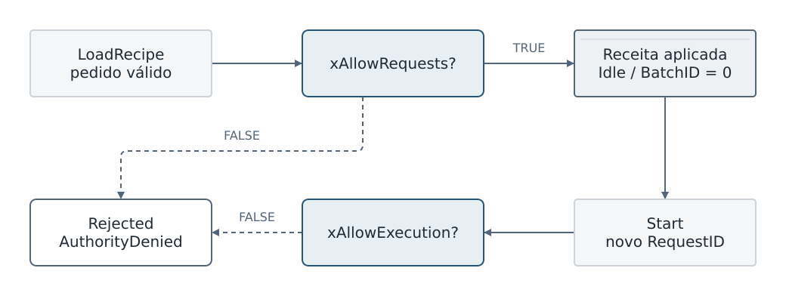

Permissão de requests libera LoadRecipe; Start também exige permissão de execução. Cada nova tentativa usa RequestID maior.

**Condição de partida** Instância nova, PRG_SEQ_Demo.xControlMockEnabled=TRUE e PRG_SEQ_Demo.xAllowPublication=TRUE; Sequence habilitada, xAllowRequests=FALSE, xAllowExecution=FALSE.

**O que você altera** Enviar LoadRecipe válido. Depois conceder PRG_SEQ_Demo.xAllowRequests=TRUE e reenviar com RequestID novo. Com receita aplicada, tentar Start ainda com PRG_SEQ_Demo.xAllowExecution=FALSE.

**Onde isso repercute** Os grants do mock alimentam xCanRequest e xCanExecute. LoadRecipe depende de requests; Start depende também de execução.

**Onde observar** PRG_SEQ_Demo.fbControlMock.stAuthority; PRG_SEQ_Demo.fbSequence.stCommandResult; PRG_SEQ_Demo.fbSequence.stRuntime; PRG_SEQ_Demo.fbSequence.stControlRequest.

**O que aprova o teste** Primeiro LoadRecipe: Rejected(2)/AuthorityDenied(20), sem receita aplicada. Segundo: Accepted(1)/None(0), xRecipeLoaded=TRUE em Idle(0). Start sem execução: Rejected(2)/AuthorityDenied(20); BatchID continua 0, sem Acquire válido.

**Se o resultado divergir** Se nada aparecer, verificar publicação e validade do grant antes de culpar o gate. Reusar RequestID rejeitado não reenvia a operação. Sequence habilitada sozinha não concede autoridade.

**Reposição** Conceder PRG_SEQ_Demo.xAllowExecution=TRUE. Novo Start precisa de RequestID novo; conservar o restante da base.

**Código de referência** src/fb/FB_Sequence.st 102-109; src/fb/FB_Sequence.st 178-250; tests/FB_SEQ_ControlMock.st 43-63

### SEQ-02 — Receita candidata, validação e cópia aplicada

Comprovar onde uma edição tem efeito e por que o lote não muda com a candidata.

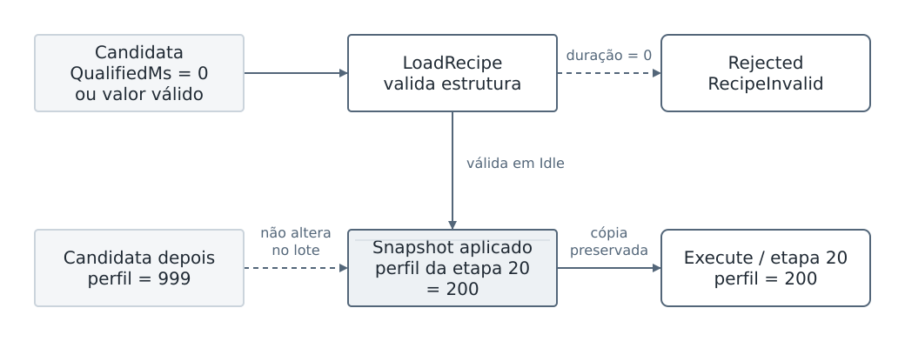

LoadRecipe valida e copia a candidata. Editar a candidata durante o lote preserva o perfil já aplicado.

**Condição de partida** Idle, requests/publicação permitidos. Anotar conteúdo de PRG_SEQ_Demo.stRecipe antes da alteração.

**O que você altera** Em PRG_SEQ_Demo.stRecipe.astSteps[1].udiQualifiedMs, testar 0 e enviar LoadRecipe com referência correspondente. Restaurar valor válido e carregar. Depois, durante o lote, mudar apenas PRG_SEQ_Demo.stRecipe.astSteps[2].uiProfileID de 200 para 999.

**Onde isso repercute** Validador rejeita duração zero em WaitQualified. LoadRecipe aceito copia a candidata para o snapshot interno. Durante execução, a intenção lê esse snapshot.

**Onde observar** PRG_SEQ_Demo.fbSequence.stCommandResult; PRG_SEQ_Demo.fbSequence.stRuntime.udiRecipeRevision; PRG_SEQ_Demo.fbSequence.stControlRequest.uiProfileID na etapa 20.

**O que aprova o teste** Candidata inválida: Rejected(2)/RecipeInvalid(7). Candidata válida: Accepted(1). A etapa 20 do lote já carregado continua publicando perfil 200, mesmo candidata=999. LoadRecipe durante Running é InvalidState(5).

**Se o resultado divergir** InvalidRecipeRef(17) indica que RecipeID/revisão do comando não correspondem à candidata; é diferente de falha estrutural. Perfis fictícios não são validação física do Control.

**Reposição** Restaurar perfil 200 e duração escolhida na candidata. Alterações só passam à execução após retornar a Idle e aplicar novo LoadRecipe; usar revisão explícita para uma variante.

**Código de referência** src/fb/FB_SEQ_RecipeValidator.st 25-75; src/fb/FB_Sequence.st 203-219; src/fb/FB_Sequence.st 489-503

### SEQ-03 — Start aceito e aquisição do recurso

Distinguir admissão do comando de execução correlacionada pelo Control.

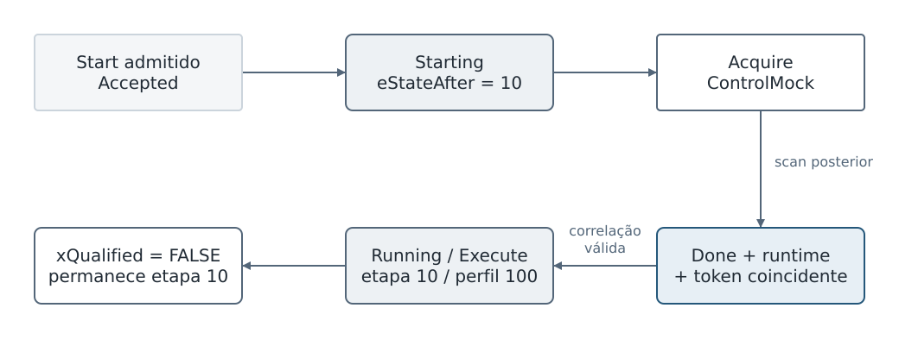

Start aceito cria a intenção Acquire. Só o retorno correlacionado com recurso concedido permite Running e Execute.

**Condição de partida** Base funcional; receita aplicada; PRG_SEQ_Demo.xQualified=FALSE. Preferir receita de observação para inspecionar sem timeout rápido.

**O que você altera** Enviar Start com receita/revisão aplicada, BatchID positivo crescente e novo RequestID.

**Onde isso repercute** Admissão cria Starting e intenção Acquire. No scan seguinte, mock concede token. A Sequence só entra em Running após result Done, runtime e token coincidentes; em seguida publica Execute.

**Onde observar** PRG_SEQ_Demo.fbSequence.stCommandResult; PRG_SEQ_Demo.fbSequence.stRuntime; PRG_SEQ_Demo.fbSequence.stControlRequest; PRG_SEQ_Demo.fbControlMock.stResult; PRG_SEQ_Demo.fbControlMock.stRuntime.

**O que aprova o teste** Resultado Accepted(1); eStateAfter=Starting(10). Evolução Starting(10)→Running(20). Acquire(1)→Execute(2), StepID=10, perfil=100, ResourceToken=1 no mock atual. Execute aceito não marca xDone e, com xQualified=FALSE, etapa permanece 10.

**Se o resultado divergir** Starting pode ser rápido demais para watch. O eStateAfter do resultado conserva a admissão; não exigir captura visual de cada scan. Execute xAccepted=TRUE com etapa parada é esperado sem critério de conclusão.

**Reposição** Prosseguir com critérios de etapa ou encerrar por Stop, aguardar Release e Reset. Não editar tokens/resultados para fabricar aquisição.

**Código de referência** src/fb/FB_Sequence.st 221-250; src/fb/FB_Sequence.st 349-381; tests/FB_SEQ_ControlMock.st 85-108

### SEQ-04 — Tempo qualificado conserva progresso

Mostrar por que tempo de etapa e tempo útil não são o mesmo contador.

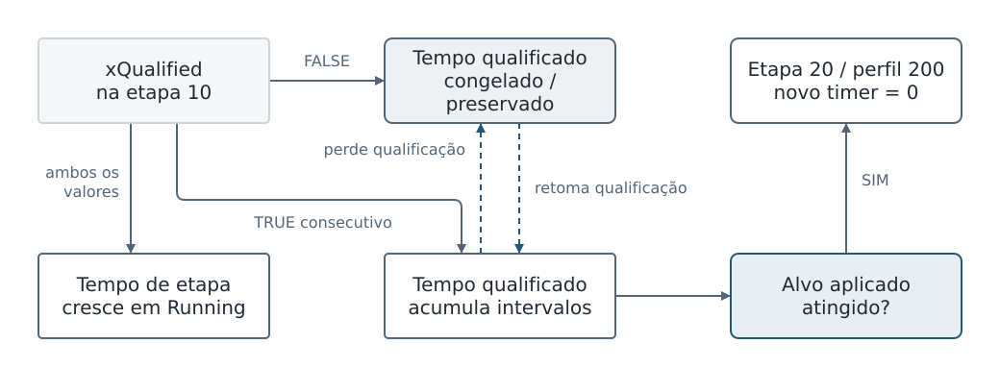

A qualificação controla apenas o tempo útil. Sua perda congela o acumulado, enquanto o tempo de etapa continua em Running.

**Condição de partida** Running na etapa 10. Receita de observação aplicada: alvo 5000 ms e timeout 600000 ms; original usa 250/10000 ms.

**O que você altera** Alternar PRG_SEQ_Demo.xQualified TRUE/FALSE antes de atingir o alvo; manter PRG_SEQ_Demo.xStepComplete=FALSE.

**Onde isso repercute** Mock publica qualificação no Execute corrente. O timer só soma intervalos com qualificação em observações consecutivas; perder qualificação congela acumulado, sem zerá-lo. Tempo da etapa continua em Running.

**Onde observar** PRG_SEQ_Demo.fbSequence.stRuntime.udiQualifiedElapsedMs; .udiStepElapsedMs; .uiStepID; PRG_SEQ_Demo.fbControlMock.stRuntime.xQualified.

**O que aprova o teste** FALSE: duração qualificada estável; duração de etapa cresce em incrementos de 20 ms virtuais. TRUE sustentado: qualificado cresce e, atingindo alvo, StepID passa 10→20 e perfil 100→200. Na troca, timer público da nova etapa volta a zero; o evento StepFinished(8) conserva duração da etapa encerrada.

**Se o resultado divergir** Não exigir aumento no primeiro scan TRUE. Não confundir reset ao entrar na etapa seguinte com perda de acumulado. Ultrapassar timeout enquanto não qualificado gera StepTimeout(12).

**Reposição** Em nova execução, alvo e timeout vêm da receita aplicada. Usar Stop/Reset para repetir e BatchID maior; não escrever no contador interno.

**Código de referência** src/fb/FB_Sequence.st 324-385; src/fb/FB_Sequence.st 451-486; src/fb/FB_SEQ_QualifiedTimer.st 18-32; src/fb/FB_SEQ_EventBuilder.st 139-149

### SEQ-05 — WaitComplete exige conclusão qualificada

Confirmar que um bit de conclusão isolado não avança a sequência.

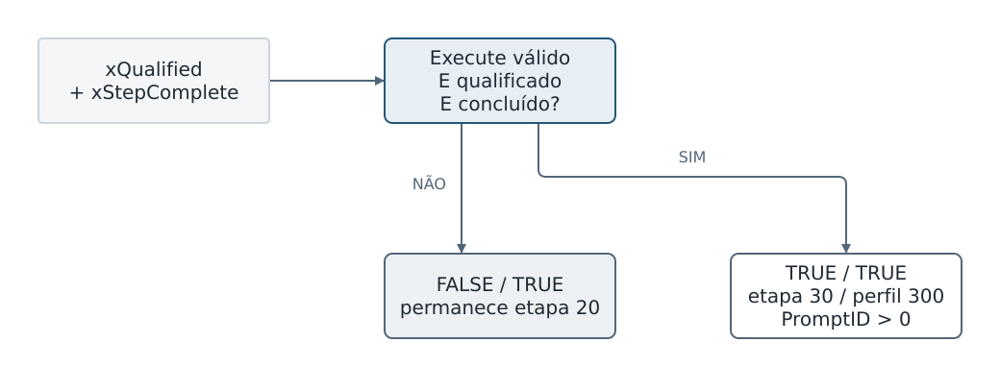

Na etapa 20, conclusão sozinha não basta: o feedback Execute precisa estar válido, qualificado e concluído.

**Condição de partida** Running na etapa 20, perfil 200; timeout de observação recomendado.

**O que você altera** PRG_SEQ_Demo.xQualified=FALSE e PRG_SEQ_Demo.xStepComplete=TRUE. Depois manter conclusão TRUE e conceder PRG_SEQ_Demo.xQualified=TRUE.

**Onde isso repercute** As duas entradas passam pelo Execute aceito do mock. WaitComplete combina qualificação corrente e conclusão; xStepComplete sozinho não satisfaz a política.

**Onde observar** PRG_SEQ_Demo.fbControlMock.stRuntime.xQualified e .xStepComplete; PRG_SEQ_Demo.fbSequence.stRuntime.uiStepID, .uiProfileID, .xWaitingOperator e .udiPromptID.

**O que aprova o teste** FALSE/TRUE: permanece na etapa 20. TRUE/TRUE: avança para etapa 30/perfil 300 e xWaitingOperator=TRUE, PromptID>0. O feedback é consumido em scans posteriores à mudança de entrada. Manter xStepComplete TRUE não confirma a etapa de operador.

**Se o resultado divergir** Se avançar sem qualificação, conferir se a etapa era realmente 20 e se existe force sobre feedback interno. Se não avançar com ambos TRUE, conferir Execute e identidade/result de Watch 3.

**Reposição** Deixar PRG_SEQ_Demo.xStepComplete=FALSE ao entrar na etapa 30, preservando xQualified conforme o próximo cenário. Para repetir, usar novo lote.

**Código de referência** src/fb/FB_Sequence.st 122-134; src/fb/FB_Sequence.st 359-379; src/fb/FB_Sequence.st 467-484; tests/FB_SEQ_ControlMock.st 100-107

### SEQ-06 — Confirmação contextual e conclusão do lote

Relacionar operador, prompt, encerramento e liberação do recurso.

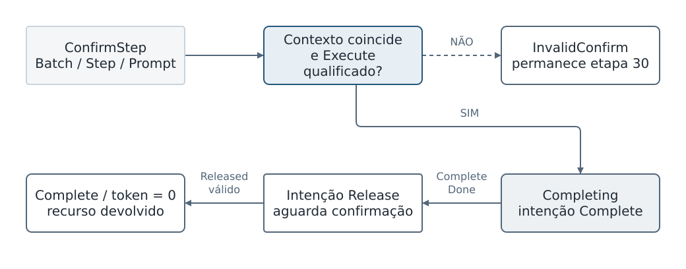

ConfirmStep só conclui a etapa com contexto exato e Execute qualificado. Complete e Release são confirmações diferentes.

**Condição de partida** Running/StepID=30, xWaitingOperator=TRUE, Execute aceito e qualificado. PRG_SEQ_Demo.xFinishActions=TRUE.

**O que você altera** Enviar ConfirmStep com PromptID diferente do runtime; depois enviar novo RequestID com BatchID, StepID e PromptID exatos de PRG_SEQ_Demo.fbSequence.stRuntime.

**Onde isso repercute** O gate valida pedido novo; a política verifica contexto e Execute qualificado. Confirmação correta conclui etapa; a intenção muda para Complete, depois Release. O mock deve confirmar ambos.

**Onde observar** PRG_SEQ_Demo.fbSequence.stCommandResult; .stRuntime; .stControlRequest; PRG_SEQ_Demo.fbControlMock.stResult; eventos PromptConfirmed(10), BatchFinished(6), ResourceReleased(12).

**O que aprova o teste** Prompt errado: Rejected(2)/InvalidConfirm(14), continua etapa 30. Correto: Accepted(1), Completing(50)→Complete(60), token termina 0; mock xResourceGranted=FALSE. BatchID permanece identificando lote concluído até Reset.

**Se o resultado divergir** Complete xDone não equivale a recurso liberado. BatchFinished só é produzido após estado terminal, não quando ConfirmStep é apenas aceito. Sem qualificação, confirmar também resulta InvalidConfirm(14).

**Reposição** Reset com BatchID concluído e novo RequestID retorna Idle; receita permanece aplicada. Proximo Start usa BatchID maior e futuro PromptID não deve reutilizar o anterior.

**Código de referência** src/fb/FB_Sequence.st 305-321; src/fb/FB_Sequence.st 397-414; tests/FB_SEQ_ControlMock.st 115-136; src/fb/FB_SEQ_EventBuilder.st 80-105

### SEQ-07 — Hold/Resume preserva etapa e tempo útil

Demonstrar pausa procedural sem perder lote, recurso ou acumulado.

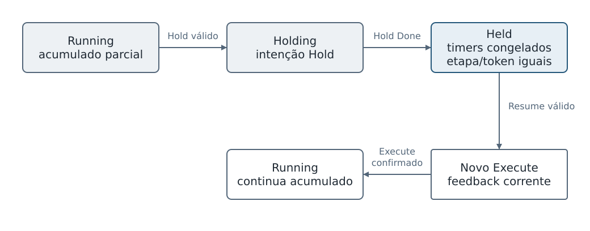

Hold pausa a etapa conservando lote, recurso e tempo acumulado. Resume retoma após nova confirmação de Execute.

**Condição de partida** Running na etapa 10 com parte do tempo qualificado acumulado; usar alvo 5000 ms ou maior e agir antes de concluí-lo. PRG_SEQ_Demo.xFinishActions=TRUE.

**O que você altera** Enviar Hold com BatchID corrente; após Held, enviar Resume com novo RequestID. Manter PRG_SEQ_Demo.xQualified=TRUE.

**Onde isso repercute** Hold cria Holding e intenção Hold. Done do mock conserva posse e confirma Held. Resume exige feedback e token correntes; gera novo Execute.

**Onde observar** PRG_SEQ_Demo.fbSequence.stRuntime.eState, .uiStepID, .udiQualifiedElapsedMs, .udiStepElapsedMs e .udiResourceToken; PRG_SEQ_Demo.fbSequence.stControlRequest.eAction e .udiIntentID.

**O que aprova o teste** Running(20)→Holding(30)→Held(40)→Running(20). StepID, BatchID e token permanecem. Em Holding/Held, tempos de etapa e qualificado não acumulam. Ao retornar, não contar o intervalo inicial anterior à nova confirmação Execute; depois acumulado continua.

**Se o resultado divergir** xFinishActions=FALSE mantém Holding; após 5000 ms virtuais gera TransitionTimeout(13). Reenviar Resume antes de Held pode ser InvalidState(5). Trocar xAllowExecution para pausar provoca falha, não Held.

**Reposição** Continuar lote normalmente ou Stop/Reset. Restaurar xFinishActions=TRUE caso tenha sido alterado; não zerar timer para retomar.

**Código de referência** src/fb/FB_Sequence.st 252-268; src/fb/FB_Sequence.st 324-346; src/fb/FB_Sequence.st 387-395; tests/FB_SEQ_ControlMock.st 109-114

### SEQ-08 — Stop e Abort encerram antes do Reset

Verificar os dois caminhos de encerramento e a necessidade de Release.

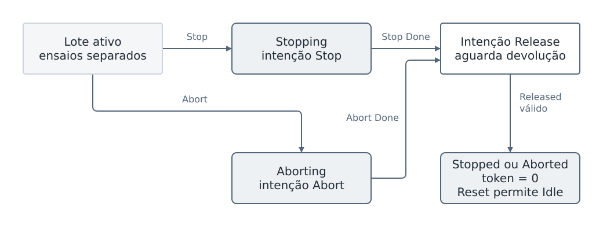

Stop e Abort usam caminhos alternativos de encerramento. Ambos exigem Release antes de Reset devolver a sequência a Idle.

**Condição de partida** Lote ativo, permissões concedidas; PRG_SEQ_Demo.xFinishActions=TRUE.

**O que você altera** Em uma execução enviar Stop; em outra enviar Abort, sempre BatchID corrente e novo RequestID. Após terminal, enviar Reset com lote que acabou.

**Onde isso repercute** Stop/Abort criam intenções diferentes. Done confirma fechamento; só a intenção seguinte Release devolve recurso. Reset valida ausência de posse e fechamento confirmado.

**Onde observar** PRG_SEQ_Demo.fbSequence.stRuntime; .stControlRequest.eAction; PRG_SEQ_Demo.fbControlMock.stResult.xDone, .xReleased e .xResourceGranted; .stRuntime.xResourceGranted.

**O que aprova o teste** Stop: Stopping(70)→Stopped(80). Abort: Aborting(90)→Aborted(100). Ambos terminam com token 0 após Release(7). Reset aceito leva Idle(0), BatchID=0 e receita ainda carregada. Novo Start com lote antigo resulta InvalidRequest(3).

**Se o resultado divergir** Reset antecipado em Stopping/Aborting é InvalidState(5). Reset em Faulted sem liberação confirmada é NotReady(8). xSequenceEnabled=FALSE não substitui Stop: em execução provoca Faulted/Disabled.

**Reposição** PRG_SEQ_Demo.xFinishActions=TRUE e entrada de falha FALSE; concluir Release e Reset. Não apagar posse do mock manualmente. Novo lote precisa ID maior mesmo depois de Reset.

**Código de referência** src/fb/FB_Sequence.st 269-303; src/fb/FB_Sequence.st 397-414; tests/FB_SEQ_ControlMock.st 115-136

### SEQ-09 — Revogar execução prende falha e não retoma sozinho

Provar que recuperar permissão não reinicia silenciosamente um lote interrompido.

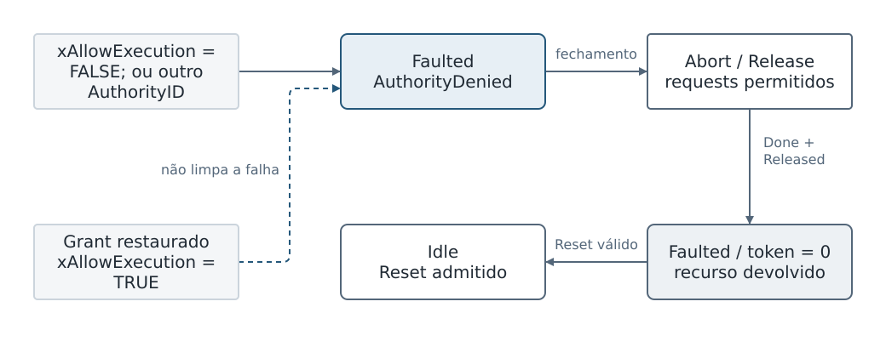

Revogação de execução ou nova geração de autoridade retém Faulted. Restaurar o grant permite recuperação, mas não retoma o lote.

**Condição de partida** Running com recurso concedido, xAllowRequests/publicação TRUE e xFinishActions TRUE.

**O que você altera** Alterar PRG_SEQ_Demo.xAllowExecution para FALSE; depois restaurar TRUE. Variante independente: mudar PRG_SEQ_Demo.udiAuthorityID de 1 para 2 durante outro lote.

**Onde isso repercute** Perda de execução ou mudança de geração invalida a autoridade do lote. Sequence trava Faulted, pede Abort/Release quando requests ainda permitidos; o mock não solta recurso simplesmente pela troca do grant.

**Onde observar** PRG_SEQ_Demo.fbSequence.stRuntime.eState/eReason/udiResourceToken; .stControlRequest; PRG_SEQ_Demo.fbControlMock.stAuthority e .stRuntime.xResourceGranted.

**O que aprova o teste** Faulted(110)/AuthorityDenied(20). Mesmo após grant restaurado, continua Faulted. Cleanup confirmado pode levar token a 0, mas saída de falha requer Reset admitido. Mudar AuthorityID também não transfere automaticamente a propriedade.

**Se o resultado divergir** Não esperar Held, retomada da etapa nem Complete. Se requests também forem negados, não há intenção pública válida até reautorização; isso não prova recurso livre.

**Reposição** Restaurar grants, retirar falha simulada e manter xFinishActions=TRUE. Confirmar ausência de posse e enviar Reset com BatchID correto; iniciar lote maior. Não mudar stConfig.udiSessionID em runtime.

**Código de referência** src/fb/FB_Sequence.st 151-175; src/fb/FB_Sequence.st 397-414; src/fb/FB_Sequence.st 489-537; tests/FB_SEQ_ControlMock.st 38-39

### SEQ-10 — Falha de processo versus intenção rejeitada

Identificar dois diagnósticos distintos que convergem para cleanup.

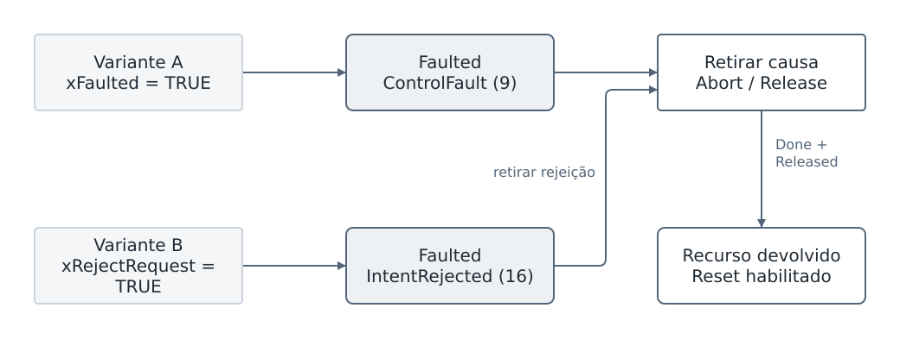

Falha de processo e rejeição da intenção chegam a Faulted por causas diferentes. A rejeição mantida também impede o fechamento.

**Condição de partida** Lote Running; requests e publicação permitidos; xFinishActions=TRUE. Executar variantes em lotes separados.

**O que você altera** Variante A: PRG_SEQ_Demo.xFaulted=TRUE. Variante B: manter xFaulted=FALSE e alterar PRG_SEQ_Demo.xRejectRequest=TRUE.

**Onde isso repercute** A marca falha no runtime do mock e retira Ready. B deixa runtime sem falha, mas rejeita intenção correlacionada. Sequence registra o motivo observado e entra em Faulted.

**Onde observar** PRG_SEQ_Demo.fbControlMock.stRuntime.xFaulted/xReady; .stResult.xRejected/uiReasonID; PRG_SEQ_Demo.fbSequence.stRuntime.eState/eReason; .stCommandResult.

**O que aprova o teste** A: Faulted(110)/ControlFault(9). B: Faulted(110)/IntentRejected(16). O comando Start anterior pode continuar Accepted: falha posterior pertence ao runtime. Remover a entrada de falha/rejeição não remove Faulted automaticamente.

**Se o resultado divergir** Na variante B, manter rejeição TRUE bloqueia também Abort/Release, portanto posse pode continuar. Não interpretar uiReasonID=1 do mock como eReason=1 da Sequence: são campos e domínios diferentes.

**Reposição** Retirar xFaulted/xRejectRequest; permitir conclusões, aguardar token/posse liberados e então Reset com lote corrente e novo RequestID. Nova execução exige lote maior.

**Código de referência** src/fb/FB_Sequence.st 166-172; tests/FB_SEQ_ControlMock.st 60-61; tests/FB_SEQ_ControlMock.st 85-143; src/fb/FB_Sequence.st 286-303

### SEQ-11 — Prazo de etapa e prazo de transição

Distinguir processo sem critério de término de ação que foi aceita mas não concluída.

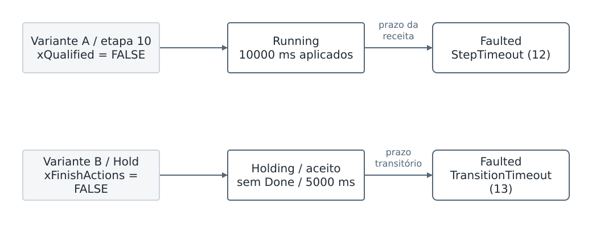

O relógio de etapa mede espera do processo; o relógio transitório mede conclusão de ação. Ambos são virtuais e produzem motivos distintos.

**Condição de partida** Variante A: receita original aplicada (timeout de etapa 10000 ms). Variante B: outro lote ativo com PRG_SEQ_Demo.xFinishActions=FALSE.

**O que você altera** A: manter PRG_SEQ_Demo.xQualified=FALSE na etapa 10. B: enviar Hold e não permitir conclusão no mock.

**Onde isso repercute** A acumula tempo Running mesmo sem tempo qualificado. B recebe Hold aceito, mas não Done; o relógio de Holding tem prazo próprio.

**Onde observar** PRG_SEQ_Demo.fbSequence.stRuntime.udiStepElapsedMs, .udiStateElapsedMs, .eState e .eReason; PRG_SEQ_Demo.fbControlMock.stResult.xAccepted e .xDone.

**O que aprova o teste** A: ao alcançar timeout aplicado, Faulted(110)/StepTimeout(12). B: Holding(30), accepted TRUE/done FALSE; após 5000 ms virtuais, Faulted(110)/TransitionTimeout(13). Feedback aceito repetidamente não evita timeout de conclusão.

**Se o resultado divergir** Se a receita de observação está carregada, A usa 600000, não 10000. Tempo avança 20 ms por chamada da Demo; não inferir duração real pelo relógio de parede. StaleFeedback(10) é outro cenário, não injetável confiavelmente alterando idade que o mock sobrescreve.

**Reposição** PRG_SEQ_Demo.xFinishActions=TRUE permite cleanup; Reset somente depois da liberação. Para prazos diferentes, editar candidata e recarregar em Idle; não alterar stConfig capturado.

**Código de referência** src/fb/FB_Sequence.st 340-347; src/fb/FB_Sequence.st 382-385; src/fb/FB_Sequence.st 419-444; tests/PRG_SEQ_Demo.st 15-17; tests/PRG_SEQ_Demo.st 51-66

### SEQ-12 — Publicação negada não significa execução parada

Entender por que uma watch zerada pode representar dado indisponível.

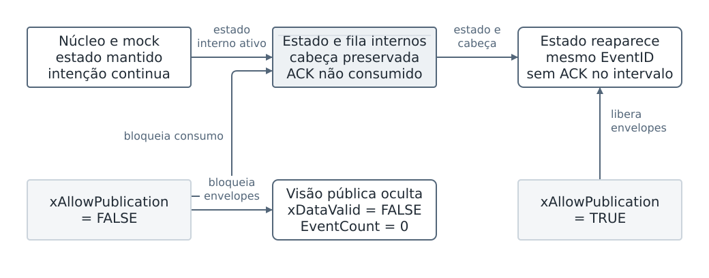

Negar publicação esvazia a visão pública, enquanto o núcleo e a negociação com o mock continuam. Ao liberar, a cabeça não confirmada reaparece.

**Condição de partida** Lote ativo em estado estável, preferencialmente Held, para observar sem timeout; requests/execução permitidos, fila com ao menos um evento, ACKs zero.

**O que você altera** PRG_SEQ_Demo.xAllowPublication=FALSE e depois TRUE. Durante bloqueio, manter outras permissões e entradas.

**Onde isso repercute** Publicação é grant independente. O núcleo continua com estado interno; envelopes públicos de runtime, resultado e eventos são esvaziados. ACK não é consumido enquanto publicação negada.

**Onde observar** PRG_SEQ_Demo.fbSequence.stRuntime.xDataValid; .xEventAvailable; .uiEventCount; .stControlRequest; PRG_SEQ_Demo.fbControlMock.stRuntime; após retorno, cabeça do evento.

**O que aprova o teste** Durante bloqueio, xDataValid=FALSE, disponibilidade/count públicos FALSE/0. Esses zeros não significam Idle real nem fila vazia. Intenção ao mock continua conforme estado. Ao restaurar publicação, estado reaparece e cabeça não confirmada preserva EventID.

**Se o resultado divergir** Não testar sem conferir xDataValid antes de interpretar eState=0. EventsDropped=0 publicado sob bloqueio também não é evidência de ausência de perda interna.

**Reposição** Restaurar publicação TRUE. ACK só depois de identificar cabeça válida. Para variante com eventos gerados durante bloqueio, dimensionar fila: 32 posições podem saturar sem consumo.

**Código de referência** src/fb/FB_Sequence.st 107-109; src/fb/FB_Sequence.st 543-580

### SEQ-13 — Identidade do pedido e idempotência

Verificar que repetir mensagem não executa operação duas vezes.

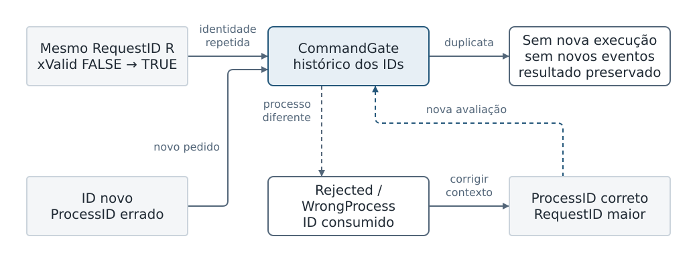

O gate distingue identidade de conteúdo: repetir o mesmo ID não reexecuta; corrigir um pedido rejeitado exige ID novo.

**Condição de partida** Idle com grants; candidata válida. Há um resultado de LoadRecipe aceito com RequestID R; anotar a contagem de eventos com ACK zero.

**O que você altera** Manter comando válido com mesmo R, inclusive alternando xValid FALSE→TRUE. Depois enviar pedido novo com processo errado; corrigir usando RequestID novamente maior.

**Onde isso repercute** Gate guarda último par observado e maior ID consumido. Repetição do mesmo ID não é uma nova operação; payload semanticamente rejeitado ainda consome ID.

**Onde observar** PRG_SEQ_Demo.fbSequence.stCommandResult.udiRequestID/eResult/eReason; .uiEventCount; .stRuntime.udiRecipeRevision; diagnóstico opcional somente leitura .fbGate.udiLastRequestID.

**O que aprova o teste** Repetição idêntica não gera novo CommandResult nem novos eventos. Novo ID com uiProcessID diferente de 1: Rejected(2)/WrongProcess(4). Corrigir processo com novo ID permite reavaliar. Sessão diferente: SessionMismatch(2); ID zero ou anterior: InvalidRequest(3), quando observado como pedido distinto.

**Se o resultado divergir** Mudar apenas payload mantendo identidade não comprova novo teste. Resultado anterior permanecer Accepted é esperado na duplicata; conferir udiRequestID. xValid não apaga o histórico do gate.

**Reposição** Retornar sessão/processo corretos e continuar IDs crescentes. Reinicialização completa só para reiniciar a instância, nunca como remédio para cada rejeição.

**Código de referência** src/fb/FB_SEQ_CommandGate.st 18-41; src/fb/FB_Sequence.st 178-199

### SEQ-14 — ACK da cabeça, overflow e proveniência

Relacionar evento preservado, confirmação exata e evidência explícita de perda.

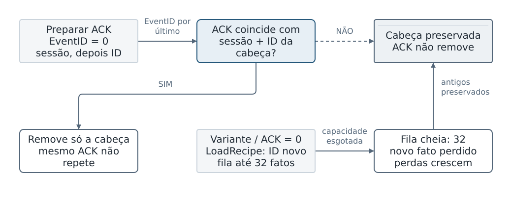

Só o par exato da cabeça confirma um evento. Sem consumo, a fila preserva antigos e torna a perda de novos fatos explícita ao saturar.

**Condição de partida** Idle, publicação permitida e fila não vazia; sem outras mudanças enquanto mede o ACK. Para overflow, instância nova ou baseline de perdas anotado.

**O que você altera** Com PRG_SEQ_Demo.udiAckEventID=0 durante a preparação, comparar pares: sessão errada/ID da cabeça; sessão 1/ID errado; sessão 1/ID exato. Usar udiAckSessionID para a sessão e escrever EventID por último. Variante: com ACKs zero, enviar LoadRecipe válido com IDs novos até saturar.

**Onde isso repercute** ACK filtra sessão e remove somente a cabeça cujo ID coincide. Sem consumo, a fila aceita até 32 fatos; depois preserva antigos e descarta novos.

**Onde observar** PRG_SEQ_Demo.fbSequence.stEvent; .uiEventCount; .udiEventsDropped; .stRuntime.xTraceHistoryComplete/xTraceReady; campos de origem e tempo.

**O que aprova o teste** ACK incorreto não remove. ACK correto reduz uma posição se não houver novos fatos; manter mesmo ACK não remove seguinte. Overflow: count=32, cabeça preservada, perdas crescem e xTraceHistoryComplete=FALSE até reinicializar. Cada LoadRecipe aceito em Idle gera RecipeLoaded(4) e CommandResult(3). Na Demo, xSyntheticTime=TRUE e xTraceReady=FALSE são esperados mesmo antes de perda.

**Se o resultado divergir** ACK é consumo local, não confirmação do historian. Não alterar tempo sintético para fingir prontidão de rastreabilidade. Tempo válido sintético não é UTC.

**Reposição** ACKs=0 antes de novos ensaios. Drenar não apaga histórico de perdas; instância nova é necessária para xTraceHistoryComplete limpo. Registrar as perdas observadas antes de reinicializar.

**Código de referência** src/fb/FB_SEQ_EventQueue.st 34-79; src/fb/FB_Sequence.st 543-579; src/fb/FB_SEQ_EventBuilder.st 66-79; tests/PRG_SEQ_Demo.st 51-66

## Registro mínimo de uma execução

Copie este modelo para cada ID de teste. Registre valores antes e depois; uma descrição como “foi” não permite reproduzir a evidência depois.

| Campo | Preenchimento |
| --- | --- |
| Teste e resultado | ID: __________    Não executado / Aprovado / Falhou / Inconclusivo |
| Ambiente | Data: __________  Pacote ou commit: __________  Programa raiz: __________ |
| Antes e estímulo | Identidade e valores iniciais: __________  Campo alterado: __________ |
| Depois | Estado, contadores, identidade e tempo observado: ____________________ |
| Evidência e reposição | Captura ou arquivo: __________  Retorno à referência confirmado: ______ |

As expectativas foram conferidas nos fontes identificados. A revisão deste manual não executou os FBs no Machine Expert e não altera o status dos ensaios já registrados.

## Referências para localizar o comportamento

[Sequence — implementação principal](https://github.com/luisauguszvc95-dot/FB_Sequence/blob/00f2953808e267bfdbc637347fea88737466e5bd/src/fb/FB_Sequence.st)

[Sequence — validação dos comandos](https://github.com/luisauguszvc95-dot/FB_Sequence/blob/00f2953808e267bfdbc637347fea88737466e5bd/src/fb/FB_SEQ_CommandGate.st)

[Sequence — fila de eventos](https://github.com/luisauguszvc95-dot/FB_Sequence/blob/00f2953808e267bfdbc637347fea88737466e5bd/src/fb/FB_SEQ_EventQueue.st)

Ao mudar campo, enum, prazo ou regra de consumo, atualize a ficha, seu diagrama e a referência de código. O PDF é a edição para consulta; Markdown e SVG são as fontes editáveis.
